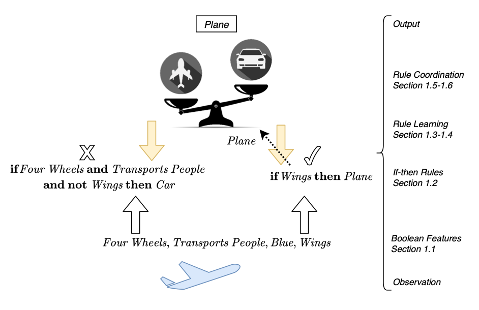

# FPGA Accelerating 

## I: Dissertation reading & researching

### 1: Abstract

- The approach using "clause chunks", which dividing the boolean expression into "chunks" to do group processing.

- Experiments were conducted on three datasets, XOR, Iris, MNIST (three famous datasets in ML domain).

- Pipeline stall could lead to increasing latency. (Pipeline stall or bubbles is the method to deal with hazard in circuit)

- Show the promise of improving hardware efficiency in ML.

### 2: Introduction 

- The increasing demand of ML acceleration using FPGA or GPU.

- TM (Tsetlin machine), a novel binary classifier may have higher efficiency.

- This paper declare the mechanism of "clause chunking" which could reduce the TM hardware and power consumption.

### 3: Literature review and background 

#### 3.1: Tsetlin Machine 

- Basic concepts of Tsetlin machine:

Applying the "if-then" principle to make decision based on the booleanisation of the input.

- It is performed through the negation input literals alongside the standard input to encode it to a **boolean feature**:

#### 3.2: Tsetlin Automata 

- The logical rules are adjusted during the training process, which reinforcing the correct decision and diminishing those incorrect decisions:

- The advantage of Tsetlin machine: no extra training time for TM.

#### 3.3: Machine learning using automata 

- Input data are defined as a set of binarized features and their complements, which is called **literals**.

- The literals are fed into the learning automation structure through two major parts: one for ****classification** another for **reinforcement and feedback for learning**.

### 4: Hardware for acceleration 

- CPU not suitable for training ML algorithm, the need for GPU and FPGA based hardware acceleration increased.

- The choice of this project: FPGA pynq-z1 

