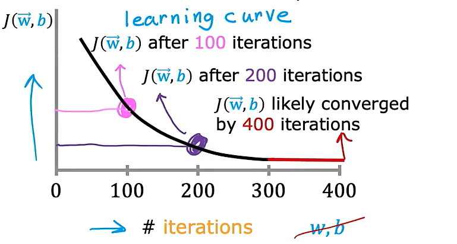
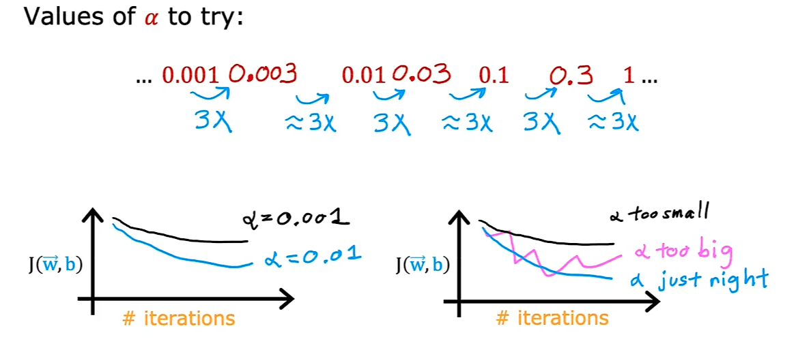

# Ng Wu Machine Learning 

## 1: Supervised Learning 

- Regression: 
    - predict a number which is infinitely many possible inputs
    - Eg. predict the houses-price 

- Classification:
    - Eg. Breast Cancer Detection
    - For one input such as the tumor length, we can get a range such as 0.5-0.7 to identify classes.
    - For two or more output, such as tumor size and age, we can still get a malignant between two classes:
    

## 2: Unsupervised learning 

- Clustering: 
    - Places the unlabeled data into different clusters.
    - Eg. Clustering news with same topic 
    - Eg. Grouping customers 

## 3: Regression Model 

- Regression model predicts numbers in supervised learning 

- The result may be infinite 

### 3.1: Cost function 

#### Computing Cost

The term 'cost' in this assignment might be a little confusing since the data is housing cost. Here, cost is a measure how well our model is predicting the target price of the house. The term 'price' is used for housing data.

The equation for cost with one variable is:
  $$J(w,b) = \frac{1}{2m} \sum\limits_{i = 0}^{m-1} (f_{w,b}(x^{(i)}) - y^{(i)})^2 \tag{1}$$ 
 
where 
  $$f_{w,b}(x^{(i)}) = wx^{(i)} + b \tag{2}$$
  
- $f_{w,b}(x^{(i)})$ is our prediction for example $i$ using parameters $w,b$.  
- $(f_{w,b}(x^{(i)}) -y^{(i)})^2$ is the squared difference between the target value and the prediction.   
- These differences are summed over all the $m$ examples and divided by `2m` to produce the cost, $J(w,b)$.  
>Note, in lecture summation ranges are typically from 1 to m, while code will be from 0 to m-1.

#### Cost-calculation function in Python 

```Python
def compute_cost(x, y, w, b): 
    """
    Computes the cost function for linear regression.
    
    Args:
      x (ndarray (m,)): Data, m examples 
      y (ndarray (m,)): target values
      w,b (scalar)    : model parameters  
    
    Returns
        total_cost (float): The cost of using w,b as the parameters for linear regression
               to fit the data points in x and y
    """
    # number of training examples
    m = x.shape[0] 
    
    cost_sum = 0 
    for i in range(m): 
        f_wb = w * x[i] + b   
        cost = (f_wb - y[i]) ** 2  
        cost_sum = cost_sum + cost  
    total_cost = (1 / (2 * m)) * cost_sum  

    return total_cost
```

### 3.2: Gradient Descent Algorithm

- Target: have some cost function $J(w,b)$, want to find a $\min_{w,b}J(w,b)$

In lecture, *gradient descent* was described as:

$$\begin{align*} \text{repeat}&\text{ until convergence:} \; \lbrace \newline
\;  w &= w -  \alpha \frac{\partial J(w,b)}{\partial w} \tag{3}  \; \newline 
 b &= b -  \alpha \frac{\partial J(w,b)}{\partial b}  \newline \rbrace
\end{align*}$$
where, parameters $w$, $b$ are updated simultaneously.  
The gradient is defined as:
$$
\begin{align}
\frac{\partial J(w,b)}{\partial w}  &= \frac{1}{m} \sum\limits_{i = 0}^{m-1} (f_{w,b}(x^{(i)}) - y^{(i)})x^{(i)} \tag{4}\\
  \frac{\partial J(w,b)}{\partial b}  &= \frac{1}{m} \sum\limits_{i = 0}^{m-1} (f_{w,b}(x^{(i)}) - y^{(i)}) \tag{5}\\
\end{align}
$$

Here *simultaniously* means that you calculate the partial derivatives for all the parameters before updating any of the parameters.


### 3.3: Multi-linear regression model 

- For the multi-features $x_1, x_2, x_3...x_n$, a linear model can built as:

$$
f_{w,b}(x) = w_1x_1 + w_2x_2 + ... +w_nx_n +b 
$$

- For a series of $w$ and $b$ can be set as two **vectors**:

$$
\vec{w} = [w_1, w_2, w_3... w_n]\\
\vec{x} = [x_1, x_2, x_3... x_n]
$$

- The function can be rewrite as:

$$
f_{\vec{w},b} = \vec{w}. \vec{x} +b 
$$

- 'Dot product' means each element being multiplied respectively.

#### Vectorized Method 


#### Feature Scaling 

- The range of the features may not same, which may lead to different weight-coefficient '$w_n$'.

- For the variable $x_1$ with standard deviation $\sigma_1$ and average $\mu_1$, $x$ can be rescaled as:

$$
x_1' = \frac{x_1 - \mu_1}{\sigma_1}
$$

#### Checking the convergence of gradient descent 

- Use the learning curve of $\J(\vec{w},\vec{b})$, it should be converged to 0:



- Use automatic convergence test: 

  - Let $\epsilon$ is the descent per step, which could be set as 0.001 or other precise tiny number.
  - If $J(\vec{w},\vec{b})$ decreases by $\le \epsilon$, this iteration is declared as convergence.


#### Choosing of learning-rate $\alpha$ 


