# Pway Class A - LU

## 1: Introduction 

### 1.1: Definition of Permanent Way and Track 

- **Permanent Way**:
    - All railway tracks in passenger service, the adjointing depots and sidings mostly electrified, timber / sleepers, cuttings, embankments, drainage and all associated features between and including the operational boundary fences.

- **Track**:
    - The permanent way and the ground within 2 m of any running rail, but exlcuing station platforms and areas guarded by physical barriar.

### 1.2: Main Components of PWay

- Running rails & joints
- Switches and corssings
- Rail fastening 
- Sleepers and timbers
- Conductor rails and fittings
- Ballast and concrete
- Track Drainage 
- Surface vegetation 
- Boudndary fences
- Train arresters 
- Structure gauge

### 1.3: Purpose of the PWay 

- Support and guide the trains
- Provide a suitable running surface for wheels
- Provide adequate space for approved vehicles travelling at authorised speed
- Provide a suitable path for collector shoes
- Provide electrical paths & insulation for power and signalling
- Provide safe walking surface for maintenance / derailment 
- Enable drainage of surface water

### 1.4: Platform Train Interface (PTI)

- Important to safety and service performance
- Maybe necessary to use special measures to fix the track position
- Preference is to standardise dimensions between tracks and platform edge, but this can result in sub-optimal solutions

### 1.5: Wheel Rail Interface (WRI)

- The wheel treads are tapered and the rails are inclined at 1 in 20 to provide self steering.
- The wheels have flanges which on tighter radius curves (radius approximately 400 metres)
- The shape of the rial head and wheel profile are very important, including track gauge and track geometry.
- Lubrication is provided by track lubricators and in some cases also train mounted lubricators.

### 1.6: Conductor Rail - Shoe Gear Interface

- Necessary to have gap in the consuctor rails and ramps to guide shoes on and off the rails.
- Most conductor rails are steel but aluminium rails with a stainless steel top surface are also used for higher conductivity.

### 1.7: Point Systems

- Provide motor drives, position detection and locking mechanisms.
- In LU, switch rails and stretcher bars are classfied as PWay assets and the drive, detection and locking system classified as Signal assets.

### 1.8: Track Condition Monitoring 

Various condition measures are used for each form of degradtion:

- Irreversible Degradation:
  - Running rail wear
  - Running rail flaws
  - Conductor rail wear
- Reversible Degradation:
  - Running rail corrugation
  - Loss of track geometry
  - Ballast contamination (eg. wet beds)

LU PWay standards mandate a suite of inspections that provide information about track condition:

- Patrolling - visual
- Junctionwork Inspections - visual and measured
- Measured Inspections - work scoping 
- Track Recording Vehicle (TRV), ATMS
- Rail Inspections - 'B' scan (ultrasonic), RSCM (magnetic flux)
- Prevention of Bukcling Inspections 

## 2: Plain Line & Junctionwork

### 2.1: Running Rails 

- Purpose - to carry and guide the train wheels
- Required to distribute significant forces
- Properties:
  - Hardness - to resist wear
  - Toughness - to absord load and resist fatigue 
  - Tensile strength - to withstand thermal forces
- Also used to locate signals equipments
- Material Most Used:
  - Normal Grade steel - historical used
  - Grade A steel - standard use
  - Premium Steels & Head Hardened - wear resistant 

### 2.2: Track Forms

- Bullhead (BH) - Traditional 

- Flat Bottom (FB) - New Works

- General Track Guage:
  - Straight Track: 1435 mm
  - Check Rail Curves: 1438 mm

### 2.3: Running Rail Joints

- Purpose - to connect together lengths of rail to form a secure path
- Welded Types:
  - Flash butt weld (workshop process)
  - Thermic (site welding process)
- Fishplated (mechanical connection):
  - Expansion (for short rails)
  - Tight
  - Junction
  - Blockjoint

### 2.4: Sleepers

- Purpose - to maintain gauge
  - Maintain dimension between rails
  - Maintain coss level
  - Support running and conductor rails
  - Distribute dynamic and static loads

#### 2.4.1: Sleepers Type

- **Softwood** - ballasted track only
  - PRO: inexpensive, lightweight
  - AGAINST: Easy to splitting and rotting 
- **Hardwood** - ballasted and mainly concreted track
  - PRO: duarbale, lighter than concrete
  - AGAINST: exotic and expensive
- **Composite**
  - FOR: Eco-friendly
  - AGAINST: flammable, heat distortion 
- **Prestressed concrete** - ballasted and concreted
  - FOR: inexpensive, strong and stable
  - AGAINST: very heavy, difficult to trim, brittle

### 2.5: Running Rail Supports and Fastenings

#### 2.5.1: Bulkhead Track Keys

- **Oak Keys**:
  - FOR - Eaasy to install, cheap, light and good electrical insulation 
  - AGAINST - Tend to shrink and fall out
- **Steel**:
  - FOR - Wear resistance, easy to install, tight fitting, good creep resistance
  - AGAINST - Need to be driven in tight, tendency to crush and fall out, tend to rust poor electricail insulation
- **PANLOCK KEYS**:
  - FOR - secure location and low maintenance
  - AGAINST - need special tool to install, tend to rust, poor electrical resistance

#### 2.5.2: Chairscrews and ferrules

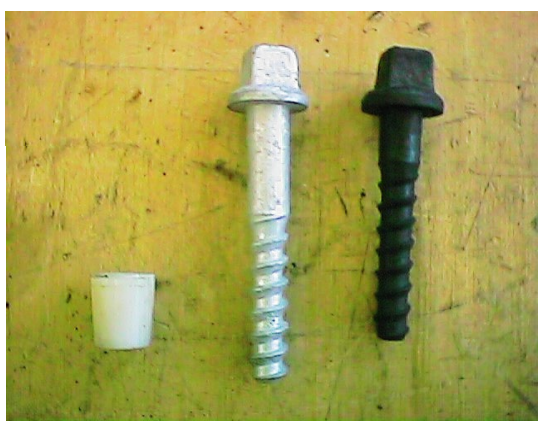

- **Chairscrews**: to hold the chair or baseplate securely to the sleepers. Restrains the rails and hold the gauge.
- **Ferrules** : accommodate casting tolerances in chair and baseplate. Prevent screw and metals to contact.

#### 2.5.3: Flatbottom Track - rail clips

- **Pandrol Clips**

- **Fastclips**

#### 2.5.4: FB Rail vs BH Rail

- **Flat Bottom rail**:
  - Baseplate with chairscrews and ferrules.
  - Special baseplate for check rail.
  - Pandrol shoulders casted into concrete sleepers.
  - Pandrol with insulators and rail seat pad, directly seated on concrete sleepers.
- **Bull Head Rail**:
  - Chairs with chariscrews, ferrules and keys
  - Keys - oak or steel (two types: Mills and Panlock)
  - Special Chairs for check rail

#### 2.5.5: Resilient Baseplate - composite with rubber insert

- **PRO**:
  - Reduced noise and vibration
  - Longer lifetime 
- **DIS**:
  - Energy dissipation into noise 
  - Bulky component in space constained area

#### 2.5.6: Track Bed

- **Ballast**:
  - Purpose:
    - To absorb and disperse track load through track foundations
    - Restrain movement of sleepers
    - Provide drainage
- **Ballast Sleepers**:
  - **Granite Ballast - preferred**
    - FOR - hard stay sharps, strong abration resistant
    - AGAINST - heavy and expensive
  - **Limestone - was most common in LU**
    - FOR- cheap, resonable drainage
    - AGAINST - scarce resorce in the UK, cannot be used with concrete sleepers
  - **Ash Ballast**
    - Waste product from coal power station. Mainly in depot.
- **Typical Faults**:
  - Wet Spot: Train dynamic movement makes the underkying clay being drawn up into the ballast, thus blocks the drainage and loose the support.

### 2.6: General Track Construction 

- 1: Geotexile laid on formation 

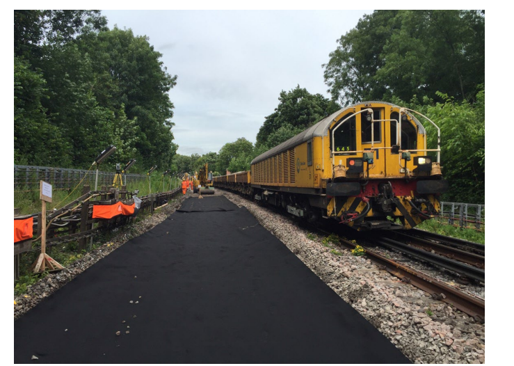

- 2: Bottom Ballast installation 

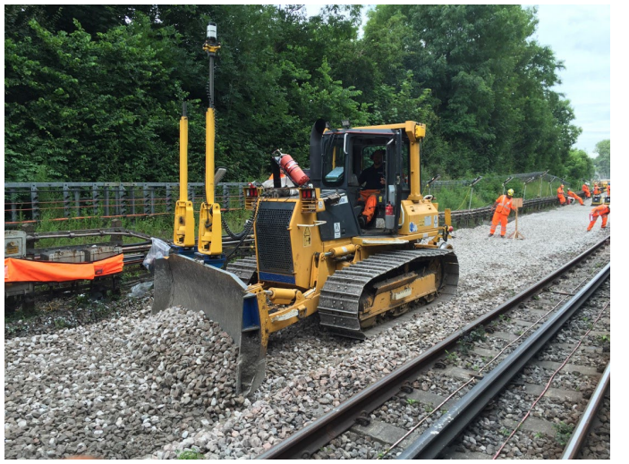

- 3: Concrete sleepers ready to lay

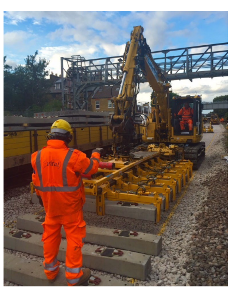

- 4: Sleeper laid Pandrol e-clip and fast clip

- 5: Rail Installation 

- 6: Top Ballast Installation 

- 7: Tamping

- 8: Welding and Stressing 

### 2.7: Check Rails

- ***Purpose**:
  - Installed on curved track of of 200m radius or less ot prevent the ourside wheels to be derailed.
  - 180 m radius on LU, DLR and trams can be lower than 60 m.
  - Also used on some under bridges to constrain train.
  - Cover check rails are provided at tripcock tester to correctly align the bogie.

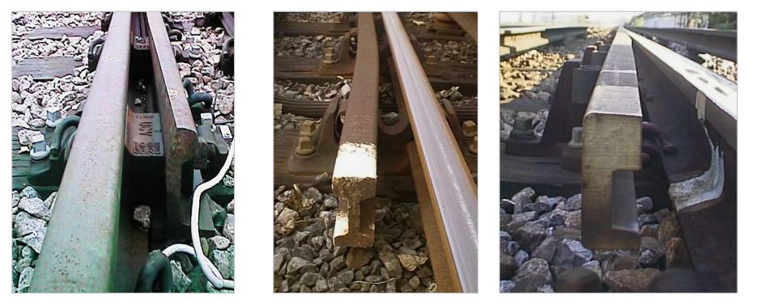

### 2.8: Special Trackforms

- **Long timbers**:
  - Used timbers or more modern composite materials.
  - The timber is set into a trough within the bridge.

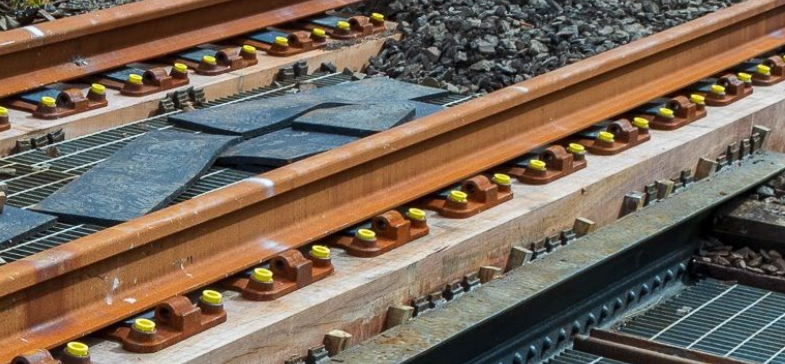

- **Laterial Restraint**
  - Laterial resistance plates clamped to sleepers to resist sideway forces.
  - Glued ballast spreads the loads and reduces the risk of localised failures.

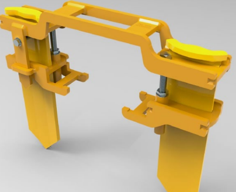

- **Slab Track**
  - Track slab is structural construction.

- **Resilient Trackform**
  - Isolation of forces from supporting structure, need to consider unintended noises.

- **Floating Slabtrack**
  - Used in noise-critical locations.

- **Depot and Sidings - Train Arrestors**
  - Energy absorption and need space behind.

### 2.9: Conductor Rails

- **Main Conductor Rail Sections**
  - Steel or Aluminium Body with Stainless Steel Cap

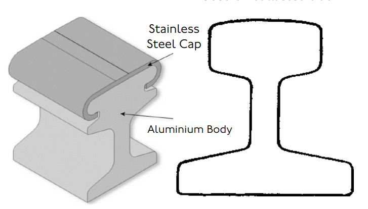

- **Rail Lengths - Allowance for thermal expansion**
  - 400m with cable connection or 600m with one cable end & one Out of Gauge (OOG) rails in open / sub-surface sections.
  - 800m with all types of connection in tube sections.
  - Max lengths are dependent on curvature.

- **Joints**
  - Purpose - to join together lengths of conductor rail
  - Type of joints
    - Welded flash butt in workshop
    - Arc welding on site
    - Fishplate - two holes

- **General Components**
  - Insulator, clipsm Coachscrews and Shim
  - Anchors

- **Tube station**
  - Due to lack of sleepers, the negative conductor rail insulator is supported on a concrete pedstral.

- **Anchors**:
  - Purpose - to restrain the conductor rail from moving bodily longitudinally. 

- **Protection Planking**

### 2.10: Junctionwork

- **Function of junctionwork**:
  - Corss from one running line or route to another
  - Gain access to stabling or depot tracks
  - Gain access to a particular platform at station

- **Facing and Trailing Crossover**:
  - When trains moving towards the *switch rail rail head*, it will be called *Facing Crossover*.
  - When trains moving from a siding to a mainline (opposite to the switch rail head), it will be called *Trailing Crossover*.
  

- **Scissors Crossover**
  - Two single lead turnout overlapped to fomr a Scissors Crossover.
  - Allows trains moving between upstream and downstream.

- **Trap Switches**
  - Avoid siding trains slipping into mainline by accident.

- **Diamond Crossing**
  - No switches in the trunout, the signalling interlocking is used as protection.
  - Only two direction allowed.

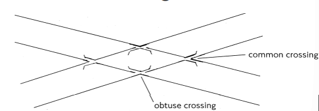

- **Double Slip**
  - Similar to Diamond Crossing, but additional swiches allow the movement from one direction to another.

### 2.11：Points (switches) 

- **Stretcher Bars & Brackets**
  - Purpose:
    - Transmits drive from one rail to another
    - Ensure no electrical isolation between switch rails
- **Flangeway**
  - The space between the switch rail and stock rail (the open side) must be designed to perimit width of wheel flanges.

- **Straightcut, Undercut and Rail Joggle**
  - Undercut / shallow depth / full depth profile provides extra space for flangeway (when switch rail is closed)
  - Extra 'joggle' will be provided in stock rail to provide flangeway. Note that point will be facing crossover only.

- **Supports and Fastenings**
  - Switchs could move laterally on slide chairs or baseplates.
  - Switch and stock rail are fixed with an anchor at heel.

- **Distance Blocks**
  - The block retain the swith in the moveable part between the end of planning and fixed heel.

- **Soleplates**
  - To maintain track gauge at the toes of points.
  - Fitted on top of the timber under the slide charis/baseplates, and are secured in position by the chariscrews hilding the slide chairs in position.

- **Switch Anchors (Bullhead)**
  - Purpose - to fix together the switch and stock rails providing:
    - A fixed pivot point for switch rail
    - Prevention of longitudinal movement.
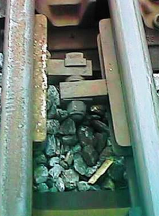

- **Heel Blocks (Flat Bottom)**
  - Purpose - to fix together the switch and stock rails (same as Anchors in BH track)
  
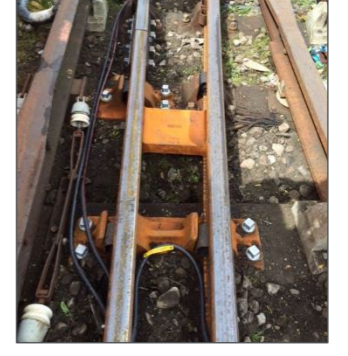

- **Twist Rails**
  - Twist the rails to change height of the rails, thus allow smooth transition between different track levels.
- **Precurving of Rails**
  - Ensure corrct curvature of stock and switch rail before installation.
  - Balancing of the energy required to normalise or revere points for the correct switch fit and providing a correct flange way.

### 2.13: Common Crossing & Obtuse Crossing

#### 2.13.1: Unbroken Crossing - Common Crossing

- Using continious rail between the two rails without 'jumping'.
- Fully fabricated
- Used for unsignalled moves, where all traffic is on one route.

- **Types of Construction**:
  - Fully fabricated or Part fabricated 
  - Cast centre block 

- **Cast Centre Block Crossings**
  - Used in congested areas for a smaller footprint.
  - Used for bespoke geometry

#### 2.13.2: Obtuse Crossings

- Obtuse crossings are used in crossing layouts which include a diamond:
  - Diamond Crossover
  - Scissors Crossover
  - Double Junction 

### 2.14: Cover Check Rails

- Purpose - to ensure that trains take the correct route when passing discontinuities in junctionwork.
- Opposite common corssing noses.
- Opposite the point rail nose-wing rail-point nose gaps of an obtuse crossings.

### 2.15: Concrete Bearers with Switch Panels

- All concrete bearers (sleepers) have to be custom cast to take account of the different crossing angles.

- Switch pannels on concrete bearers include yhe slide base plate and heel charis fixed to the bearer with a rubber pad beneath the baseplate.

- Beyond the heel the concrete bearers become deeper to maintain a constant construction depth where the rail is directly fixed with cast in Pandrol shoulders.

- Composite Bearers (recycled plastic) has been used to provide similar performance.

### 2.16: Concrete Track Form 

- LVT Blocks
- Delkor Eggs - Resilient

### 2.17: Conductor Rails at Points

- **Positive Splays / pick-up ramp**:
  - Guide collector shoes in the crossing areas.
- **Negative Splays**:
  - To prevent collector shoes falling and jamming between the main and lean-to rail.
- **Slipper Run Boards**:
  - Designed to carry low or hanging negative shoes over lead rails

