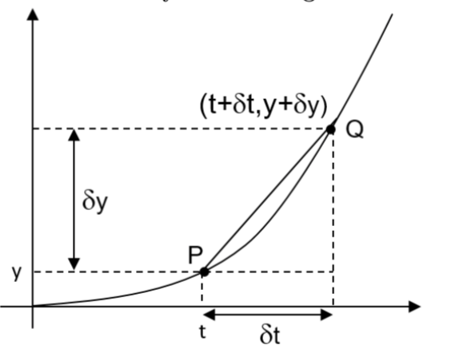
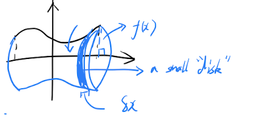
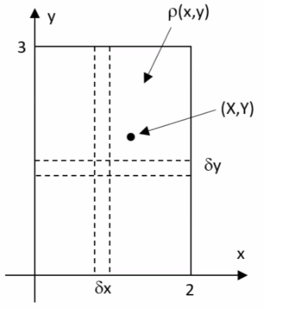

## I: Matrix and Vector 
### 1: Matrix 
#### 1.1: Definition and Notation 
* A method of recording hundreds of equations in engineering. (eg. infinite elements with 3D nodes) 
* A matrix is called "lines by column", eg. 2x3 means 2 lines and 3 columns.
* Capital letter 'A' for a matrix and lower case '$a_{ij}$' for the element of 'A', 'i' is the line and 'j' is the column.
* $A=\begin{pmatrix}1&1\\1&1\end{pmatrix}$ which is a 2x2 matrix.

#### 1.2: Special Matrix 

##### (1): Diagonal Matrix
All elements are '0' except the '\' diagonal, but the diagonal can be '0'.
e.g, $\begin{pmatrix}2&0&0\\0&3&0\\0&0&4\end{pmatrix}$

##### (2): Symmetric matrix 
$\begin{pmatrix}1&3&-7\\3&0&2\\-7&2&-5\end{pmatrix}$, $a_{ij}=a_{ji}$

##### (3): Antisymmetric matrix
$\begin{pmatrix}1&-3&7\\3&0&2\\-7&2&-5\end{pmatrix}$ , $a_{ij}=-a_{ji}$, $i\not ={j}$
    
##### (4): Upper/Lower triangular matrix 
$\begin{pmatrix}1&1&1\\0&1&1\\0&0&1\end{pmatrix}$, $i>j$, $a_{ij}=0$,which is **Upper** . 

$\begin{pmatrix}1&0&0\\1&1&0\\1&1&1\end{pmatrix}$, $i>j$, $a_{ij}=0$, which is **Lower**.

#### 1.3: Matrix Transpose
##### (1): Transpose means  swap 
$\begin{pmatrix}a&b&c \\ d&e&f\\ g&h&i \end{pmatrix}^T=\begin{pmatrix}a&d&g\\ b&e&h\\ c&f&i \end{pmatrix}$
##### (2): The Transpose of transposed matrix
$[A^T]^T=T$

#### 1.2: Matrices Algebra 
##### Scalar multiply 
- (1): Do the calculation directly. 
- (2): Only same-size matrix can do
##### Matrix Multiplication 
- Example:
$A=\begin{pmatrix}m&p\\n&q\end{pmatrix},\quad B=\begin{pmatrix}a&c\\b&d\end{pmatrix}$
- $AB=\begin{pmatrix}m&p\\n&q\end{pmatrix}.\begin{pmatrix}a&c\\b&d\end{pmatrix}=\begin{pmatrix}am+bp&cm+dp\\an+bq&cn+dq\end{pmatrix}$
- Notes that $A.B\not ={B.A}$ (mostly)
#### 1.3: Identity Matrix 
- Example:
$\begin{pmatrix}1&2\\0&1\end{pmatrix}$
- The 'I' could be 'N x N' matrix
- $I.A=A=A.I$, whilst I is different 
#### 1.4: The properties & rules of matrices 
##### (1): Equality 
All the elements are same, $a_{ij}=b_{ij}$ means '='.
##### (2): Properties of Transpose 
$(A+B)^T=A^T+B^T$, $(A^T)^T=A$
#### 1.5: Simultaneous equations & Matrices
##### Transfer the Matrix and Simultaneous equations 
- Original equations: $\begin{aligned} 2x-3y=4 \\-x+2y=1\end{aligned}$
- Matrix form: $\begin{pmatrix}2&-3\\-1&2\end{pmatrix} . \begin{pmatrix} x \\ y\end{pmatrix}=\begin{pmatrix} 4 \\ 1\end{pmatrix}$
##### (1): Determinant
- If the matrix $A=\begin{pmatrix}a&b\\c&d\end{pmatrix}$, written $\det A \left| \begin{array}{cccc}a&b\\ c&d 
\end{array} \right |=ad-bc$
- If $\det A=0$, the matrix is singular.
##### (2): Inverse of a matrix 
- To solve the equation $\vec{A}X=\vec{b}$, according to $A.I=I.A$, **$X=A^{-1}\vec{b}$**.
#### 1.6: Solve the simulations equation by Gauss's Elimination 
##### (1): Elementary Row Operations (ERO)
- Firstly, change it to extended matrix form: $\left[\begin{array}{lcr|r} 1 & -3 & 1 & 1 \\ 2 & 5 & 3 &24 \\ -1 & 2 & 1 &1 \end{array}\right]$.
- Use 'add','minus','multiply' and 'divide' to change the left matrix into a upper-triangular matrix.
- Follow the rule of 'from up to down' and 'from left to right', i.e '2'$\rightarrow$'-1'$\rightarrow$'2'.
- Finally got $\left[\begin{array}{lcr|r}1&-3&1&-9\\ 0&1&2&-8 \\ 0&0&23&-46\end{array}\right]$, the solution can be solved easily.
##### (2): Finding inverse matrix by EROs 
- For Example, $A=\begin{pmatrix}2&3\\-1&4\end{pmatrix}$.
- Change $A$ and $I$ to extended matrix form, $(A|I)=\left[\begin{array}{lcr|r}2&3&1&0 \\ -1&4&0&1 \end{array}\right]$.
- Using EROs changing left-side to $I$, the right will be $A^{-1}$, $\left[\begin{array}{lcr|r} 1&0&4/11&-3/11 \\ 0&1&1/11&2/11\end{array}\right]$.
- To find the inverse matrix of 2x2 matrix,if $A=\begin{pmatrix}a&b \\ c&d\end{pmatrix}$, $A^{-1}=\frac{1}{|A|}\times A^{*}=\frac{1}{\det A}\times \begin{pmatrix}d&-b\\-c&a\end{pmatrix}$
##### (3): Determinant of 3x3 matrix 
- For Example, $\left | \begin{array}{cccc}2&3&-1 \\ 4&1&2 \\ -1&0&3\end{array} \right |=2\left | \begin{array}{cccc}1&2 \\ 0&3 \end{array} \right |-(3)\left |\begin{array}{cccc}4&2 \\ -1&3 \end{array} \right |+(-1)\left | \begin{array}{cccc} 4&1 \\ -1&0 \end{array} \right |=-37$
### 2: Vectors
#### 2.1: Definition 
- Cartesian form in right-hand set are (2,3,1) or $2\vec{i}+3\vec{j}+\vec{k}$
#### 2.2: Scalar Product (Dot product)
- Example: $W=\vec{F}.\cos\theta\vec{d}=|\vec{F}||\vec{d}|\cos\theta$, the result is a **scalar**.
- $\vec{i}.\vec{j}=0$, two vectors are perpendicular.
- $\cos\theta=\frac{\vec{a}.\vec{b}}{|\vec{a}||\vec{b}|}$
- Unit vectors: $\hat{a}=\frac{\vec{a}}{|a|}$.
- Component in one direction: $|\vec{F_1}|=\vec{F}.\hat{a}$, $\vec{F_1}=(\vec{F}.\hat{a})\hat{a}$
#### 2.3: Vector Product (Cross Product)
- In 2D, $\vec{M}=|\vec{d}||\vec{F}|\sin\theta$
- In 3D, $\vec{M}=\vec{d}\times\vec{F}=|\vec{d}||\vec{F}|\sin\theta\hat{n}$
- Corkscrew rule can justify the direction.
- $\vec{m}\times \vec{n}=\left|\begin{array}{cccc}\vec{i}&\vec{j}&\vec{k}\\ a&b&c \\ d&e&f\end{array} \right |=(ae-bd)-(af-dc)+(ae-bd)$

## II: Complex numbers
### 1: Basic Concepts
- $i^2=-1$, use 'j' in electrical engineering
- The coefficient of real number is the **real part**, the one of imaginary number is the **imaginary part**.
- If $z=a+bi$, $\bar{z}=a-bi$, which is called **complex conjugate**.
- $|z|=|a+bi|=\sqrt{a^2+b^2}$, which is the **modulus** of $z$.
### 2: Argument 
- $\arg(z_1)+\arg(z_2)=\arg(z_1z_2)$
### 3: Exponential form and applications
#### (1): Exponential Form / Polar Form 
- $z=x+yi=re^{i\theta}$,  $\theta=\arg(z)$, $r=|z|$ 
-  Euler's Identity: $e^{i\pi}=-1$
#### (2): Sine/cosine form 
- $\cos\theta +i\sin\theta =e^{i\theta}$
#### (3): Complex roots of equations
- Try '0','$\pm 1$' and '$\pm 2$' to find a real root.
- Use **long division** find the roots of the quadratic equation.

## III: Ordinary Differential Equations 1
### 1: First order differential equations 
#### (1): Definition
- The equation relates an unknown function $T(t)$ and its derivatives.
- The equation only have a first derivative called first-order diff-equation.
#### (2): The solutions
##### Using trial solution 
- The equation like $\frac{dy}{dx}=Ay$, $A$ is a constant can be solved using $y=e^{mx}$,($m$ is unknown).
- For example, $\frac{dp}{dt}=2.5p$, let $P=e^{mt}$, $m=2.5$, so solution is $P=Ae^{2.5t}$.
##### Separating variables 
- If the ODE can be written as $\frac{dy}{dx} =y(x)g(y)$, it can be solved with separating variables.
- For example:

$$
  \begin{aligned}
  \frac{dy}{dx}&=3y \\
  \frac{1}{y}.\frac{dy}{dx}&=3 \\
  \int \frac{1}{y}\frac{dy}{dx}{\rm d}x&=\int 3{\rm d}x \\
  \ln{y}&=3x+C \\
  y&=Ae^{3x}+B
  \end{aligned}
$$

### 2.Second- order differential equations
#### 2.1 Mechanical System with spring and damping

$$
\frac{md^2y}{dt^2}=-ky-C\frac{dy}{dt}
$$
$$
i.e.ma=-F_{restoring}-F_{damp}
$$
It show the relationship between the y and t in the damping system.
##### 2.1.1 Another physical example-an electrical circuit
In a circuit with R,L and C,we can find the voltage relationship:
$$
IR+L\frac{dI}{dt}+\frac{Q}{C}=V(t)
$$
$$
R\frac{dQ}{dT}+L\frac{d^2Q}{dt^2}+\frac{Q}{C}=0
$$
This a second order differential equation.

#### 2.2
 Solve the equation

$$
\frac{d^2y}{dx^2}+3\frac{dy}{dt}+2y=0
$$
First, use the $y=e^{mt}$ as a trial solution.

$$
m^2e^{mt}+3me^{mt}+2e^{mt}=0
$$
$$
(m+1)(m+2)=0
$$
$$
m=-1
$$
$$
m=-2
$$
So we have two solutions.

In fact, the GS is 
$$
y=Ae^{-t}+Be^{-2t}
$$
While A, B are the constants.(when A or B=0,ensure containing all the answer)

Then we can use the 
$$
y(0)=1
$$
$$
\frac{dy}{dt}(0)=0
$$
Then we can find the A=2,B=-1.
So the P.S is
$$
y=2e^{-t}e^{-2t}
$$
#### 2.3 Quadratic(repeated) roots the same

$$
\frac{d^2y}{dt^2}-2\frac{dy}{dt}+y=0
$$
This gives only one solution:
$y_1=Ae^{-t}$

This case is called the **critical damping**.
However, all second-order d.e.s have two independent solutions.

The other one is 
$$
y_2=Bte^{-t}
$$
So the GS is
$$
y=(A+Bt)e^{-t}
$$
#### 2.4 Example of simple harmonic motion
If we choose the simplest case of no damping (R=0), we can find this equations:
$$
\frac{d^2Q}{dt^2}=-\frac{Q}{LC}
$$
This is the simple harmonic motion.
##### 2.4.1
Oscillations- complex roots of the auxiliary equations
$$
\frac{d^2y}{dt^2}+2\frac{dy}{dt}+2y=0  
$$

Try $y=e^{mt}$

We can find that m=$-1\pm i$

So the GS is 
$$
y=Ce^{(-1+i)t}+De^{(-1-i)t}
$$
Next, we use the result:
$$
e^{i\theta}=cos\theta+isin\theta
$$
$$
y=e^{-t}[Acos\theta+Bsin\theta]
$$
We use the final real number to do solve the physical problems.
#### 2.6 General Solution for the oscillation equations

If we find $m=\pm Ci+D$;
the GS for real number is:
$$
y=e^{Dx}[Acos(Cx)+Bsin(Cx)]
$$

## IV: Functions and Curves
### 1: Functions- general ideas
#### 1.1 What is a function
#### 1.2 Combining of functions
#### 1.3 Domain and Range
* Domain is all the possible input values.
* Range is all the possible output values.
#### 1.4 Inverse Functions
* We use $f^{-1}$ to mean inverse.
* Examples:
  * If $f(x)=1-2x$, we write $f=1-2x$
  * And we can write it as a function of x :$f=1-2x$ 
     $x=\displaystyle\frac{1-f}{2}$
  * $f^{-1}(x)=\displaystyle\frac{1-x}{2}$
  * The graph of the functions and its inverse are reflections of each other in the line $y=x$.
* Domain of $f(x)$ is equal to the Range of $f^{-1}$ and vice versa.
* Other important functions and their inverses:
   * $e^x$ and $\ln{x}$
   * $\sin x$ and $sin^{-1} x$
### 2: Exponential and Logarithmic functions
#### 2.1 Exponential function
##### 2.1.1 The application of exp(x)
* $e^{-x}$-the exponential decay
* $e^{-x^2}$-the normal distribution
* $xe^{-x}$-the Poisson distribution
##### 2.1.2 The hyperbolic cosine and hyperbolic sine
* $\cosh x=\displaystyle\frac{(e^x+e^{-x})}{2}=\displaystyle\frac{e^{ix}+e^{-ix}}{2}$
* $\sinh x=\displaystyle\frac{(e^x-e^{-x})}{2}=\displaystyle\frac{e^{ix}-e^{-ix}}{2i}$
* $(\cosh x)^2-(\sinh x)^2=1$
$$
  \displaystyle\frac{d}{dx}\cosh x=\sinh x
$$

$$
  \displaystyle\frac{d}{dx}\sinh x=\cosh x
$$

- $\cosh (ix)= \cos(x)$
- $\sinh (ix)= i\sin(x)$
- $\sin (x)=-i\sin(ix)$
#### 2.2 Logarithm and powers
### 3: Sine and Cosine functions 
#### 3.1 Combination of sine and cosine functions
The combination of the sine and cosine produce more complicated shapes, such as Fourier Series.
### 4: Transformation
#### 4.1 Translation and Magnifications
#### 4.2 Plotting a quadratic graph
#### 4.4 Odd,even and periodic functions
* Even function:$f(-x)=f(-x)$ 
* Odd function:$f(-x)=-f(-x)$
* Periodic function: like $\sin x$
### 5: Curve sketching
#### 5.1 Aims and strategy
* Cross or touch the axes.
* Max, min and inflection points
#### 5.2 Stationary points- First derivation
Using the first derivation to find the gradient each side.
#### 5.3 Stationary points- Secondary derivation
* The inflection points means if $y''=0$ at this point and $y''$ have different signs in double sides.
* The gradient of the function reach a max or min at the infection points.
* It is useful only if the $\displaystyle\frac{dy}{dx}\not ={0}$
### 6: Asymptotes and Rational Functions
#### 6.1 Definitions
* The function that is a quotient of two polynomial functions
* As the denominator of the fraction takes the value zero, the function becomes infinite, we get a vertical line called vertical asymptote. The function may have horizontal , sloping and vertical asymptote.
* Theses lines may cross.
#### 6.2 Rewriting the functions by long division
 * This is a way to separate the function to make to curves graphing easier.
 * Examples:
   * $\displaystyle\frac{x^2}{x+1}=\displaystyle\frac{(x-1)(x+1)+1}{x+1}=x-1+\displaystyle\frac{1}{x+1}$
    $\quad$
   * $\displaystyle\frac{x+1}{x-3}=\displaystyle\frac{(x-3)+5}{x-3}=1+\displaystyle\frac{5}{x-3}$

### 7: Curve Sketching Examples

#### 7.1: Example 1

$$
  y=\displaystyle\frac{2x+1}{(x-1)(x+2)}
$$

* Finding the roots of the denominator, which is the vertical asymptotes.
* Finding the monotony of each parts of the function.
* Finding the infinite of the function.

#### 7.2: Example 2

$$
  y=\displaystyle\frac{x^3-2x^2+x-2}{1-x^2}
$$

* Separating the factors as $(x-2)(x^2+1)$.

* Following the example 1 to get the vertical asymptotes and the monopoly.

* Using the long division to separate the constant to find the slope asymptotes:

$$
 y=\displaystyle\frac{(1-x^2)(2-x)+2x-4}{1-x^2}
$$
i.e.:
$$
y=-x+2+\displaystyle\frac{2x-4}{1-x^2}
$$
As the last part of the term is really small, the slope asymptote is the $y=-x+2$.

#### 7.3: Example 3 (modulus function)
* $y=|x+3|+|x-1|$
* The graph can be drawn by apart the functions.

## VI: Fourier Series
### 1: Periodic functions and Fourier Series representation
#### 1.1 Periodic Functions
* The pattern that repeat themselves in the period of $t$ or $x$.
* These functions can be interpreted as a sum of sine and/or cosine, i.e the sum of the frequencies.
* The mix of the frequencies makes the voice and the sound.
* The combining of sine and cosine components is called Fourier synthesis.
* Breaking down the function into components is called Fourier Analysis.
#### 1.2 Representing a function using harmonic functions
* The most of the function we considered have the period of $2\pi$.
* Let:
$$
f(t)=C+a_1\cos(t)+a_2\cos(2t)+.....+b_1sin(t)+b_2\sin(2t)...
$$
$$
i.e:
f(t)=\displaystyle\frac{a_0}{2}+\sum_{n=1}^{\infty}[a_n\cos(nt)+b_n\sin(nt)]
$$
* The term C represent the mean value of the function (DC component in oscillation)
#### 1.3 Finding the coefficient
* To find the coefficient term, we calculated the mean value of $f(t)$, i.e.$C=\displaystyle\frac{a_0}{2}=\displaystyle\frac{1}{2\pi}\int_{-\pi}^{\pi}f(t)dt$
* The way to solve the components is to multiply $\cos(t)$ in both sides of the $f(t)$.
* Then integrate both sides in $[-\pi ,\pi]$.
* Cause the integration of $\cos(t)$ in the range $[-\pi , \pi]$ =0.
* So we can find that:
$a_1=\displaystyle\frac{1}{2\pi}\int_{-\pi}^{\pi}f(t)\cos(t)dt$
* It is clear that we can find the related component by multiply the related cos or sin.
* The final solutions:
$$
 \displaystyle\frac{a_0}{2}=\displaystyle\frac{1}{2\pi}\int_{-\pi}^{\pi}f(t)dt
$$

$$
a_n=\displaystyle\frac{1}{\pi}\int_{-\pi}^{\pi}f(t)\cos(nt)dt
$$

$$
b_n=\displaystyle\frac{1}{\pi}
$$
#### 1.4 Examples
##### 1.4.1 The square wave
* $f(t)=-2$ if $-\pi \leq t<0$
* $f(t)=2$ if $0\leq t\leq \pi$
* This a odd function, so we need sine only.($a_n=0$)
* $b_n=\displaystyle\frac{1}{\pi}\int^{\pi}_{-\pi}f(t)\sin(nt)dt$
* $b_n=\displaystyle\frac{8}{n\pi}$ if n is odd or =0 if n is even.
* $f(x)=\displaystyle\frac{8}{\pi}\sum_{m=1}^{\infty}\displaystyle\frac{1}{(2m-1)}\sin(2m-1)t$
* We look at the partial sum and the discontinuity of this function.
##### 1.4.2 Quadratic Function 
* $f(t)=t^2$ on the interval $[-\pi,\pi]$ 
* $f(t)$ is a even, so only cosines are needed, and $b_n=0$
* 
$$
\displaystyle\frac{a_0}{2}=\displaystyle\frac{1}{2\pi}\int_{-\pi}^{\pi}t^2 dt=\displaystyle\frac{\pi ^2}{3}
$$
* $a_n=\displaystyle\frac{1}{\pi}\int_{-\pi}^{\pi}t^2\cos(nt)dt=\displaystyle\frac{4}{n^2}(-1)^n$
* So the final form of the Fourier Series is:
$$
f(x)=\displaystyle\frac{\pi ^2}{3}+4\sum_{n=1}^{\infty}\displaystyle\frac{(-1)^n}{n^2}
$$
### 2:Complex form of the Fourier Series
* We can combine the cosine and sine to a complex form:$c_n=a_n+ib_n$
* $f(x)=\sum_{-\infty}^{\infty}c_ne^{-inx}$
* $c_n=\displaystyle\frac{1}{2\pi}\int^{\pi}_{-\pi}f(x)e^{inx}dx$
### 3: Other forms of Fourier Series
#### 3.1 General interval
* If we use a general interval in $[a,b]$, the series takes this form:
    * $f(t)=\displaystyle\frac{a_0}{2}+\sum_{n=1}^{\infty}a_n\cos(\displaystyle\frac{2\pi nt}{b-a}+b_n\sin(\displaystyle\frac{2\pi nt }{b-a})$
#### 3.2: Half-range series
* $f(t)=\sum a_n\cos(nt/2)$
* $f(t)=\sum b_n\sin(nt/2)$
#### 3.3 Discrete data
If the function we wish to analyse is discrete points instead of the algebraic function,the numerical integration is needed,while the limited data will come out spurious result.

## VII: Partial Differentiation
### 1: Concept and first Derivative
#### 1.1 The concept
* Many quantities are functions of more than one varieties.
* Partial differentiation means finding the gradient as we change one variable whilst others fixed.
#### 1.2 Examples
* $h=yx^2$ ($y,x$ both variables):
as we move in the $x$ direction, we can find $\frac{\partial h}{\partial x}=2yx$ or $\frac{\partial h}{\partial x})_y=2yx$, we can say this:"partial dh by dx".
* We also need use the chains rules and product or quotient rules to find the answers.
### 2: Second derivative
#### 2.1 Definition
* The ways to produce a second derivative.
   * $\frac{\partial^2 z }{\partial x^2 }=\frac{\partial }{\partial x}(\frac{\partial z}{\partial x})$
   * $\frac{\partial^2 z }{\partial x \partial y }=\frac{\partial }{\partial x}(\frac{\partial z}{\partial y})=\frac{\partial }{\partial y}(\frac{\partial z}{\partial x})$(The order doesn't matter)
#### 2.2 Stationary points
* There is a variety of behavior of such functions called saddle points and local max or min points.
{width="300"}

* At a stationary point, all first derivation are 0:
$\frac{\partial f}{\partial x}=0$ and $\frac{\partial f}{\partial y}=0$.
* What's more, we need all second derivatives.(The mixed derivation needed to ensure a correct conclusion).
### 3: Small increments:
#### 3.1 One variable
* We can use the current slope to estimate the increment of y if the x is fairly small.
* This could also be used as a basis of Newton-Raphson Method and the derivation of engineering theories.
* For example, the change in height $\approx$ distance $\times$ slope, hence :
$$
\delta \approx \displaystyle\frac{dy}{dx}\delta x 
$$
* Example:
   * If the radius of the sphere increases from 0.2m to 0.21m, estimate the change in volume.(Just as an example): $V=\displaystyle\frac{4}{3}\pi r^3$, $\delta\approx\displaystyle\frac{dV}{dr}\delta r=4\pi r^2\delta r=0.0016\pi$, note that the surface area gives the rate of change of volume as the radius increases.
#### 3.2 Multiple variables
* For multiple variables,the approach is the same, but with increments resulting from changes in any or all of the variables:
$$
\delta z\approx\displaystyle\frac{\partial f}{\partial x}\delta x+ \displaystyle\frac{\partial f}{\partial y}\delta y
$$
* Example:
   * Estimate the percentage change in volume of a circular cylinder if the length increase in 2% and the radius decreases by 1%:
   $$
   V=\pi r^2L, \delta \approx\frac{\partial V}{\partial r}\delta r+\frac{\partial V}{\partial L}\delta L=2\pi rL\delta r+\pi r^2\delta L
   $$
   $$
   \displaystyle\frac{\delta V}{V}\times 100\approx 2 \displaystyle\frac{\delta r}{r}\times 100+ \displaystyle\frac{\delta L }{L}\times 100
   $$
   * Thus the volume is approximately constant if the ratio of the lengthening to thinning is 0.5.
   * This ratio is called Poisson's ratio($\nu$) in stress analysis, and it is usually less than 0.5.
* Example 2:
   * The Reynolds Number of a fluid flow combines information about the dimensions, speeds and viscosity to characterise the nature of the flow -laminar, turbulent,etc. It is a dimensionless number(no units).If $U$ is typical velocity, $L$ is a typical dimension, and $\nu$ is the kinematic viscosity , the we define:
   $$
   Re=\displaystyle\frac{UL}{\nu}
   $$
   If $L$ is decreased by 5%, $U$ increased by 3%, and $\nu$ decreased by 4%, estimate the change in $Re$.
   * Same as above, 
   $$
   \displaystyle\frac{\delta Re}{Re}\times 100\approx \displaystyle\frac{\delta U}{U}\times 100+\displaystyle\frac{\delta L}{L}\times 100-\displaystyle\frac{\delta\nu}{\nu}\times 100
   $$

## VIII:Ordinary Differential Equations 2
### 1: Ordinary Differential Equations(ODE)
#### 1.1: Second order ODE
* The order means the highest order of the derivation.
* The ordinary means that it is about derivation instead of partial differential.
* Such as the Newton's second law:
$$
m\displaystyle\frac{d^2x}{dt^2}=F
$$
### 1.2: Second order,linear,homogeneous ODEs
#### 1.2.1 The common format of the second order ODEs

$$
a\displaystyle\frac{d^2y}{dx^2}+b\displaystyle\frac{dy}{dx}+cy=0
$$

#### 1.2.2 The solution
* Let $y=e^{mt}$ as the trial solution, so the equations can be expressed as $am^2+bm+c=0$, and we can find the value of $m_1$ and $m_2$.
* For three cases:
    * If $m_1$ =$m_2$, the solution will be: $y(t)=Ae^{m_1t}+Be^{m_2t}$.
    * If $m_1$ = $m_2$, the solution will be : $y(t)=Ae^{mt}+Bte^{mt}$.
    * If $m_1$ or $m_2$ =$a+bi$, the solution will be : $y(t)=e^{at}[A\cos(bt)+B\sin(bt)]$
### 1.3: Forced (inhomogeneous), second order, linear ODEs
#### 1.3.1: The simple example
$$
a\displaystyle\frac{d^2y}{dt^2}+b\displaystyle\frac{dy}{dx}+cy=F(t)
$$
The $F(t)$ is what we called the forced.
#### 1.3.2: The composition of the Inhomogeneous equations
* If the $F(t)$ is equal to 0, which is the free and natural case. This solution is called a **complementary function**.
* If the $F(t)$ is not equal to 0, the solution to this will be a combination of CF and a **response to the forcing**, which is known as **PI** short for **Particular Integration**.
* $y_{GS}(t)=y_{CF}(t)+y_{PI}(t)$
#### 1.3.3: The way to find the PI
* Find the trial solution $y(t)$ for the $F(t)$
    * Use constant 'C' to replace the constant in $F(x)$.
    * Keep the constant in the power.
    * Use $A\cos(nx)+B\sin(nx)$ for $\cos(nx)$
* Some examples:
    * $y''+3y'+2y=6$ for $y(t)$
        * Firstly, use $y(t)=C$ as the trial.
        * So $y'=0$ and $y''=0$.
        * Substitute these to the above equations: $0+0+2y=6$
        * So we can find $y(t)=3$
        * The CF of this equation can be find by:
          * $m^2+3m+2=0$, $m_1=-1$ and $m_2=-2$.
          * So $y_{CF}(t)=Ae^{-2t}+Be^{-t}$.
        * The $y_{GS}(t)=Ae^{-2t}+Be^{-t}+3$
    * $y''+5y'+6y=\displaystyle\frac{2}{3}e^{-t}$ and $y(0)=0$,$y'(0)=1$
        *  We can use $Ae^{-t}$ as the trial
        *  So $y'=-Ae^{-t}$ and $y''=Ae^{-t}$.
        *  $Ae^{-t}-5Ae^{-t}+6Ae^{-t}=\displaystyle\frac{2}{3}e^{-t}$, A=$\displaystyle\frac{1}{15}$, $y_{PI}=\displaystyle\frac{1}{3}e^{-t}$    
        *  $m^2+5m+6=0$ , so $m_1$ = -2 and $m_2$= -3. The $y_{CF}=Ae^{-2t}+Be^{-3t}$ 
        *  The  $y_{GS}=Ae^{-2t}+Be^{-3t}+\displaystyle\frac{1}{15}e^{-t}$   
### 1.4: Oscillations & Resonance
#### 1.4.1: Resonance
* If forcing “matches” natural/free   behavior of the system we get a “bigger” response - we call this resonance.
* In maths, the resonance means that the force **F(x)** will be applied on both CF and PI.
#### 1.4.2: Find the PI of Resonance
* Resonance is most relevant to oscillatory forcing but the same mathematical idea can be applied on other force.
* The PI of resonance should be multiply a 't' of the ordinary PI.
### 1.5: First order, linear ODEs
#### 1.5.1: The Standard form 
$\displaystyle\frac{dy}{dt}+p(t)y=q(t)$
- $p(t)$ and $q(t)$ are for function of $t$.
- The methods to solve the equations including **integrating factors, separation of variables and substitution.**

#### 1.5.2: Integrating Factors
* Firstly, the function should be converted to he standard form.
* $\displaystyle\frac{dy}{dt}+p(t)y=q(t)$
* The **integrating factor** is given by $u(t)=e^{\int p(t)dt}$.
* Multiply the standard function by $u(t)$, then integrating both sides.
* $y(t)=\displaystyle\frac{1}{u(t)}\int u(t)q(t)dt$
* Examples:
    * $y'+2y\sin(2x)=2e^{\cos(2x)}$
        * $u(x)=e^{\int p(x)dx}$, for this situation $p(x)=2\sin(2x)$, $u(x)=e^{\int 2\sin(2x)dx}=e^{2\times(-1)\times0.5\cos(2x)}=e^{-\cos(2x)}$
        * $y(x)=e^{\cos(2x)}\int [e^{-\cos(2x)}\times2e^{\cos(2x)}]=e^{\cos(2x)}(2x+C)$
#### 1.5.3: Methods of Substitution
* One standard method is to make the substitution of $y(t)=tv(t)$, where the $v(t)$ is a new function.
* Used in the non-linear 1st ODE, which cannot use the **IF** (not linear) and **separation of  variables** ($\displaystyle\frac{dy}{dx}\not ={y(x)g(y)}$), then use the above methods to solve the equations.

### 2: Eigenvalues & Systems of Equations
#### 2.1: Motivation
* In many engineering applications, we have to solve systems of coupled differential equations.
#### 2.2: Linear Geometric Transformations
* If we treat the matrix $A$ as a kind of transformation which could change the **base vectors $i$ and $j$**.
* For some vectors for example $\vec{x}$, the transformation $A$ may not change the direction of $A$, which means it will stay at the linear space it has extended, but its **magnitude may change**.
* In this condition, we may say $Ax=\lambda x$, which means the transformation $A$ is just as a scalar $\lambda$.
#### 2.3: Finding the Eigenvalues and Eigenvectors
* The scalar $\lambda$ is called the **eigenvalue**, while the vector $x$ is called the **eigenvector**.
* In order to solve $Ax=\lambda x$, we can change it to $(A-\lambda I)x=0\Rightarrow |A-\lambda I|=0$

#### 2.4:Systems of ODE I
- For example, $\begin{aligned}m_1y''_1&=-k_1y_1+k_2(y_2-y_1)\\ m_2y''_2&=-k_2(y_2-y_1) \end{aligned}$
- $\begin{pmatrix} \ddot{y_1} \\ \ddot{y_2}\end{pmatrix}=\begin{pmatrix}-\frac{(k_1+k_2)}{m_1} & \frac{k_2}{m_1} \\ \frac{k_2}{m_1} & -\frac{k_2}{m_2} \end{pmatrix}\begin{pmatrix}y_1 \\ y_2\end{pmatrix}$

* We can take the oscillation (for the second order) :
    * $y_1=c\cos(\omega t-\alpha _1)$
    * $\ddot{y_1}=\omega ^2 y_1$
    * Same for $y_2=\omega ^2 y_2$
    * Any oscillation will got same answer.
    * If we treat that $2\times 2$ matrix as $A$, $\omega ^2 \begin{pmatrix}y_1\\y_2 \end{pmatrix}=A\begin{pmatrix}y_1 \\y_2\end{pmatrix}$

* It is same as the $Ax=\lambda x$, and the answer of these equations is $x$, which is the eigenvectors.
#### 2.5: Systems of ODESs II
- For example, $\begin{aligned}\displaystyle\frac{dx}{dt}&=-4x+y \\ \displaystyle\frac{dy}{dt}&=-5x+2y \end{aligned}$
- $\displaystyle\frac{d}{dt}\begin{pmatrix}x \\y \end{pmatrix}=\begin{pmatrix} -4 && 1 \\-5 && 2 \end{pmatrix}\begin{pmatrix}x \\y \end{pmatrix}$
    
- Let $\begin{pmatrix}x \\y\end{pmatrix}=\begin{pmatrix}x_0 \\y_0\end{pmatrix}e^{\lambda t}$
* $x_0$ and $y_0$ are constant. 
* Then we get: $\lambda \begin{pmatrix}x_0 \\y_0 \end{pmatrix}=\begin{pmatrix}-4 && 1 \\-5 && 2\end{pmatrix}\begin{pmatrix}x_0 \\y_0\end{pmatrix}$

* Use the way of E-value and E-vectors can find the solution.
#####  Solve by elimination
- For example, $\begin{cases}\dot{x}=-4x+y \\ \dot{y}=-5x+2y\end{cases}$
- $\begin{aligned}\ddot{x}&=-4\dot{x}+\dot{y} \\ &=-4\dot{x}=5x+2(\dot{x}+4x)\end{aligned}$
-  Substitute $x',x$ to original equation, find the x,y.
#### 2.6: Systems of ODEs III
- For example, $\begin{aligned}\dot{x}&=x+y-2z\\ \dot{y}&=-x+2y+z \\ \dot{z}&=-y-z \end{aligned}$
- The matrix form: $\displaystyle\frac{d}{dt}\begin{pmatrix}x\\ y\\ z\end{pmatrix}=\begin{pmatrix}1&1&-2 \\-1&2&1 \\0&-1&-1\end{pmatrix}\begin{pmatrix}x\\ y\\ z\end{pmatrix}$

* Just find the E-vector, the equations can be solved.

### 3: Diagonalisation of matrices and decoupling of systems of equations
- $\begin{aligned}\displaystyle\frac{dx}{dt}&=-4x+y \\ \displaystyle\frac{dy}{dt}&=-5x+2y \end{aligned}$

- Then, $\displaystyle\frac{d}{dt}\begin{pmatrix} x\\ y\end{pmatrix}=\begin{pmatrix}-4&&1\\-5&&2\end{pmatrix}\begin{pmatrix}x\\ y\end{pmatrix}$

- If we assumed $y=Pz$
- It is found that $\lambda_1=1$, $x_1=\begin{pmatrix} 1\\ 5\end{pmatrix}$ and $\lambda_2=-3$, $x_2=\begin{pmatrix}1\\1\end{pmatrix}$.
- So $P=\begin{pmatrix}1&1\\5&1\end{pmatrix}$ 
- The diagonalisation $Z=P^{-1}AP^{-1}$
- $Z=\begin{pmatrix}1&&0\\0&&-3\end{pmatrix}$
- $\begin{pmatrix}\dot{z_1}\\ \dot{z_2}\end{pmatrix}=Z\begin{pmatrix}z_1\\z_2 \end{pmatrix}$
- It is easy to find $z_1=Ae^t$ and $z_2=Be^{-3t}$.
- $y=Pz\Rightarrow\begin{pmatrix}x\\ y\end{pmatrix}=\begin{pmatrix}1&1\\ 5&1\end{pmatrix}\begin{pmatrix}z_1\\z_2\end{pmatrix}$
- Then the expression of $x$ and $y$ can be found.

## IX: The Principles & Applications of Calculus
### 1: Limits and Differentiation
#### 1.1: Introduction to limits
* A limit is best regarded as the end point of the infinite process, or the target, so we **avoid the question of do we ever reach it**.
#### 1.2: Differentiation from First Principles
##### 1.2.1: Average and exact gradient
* We need know the **precise** answer at **a point**.
* We choose two points close together, find the slope between them, then move them together.
* Then we find the tangent line by consider the limit of the 'close' process.
##### 1.2.2: Gradient of a curve - differentiation
* Example_1: 
    * If we consider the function $y=t^2$.
    * {width="300"}
    * If we want to know the slope of the curve PQ, i.e. $\displaystyle\frac{\delta y}{\delta t}$
    * We can find that at point P,$y=t^2$ and at point Q $y+\delta y=(t+\delta x)^2$
    * Since $y=y$, we can find and rearrange it: $\displaystyle\frac{\delta y}{\delta t}=2t+\delta t$
    * When $\delta t\rightarrow 0$, we write: $\displaystyle\frac{dy}{dt}=\lim_{\delta t\to 0}\displaystyle\frac{\delta y}{\delta t}=2t$
    * We call this process **differentiation from first principles**, and its result is called **derivative**.
#### 1.3: Notation
* Differentiation use various symbols: $d,\partial,D$ for derivatives, $\delta$ is used for  *infinitesimal* changes (tiny), and $\Delta$ for *finite* change (that don't tend to zero)
* We use these for derivatives: $\displaystyle\frac{dy}{dx},\displaystyle\frac{d}{dx}(y),f'(x),y'(x),\dot{y}$
* **Noted** that over-dot is only used for *time derivatives*.
* Partial differential are denoted: $\frac{\partial z}{\partial x},(\frac{\partial z}{\partial x})_y,z_x$
* Second derivatives use different symbols: $\displaystyle\frac{d}{dx}(\displaystyle\frac{d}{dx}(y))$, or $(\displaystyle\frac{d}{dx})^2y$ and $\displaystyle\frac{d^2y}{dx^2}$
* The 'double dot' and 'double prime' rules are same as that in first derivatives in second derivatives.
#### 1.4: Standard Derivatives
* {width="300"}
* Note that we use **binomial expansion** for the derivation of $y=x^n$.
#### 1.5: Limits
##### 1.5.1: Convergent and Divergent series
* Such as $S_1=1/2+1/4+1/8+....\to 1$, we simply say $S_1=1$. If we consider is as a limit, this is a **convergent series**.
* Compared it with $S_2=1-1/2+1/3_1/4+....$, which has one '+' after one '-', it is called **convergent alternating series**.
* After re-arrange the series, we can find: 
{width="300"}
* We call it **conditionally convergent**.
* A series that converges (*convergent*) even if all terms are made positive is called **absolutely convergent** which can be re-arrange to find the limit.
* However, the series labelled $S_3$ diverges, the prove can be:
{width="300"}
* So $S_3\to \infty$ and is therefore divergent. This method of proof is called the **comparison test**.
* Noted that even though the individual terms in this series tend to zero, that does not prove convergence.
##### 1.5.2: Limits of functions
* 1: $\lim_{x\to 0}3x^2-4=-4$, whilst $\lim_{x\to \infty}3x^2-4=\infty$
* Note that the function is not simply getting close to the zero, but the difference between the function and zero is getting smaller.
* 2: $\lim_{x\to \infty}sin(x)=$'undefined', cause the sin(x) neither tends to a fixed value nor to infinity.
* 3: $\lim_{x\to 2}\displaystyle\frac{3}{x-2}\to \pm\infty$, or $\lim_{x\to 2+}\displaystyle\frac{3}{x-2}\to +\infty$ and $\lim_{x\to 2-}\displaystyle\frac{3}{x-2}\to - \infty$
* **Note that we use notation 2+ to mean 'from the positive side' and 2- for 'from the negative side'**.
* 5: $\lim_{x\to \infty}(\displaystyle\frac{x^2-1}{x+3})=\lim_{x\to \infty}[\displaystyle\frac{x^2(1-1/x^2)}{x(1+3/x)}]=\infty$
* In that case, the numerator and denominator both tend to infinity, we re-arrange and get the answer.
##### How to get the limit of p(t)/q(t)
- $p(t)$ and $q(t)$ are polynomials.
- Try to separate factors:  Such as $\lim\frac{\sqrt{x^2+3}}{x+3}$, try to separate "x", $\lim \frac{\sqrt{x^2(1+3/x^2)}}{x(1+3/x)}$, then find the limit. 
- Using L'Hopital's Rule:  Note that "$\frac{\sqrt{()}}{kx+b}$" or inverse cannot be should be solved it.
### 2: Integration
#### 2.1: The Definite Integration and Indefinite integration
* The integration that produces a value not merely a formula is called a **definite integration**.
* An integration without a value is called **indefinite integration**.
#### 2.2: Relationship of integration to differentiation
* According to the fundamental theorem of calculus:
$\delta A\approx f(x)\delta x$, and $\displaystyle\frac{dA}{dx}=f(x)$ in the limit $\delta x\to 0$
* And the area is the **antiderivative** of the area, written as $A=\displaystyle\int{f(t)}dt$
#### 2.3: Volume of Revolution
* A volume of revolution is formed by rotating a curve about a axis, which may be the x-axis or y-axis or other line.
* If the rotation is about the x-axis,each with radius given by $f(x)$ and thickness $\delta x$, the volume of one disc is $\delta V\approx \pi f(x)^2\delta x$
* And the volume between $x=a$ and $x=b$ is given by:
$\lim_{\delta x\to 0}\Sigma^{x=b}_{x=a}\pi f(x)^2\delta x$
* So $V=\displaystyle\int _a^b\pi y^2dx$
{width="300"}

#### 2.4: Arc-length
{width="300"}

* To find the length of a curve expressed as $y=f(x)$.
* $\delta s^2\approx \delta x^2+\delta y^2$, so $\delta s\approx \sqrt{\delta x^2+\delta y^2}=\sqrt{1+(\displaystyle\frac{\delta y}{\delta x})}dx$
* Then we take a limit: 
$$
s=\lim_{\delta x\to 0}\sum\delta s=\lim_{\delta x\to 0}\sqrt{1+(\displaystyle\frac{\delta y}{\delta x})^2}\delta x=\int_a^b\sqrt{1+(\displaystyle\frac{dy}{dx})^2}dx
$$

#### 2.5: Surface area or revolution
* The volume of revolution has a curved surface, which may be regarded as a sum of thin circular bands. 
* For each, the area is approximately the circumference multiplied by the length of the small piece of arc.
$$
A_S\approx\sum 2\pi y\delta s=\sum 2\pi y\sqrt{1+(\displaystyle\frac{\delta y}{\delta x})^2}\delta x=\int_a^b 2\pi y\sqrt{1+(\displaystyle\frac{dy}{dx})^2dx}
$$
#### 2.6: Bending stiffness
* Initially, we will consider only a rectangular beam bending a small amount.Resistance to bending comes from stretching planes of material on the outside if the bend, and compressing in the inside bend, with: Resistance to bending $\pm$ amount of stretching $\times$ moment of about centre line.
* The strain (amount od stretch/compression) is proportional to the distance from the centre line, and the moment of that force is also proportional to the distance from the centre. Therefore we need to calculate the **second moment of area** about the centre line.
* For thickness $\delta y$ and width $w$, we get second moment $I$
$I\approx \sum (w\delta y)(y)(y)$,hence $I=\int_{-d/2}^{d/2}wy^2dy$.
* For rectangular beam of width $w$ and depth $d$, this gives $I=\displaystyle\frac{wd^3}{12}$.
* For a circular bar, it gives that $I=\pi r^4/4$, and hence for tube of inner radius $a$ and outer radius $b$, we get $I=\pi (b^4-a^4)/4$.
* Tubes and I beams have a large bending stiffness relative to their mass as much of the mass is away from the centre line (*neutral* *axis*).
### 3: Centre of Mass and Multiple Integrals
#### 3.1: Centre of Mass in 1D 
{width="300"}

* For two objects, we calculate the *centre of mass* by looking at total mass and the total moment.Take the moment about $O$, with $X$ as the coordinate of the c.o.m:
$$
m_1x_1+m_2x_2=(m_1+m_2)X,X=\displaystyle\frac{m_1x_1+m_2x_2}{m_1+m_2}=\displaystyle\frac{total moment}{total mass}
$$
* A collection of discrete objects but all on the same line:
$$
X=\displaystyle\frac{\sum m_ix_i}{m_i}
$$
* For a continuous bar in 1D, but with varying density $\rho(x)kg.m^{-1}$, we use the same starting with one small piece of the rod:
    * For the mass: $\delta m\approx\rho \delta x,m=\int_0^L\rho (x)dx$
    * For the moment about the $O$: $\delta M\approx \rho x\delta x,M=\int_0^L\rho(x)xdx$
    * Then the position of $X$ is given by the same ratio, $X=\displaystyle\frac{M}{m}$
#### 3.2: Multiple integrals
* Integration in 2D or 3D uses the same concept - the limit of a sum of small contributions.**For example**, to find the mass of a rectangular plate with density $\rho=3+x+2y$, extending from $x=0\to 2$ and $y=0\to 3$
{width="300"}

#####  Two ways to do the 2D Integrals
- Use 1-D integration (uniform $\rho$): $m=\int_a^b\rho y{\rm d}x$
- Use Double integration ($\rho (x,y)$): $m=\int_a^b\int_0^y \rho {\rm d}y{\rm d}x$, note that "$\int_0^y$" is the range of $y(x)$

* For one small piece, $\delta m\approx \rho x\delta y$. For a strip parallel to the x-axis, mass $\approx[\sum \rho \delta x]\delta y$.
* Overall,$m\approx\sum [\sum \rho \delta x]\delta y$, and in the limit $\delta x\to 0$, $\delta y\to 0$.
* $m=\displaystyle\int_{y=0}^3[\displaystyle\int_{x=0}^2\rho(x,y)dx]dy=\int_0^3\int_0^2\rho(x,y)dxdy$
* Note that the inner integral has the end-points 0,2 and is treated as a function of $x$, with $y$ held constant, before complete the outer integral of $y$.(Order doesn't matter)
* To find the c.o.m with coordinates(X,Y), we need moments about two axes:
$M_X=\displaystyle\iint x\rho dxdy$ (About the y-axis), $M_Y=\displaystyle\iint y\rho dxdy$ (About the x-axis)
* Then $X=\displaystyle\frac{M_X}{m}$,$Y=\displaystyle\frac{M_Y}{m}$
* It is possible to adapt this approach to find the c.o.m, of non-rectangular regions.
* Other applications includes the case of a 2D or 3D body with internal heat sources or heat sinks. If there is equilibrium, then the heat crossing the boundary of the region must equal to the total heat source or sink within it.
* Thus we can equate the **volume integral** of heat produced with the **surface integral** of heat crossing a boundary.
#### The sample exercise of Integrations 
##### 1: The integration Methods 
- (1): Normal integral - use anti-derivate and chains rules 
- (2): Substitution: as $\int p(x)f(g(x))$
eg:$\int 3x\sqrt{1-5x^2}{\rm d}x$.let $u(x)=1-5x^2$, $\frac{du}{dx}=-10x$, $dx=-\frac{du}{10x}$.

$\begin{aligned}\therefore \int 3x\sqrt{1-5x^2}{\rm d}x&=\int 3x(-\frac{1}{10x}\sqrt{u}){\rm d}u\\ &=\frac{-3}{10}\int \sqrt{u}du\\  &=-\frac{1}{5}(1-5x^2)^{3/2}\end{aligned}$

- (3): By part, as $[\int u'v=uv-\int uv']$
eg: $\int 3x\cos(1-3x){\rm d}x$, let $v(x)=2x$, $u'(x)=\cos(1-3x)$, $v'(x)=2$, $u(x)=-\frac{1}{3}\sin (1-3x)$.

$\begin{aligned}\int 3x\cos(1-3x){\rm d}x&=2x(-\frac{1}{3})\sin (1-3x)-\int -\frac{1}{3}\sin (1-3x).2{\rm d}x \\ &=-\frac{2}{3}x\sin (1-3x)+\frac{2}{3}[\frac{1}{3}\cos(1-3x)] \end{aligned}$

- (4): By partial fraction, as $\int \frac{p(x)}{q(x)}{\rm d}x$

eg: $\begin{aligned}\int \frac{3x-1}{2x^2-x}{\rm d}x&=\int \frac{3x-1}{x(2x-1)}{\rm d}x\\ &=\int (\frac{A}{x}-\frac{B}{2x-1}){\rm d}x\end{aligned}$

$\because A(2x-1)-Bx=3x-1$, $\therefore A=B=1$.

$\begin{aligned}\int(\frac{A}{x}-\frac{B}{2x-1}){\rm d}x&=\int \frac{1}{x}-\int \frac{1}{2x-1}\\ &=\ln{x}-\frac{1}{2}\ln{2x-1}\end{aligned}$

- (5): By sin/cos substitution, as $\int \sqrt{a^2-x^2}{\rm d}x$
eg: $\int \sqrt{a^2-x^2}{\rm d}x$, $a>0$, let $x=a\sin \theta$, $\theta\in (-\frac{\pi}{2},\frac{\pi}{2})$.

$\begin{aligned}\int\sqrt{a^2-x^2}&=\int\sqrt{a^2-a^2\sin^2\theta} da\sin\theta \\&=\int a\cos\theta(a\cos\theta){\rm d}\theta \\&= a^2\int \frac{1}{2}(1+\cos(2\theta)){\rm d}\theta \\&= \frac{a^2}{2}(t+\frac{1}{2}\sin 2\theta)+C \end{aligned}$

Note the integration range should be changed to the range of '$\theta$'.

##### 2: Area, surface area, volume and length calculation 
- (1): Area calculation - $A=\int y{\rm d}x$
eg: Find the area enabled by $y=3x-x^2$ and x-axis: $A=\int_ 0^3 (3x-x^2){\rm d}x$

- (2): Revolution volume - $V=\int \pi y^2{\rm d}x$
eg: Find the revelation volume of $y=\sqrt{4-x^2}$ between x=0 and x=2 around x-axis, the volume should be $\int _0^2 \pi \sqrt{4-x^2}{\rm d}x$.

- (3): Length of the curve - $S=\int _a^b\sqrt{1+(\frac{dy}{dx})^2}{\rm d}x$.
eg: Find the length given by $y=\cosh x$ between x=0 and x=2, $S=\int _0^2 \sqrt{1+\sinh ^2x}{\rm d}x$, $\because \frac{\sinh(xi)}{i}=\sin x$, $\therefore S=\int _0^2 \sqrt{1+\sinh ^2x}{\rm d}x= \sinh 2$.

- (4): Centre of mass (Uniform density)
eg: Find the c.o.m of the triangular plate enclosed by $y=\pm \frac{1}{2}x$ and $x=4$.

$\begin{aligned}m&=2\int _0^4\rho (\frac{1}{2}){\rm d}x\\ &=2\rho [\frac{1}{4}x^2]_0^4 \\ &=8\rho  \end{aligned}$

$\begin{aligned}X&=\frac{M_x}{m}\\ &=\frac{8}{3}\end{aligned}$;

$\begin{aligned}X&=\frac{M_x}{m}\\ &=\frac{8}{3}\end{aligned}$, $Y=0$.

eg2: Find the centre of mass of $x^2+y^2=a^2$, for $x>=0$, the semi-circle:

$\begin{aligned}m&=2\int _0^a\rho \sqrt{a^2-x^2}{\rm d}x\\ &= 2\rho \frac{1}{4}\pi a^2 \\ &=\frac{1}{2}\rho \pi a^2\end{aligned}$

$\begin{aligned}
M_x&= \rho \int_0 ^a x2y{\rm d}x \\ &=\frac{2}{3}\rho a^3\end{aligned}$

$\begin{aligned} X&=\frac{M_x}{m}\\ &=\frac{4a}{3\pi} \end{aligned}$

- (5): Centre of mass ($\rho =\rho (x,y)$)
eg1: Find the c.o.m, $0<x<3$, $0<y<2$, $\rho =x^2y-xy^2$ (per unit area), $m=\int _0 ^3\int _0^2 (x^2y-xy^2){\rm d}x{\rm d}y$.

$\begin{aligned}m&=\int _0 ^3\int _0^2 (x^2y-xy^2){\rm d}x{\rm d}y\\ &= \int _0^2 [\frac{1}{3}yx^2-\frac{1}{2}y^2x^2]_0^3{\rm d}y\\ &=6 \end{aligned}$

$\begin{aligned} M_x&=\int _0^2\int _0^3x(x^2y-xy^2){\rm d}x{\rm d}y \\ &=\frac{33}{2}\end{aligned}$

$\begin{aligned}M_Y&= \int _0^2 \int _0 ^3 y(x^2y-xy^2){\rm d}x{\rm d}y\\ &=6 \end{aligned}$

eg2: A triangular plate has corner at (0,0),(0,1), (1,0). Find its centre of mass, $\rho =y$.

$\begin{aligned}
m&=\int _0^{1-x}\int _0^1 \rho {\rm d}x{\rm d}y\\ &=\int _0^{1-x}\int _0^1 y{\rm d}y{\rm d}x\\ &=\frac{1}{6}\end{aligned}$

$\begin{aligned}
\int _0^1\int _0^{1-x}\rho x{\rm d}y{\rm d}x&= \int _0 ^2[\frac{1}{2}xy^2]_0^{1-x}{\rm d}x\\ &=\frac{1}{24}\end{aligned}$

- (6): Area of surface of revolution - $A=\int _a^b2\pi y\sqrt{1+(\frac{dy}{dx})^2}{\rm d}x$
eg. Find the area of revolution of $y=\cosh x$, $x\in (0,2)$.

$\begin{aligned}A&= \int _0 ^2 2\pi \cosh(x)\sqrt{1+\sinh ^2(x)}{\rm d}x \\ &= \frac{1}{2}\pi \sinh(4)+2\pi 
\end{aligned}$

- (7): Centre of mass of revelation 
eg: Find the centre of mass of the revolution body of $x^2+y^2=a^2$, ($x>=0$)

$\begin{aligned}m&=\int _0 ^a \pi y^2\rho {\rm d}x \\ &=\pi \rho \int _0 ^a (a^2-x^2){\rm d}x\\ &= \frac{2}{3}a^3\pi \rho \end{aligned}$

$\begin{aligned}
M_x&=\int _0 ^a x\pi y^2\rho {\rm d}x \\
&= \frac{1}{4}a^4\pi \rho \end{aligned}$

$\begin{aligned}
 X&=\frac{M_x}{m} \\
 &=\frac{3}{8}a 
\end{aligned}$

## X: Maclaurin Series
### 1: The Exponential, Sine and Cosine Series
#### 1.1: An infinite power Series
##### 1.1.1: Introduction
* Consider the infinite Series:
$$
S=1+x+\frac{x^2}{2!}+\frac{x^2}{3!}+\frac{x^4}{4!}+....
$$
* If we differentiate both sides, we can get:
$$
\displaystyle\frac{dS}{dx}=S
$$
* Noting that $\displaystyle\frac{d}{dx}e^x$, so we see that this is the **exponential Series**:
$$
e^x=exp(x)=1+x+\displaystyle\frac{x^2}{2!}+\displaystyle\frac{x^3}{3!}+....
$$
##### 1.1.2: Properties 
* This is a **infinite power series** about $x=0$, which means it works at $x=0$ and nearby.
* The series for $e^x$, converges for all values of $x$, and $x$ can also be complex number.
* We can say it has an **infinite radius of convergence**.
* It works best for small values of $|x|$ or $|z|$.
* A **Maclaurin Series** in a variable $x$ is just a power series about $x=0$.
* The series of cosine, sine and exponential have same derivation way. (Differential)
#### 1.2: Using the exponential series
* $e^{10.1}=e^{10}e^{0.1}=e^{10}[1+0.1+\frac{0.01}{2}+ ....]$. If we get the value of $e^{10}$, then we can choose various adaptations of power series like this to get a desired level of accuracy.
* $e^{1+x}=e^1e^x=e[1+x+\frac{x^2}{2} + ....]$
* Using a complex argument is permitted, and the choice of $i\theta$ results in two more useful series: ($\theta $ in radian)
$$
e^{i\theta}=\cos\theta+i\sin\theta=[1-\frac{\theta^2}{2!}+\frac{\theta^4}{4!}- ....]+i[\theta-\frac{\theta^3}{3!}+\frac{\theta^5}{5!}- ...]
$$
* This the power series of $\cos(\theta)$ and $\sin(\theta)$
$$
\cos\theta=1-\frac{\theta^2}{2!}+\frac{\theta^4}{4!}- ....
$$
$$
\sin\theta=\theta-\frac{\theta^3}{3!}+\frac{\theta^5}{5!}- ...
$$
### 2: The Logarithmic Series
* If there is a series like this: $ln(x)=a_0+a_1x+a_2x^2+...$
* If we change another form of this series:
$$
ln(1+x)=x-\frac{x^2}{2}+\frac{x^3}{3}-\frac{x^4}{4}+ ....
$$
* For more usual form, we get **Taylor Series**:
$$
ln(y)=(y-1)-\frac{(y-1)^2}{2}+\frac{(y-1)^3}{3}- ....
$$
* **Taylor Series** is valid near $y=1$, and converges if $0<y\leq 2$. This is a Taylor Series about $y=1$.
* If we differentiate the series, we get: $\frac{1}{1+x}=1-x+x^2-x^3+...$, which is a *geometric series* with first term $a=1$, ratio $r=-x$.
* The geometric series converges if $|x|<1$.
### 3: The Binomial Series
#### 3.1: The Binomial Expansion
$$
(a+b)^n=\displaystyle\sum_{r=0}^nC^r_na^{n-r}b^r
$$
* This series is **finite** if $n$ is a positive integer.
#### 3.2: The Binomial Series
* If $n$ is negative or a fraction, and we use the same series as above, th series will be **infinite**.
* Firstly, $(a+b)^n=a^n[1+(\frac{b}{a}) ]^n$, then we use the binomial expansion:
$$
(1+x)^p=1+px+\frac{p(p-1)}{2!}x^2+\frac{p(p-1)(p-2)}{3!}x^3+...
$$
* If the power $p$ is a positive integer, the series terminated as before and always convergent.
* If $p$ is negative integer or a fraction, the series is infinite, and converges only if $|x|<1$.
### 4: Applications and Combining series
#### 4.1: Combining series
* If we have a function composed of two or more standard series, we can combined, if we correctly identify the overall domain of convergence for the final series.
* For example: 
$$
\begin{aligned}
f(x) &=\displaystyle\frac{ln(1-2x)}{\sqrt{1-3x}} \\
&=ln(1-2x)(1-3x)^{-1/2} \\
&=[-2x-2x^2-\frac{8}{3} x^3-...]\times[1+\frac{3}{2}x+\frac{27}{8}x^2+... ] \\  
&=(-2)x+(3-2)x^2+(-\frac{27}{4}+3-\frac{8}{3})x^3+... \\  
\end{aligned}
$$
* The combined series will converge if both series converge, so we must satisfy both convergence conditions:
$$
-1<-2x\neq 1\qquad -1<-3x<1
$$
* So $|x|<\frac{1}{3}$ works for both conditions.
#### 4.2: Applications for Infinite Series
* Infinite Series can be used to find $e^x$ and $\sin(x)$ in computers.
* Series can be used to evaluate the integral, such as binomial expansion can be used to estimate $\displaystyle\int _0^1\displaystyle\frac{1}{(1+x^2)^3}{\rm d}x$.
* To solve more complicated differential equations.

