# Analog Electronics 

## I: Introduction & Overview

### 1: Introduction 

- Consider what can affect these circuits (noise etc)

- Consider how to improve designing circuits 

- Focus on 2 examples:
    - instrumentation amplifier for sensors
    - Power amplifier 

### 2: Basic Laws 

#### 2.1: Kirchoff's Law 

#### 2.2: The diode basics 

#### 2.3: Ideal Sources 

#### 2.4: Equivalent circuits 

#### 2.5: Small and Large signal modelling 

- The input signal can be separated to the large signal (DC component) and small signal (AC component).

- The DC component is called **the DC bias** (Quiescent point, Q point, or the operating point, bias point)

- For BJT circuit like below:

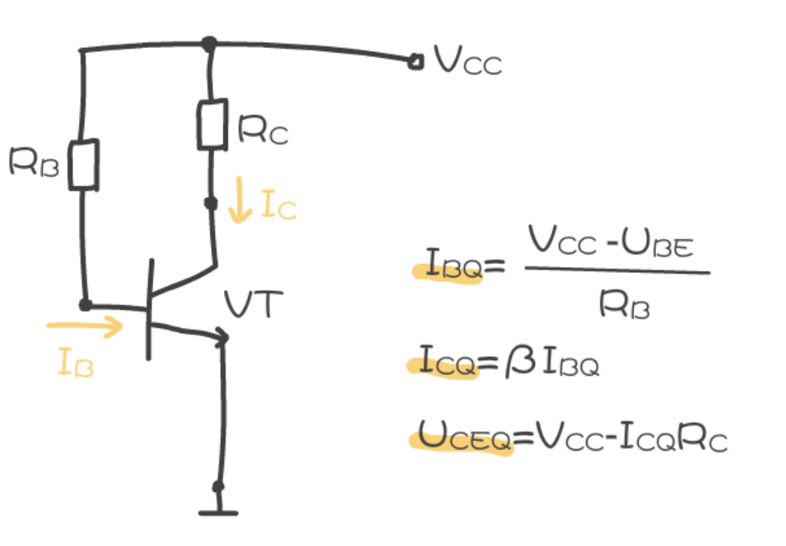

- Using $I_B$, $I_C$ and $V_{CE}$ and the V-I curve of transistors, the Q point can be found:

- The Q-point in the middle will be most proper.

#### 2.6: Small signal conductance 

For AC model:

we tend to think in terms of conductance g:

$$
\frac{1}{r_{AC}} = g_{ac} = \frac{\Delta I_{AC}}{\Delta V_{AC}}
$$

noted that we typically use $i_{ac}$ and $v_{ac}$ short for $\Delta I_{AC}$ and $\Delta I_{AC}$。

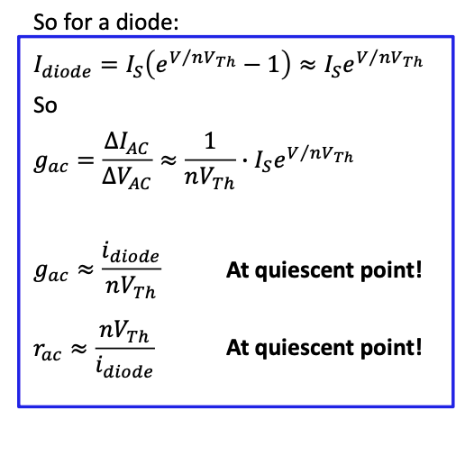

#### 2.7: Load line analysis 

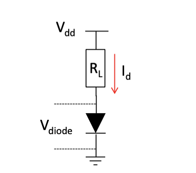

### 3: Noise 

- Noise refers to unwanted signals.

- Noise can originate in the sensor, lines or amps.

#### 3.1: Thermal Noise 

- Also known as Johnson-Nyquist noise.

- Thermal noise from random motions of electrons in conductors.

#### 3.2: Shot noise 

- Also known as Poisson noise.

- From the quantum nature of charge flow.

## II: Filters & Bode Plots 

### 1: Low Pass filter 

- For resistance, $Z_R=R$; for capacitance, $Z_C = X_C = \frac{1}{j\omega C} = \frac{1}{2\pi f C}$

- Low pass filter can be considered as a potential divider:

$$
V_{OUT} = V_{in}\times (\frac{Z_C}{Z_{total}})
$$

The total impedance $Z_{total}$ is given by:

$$
Z_{total} = \sqrt{R^2 +X_C ^2}
$$

So 

$$
V_{out} = V_{in} \times (\frac{X_C}{\sqrt{R^2+X_c ^2}})
$$

- If we increase the frequency, the output voltage will be:

And the gain in dB = 20log(Vout/Vin):

- This plot is known as a **Bode Plot**.

- There is a frequency at which $X_c = R$, which is know as the cut-off frequency ($f_c$).

- The cut-off frequency is 100 Hz as above.

- The gain in dB in $f_c$ usually defines the band-width.

### 2: High Pass Filter 

Use the same method, the formula is:

$$
V_{out} = V_{in} \times (\frac{R}{\sqrt{R^2 +X_c^2}})
$$

- If we increase the frequency, the output will be:

### 3: Multi-stage Filter 

$$
V_{out2} = V_{in1} * (\frac{R_1^2}{R_1^2+X_{c1}^2})
$$

### 4: Passive bandpass filter 

**A band pass filter** is to be constructed using RC components will only allow a range of frequencies to pass, calculating the 

- Note that the high pass filter defines the lower threshold.

## III: BJT transistors - the analog perspective 

### 1: Discrete BJT structure 

### 2: BJT large signal operation 

#### 2.1: Ebers Moll model for BJT

For example of NPN:

where $\alpha _F$ is the forward current gain:

$$
\alpha _F = \frac{I_C}{I_E}
$$

and 

$$
\beta _F = \frac{I_C}{I_B}
$$

with some operations we can also get the relation between $\alpha$ and $\beta$:

$$
\beta _F = \frac{\alpha _F}{1-\alpha _F}
$$

#### 2.2: Driving the BJT with V_BE and I_B

The collector current increases exponentially with $V_{BE}$.

|||
|---|---|

#### 2.3: BJT operating regions 

## IV: 2-port Network 

### 1: Two port analysis 

- Circuits are built from building blocks.
- Each of these blocks can defined has an input impedance and a Norton or Thevenin output stage as:

#### 1.1: Two port analysis of transistors 

- The common transistor types such as BJTs and MOSFETs operate by one terminal controlling the current flow between other 2 terminals. 
- They are therefore current sources with control.
- For BJT, the base is controlled by a current so the impedance is almost just resistance.
- The output impedance is really just the resistance from collector to emitter if we ignore the small internal capacitance.

#### 1.2: Two port analysis of Mosfet 

- For mosfet, the gate is controlled by a voltage so the impedance is just a capacitance.

- The output impedance is just resistance from source to drain.

#### 1.3: Hybrid pi model 

- The 2 port model can be used as the basis for circuit simulator.

#### 1.4: H parameter Model 

- The H parameter model uses the input current as one of variables.

- H11 is the input impedance

- H12 is the usually assumed to 0.

- H21 is the gain.

- H22 is the output impedance of transistor.

H method be like:

$$
\left(\begin{matrix}
    V_1 \\
    I_2
\end{matrix}\right)=\left(\begin{matrix}
    h_{11} & h_{12} \\
    h_{21} & h_{22} 
\end{matrix}\right)\left(\begin{matrix}
    I_1 \\
    V_2 
\end{matrix}\right)
$$

### 2: BJT Amplifier 

#### 2.1: The ideal Amplifier 

- Voltage gain = $A_{v} = \frac{V_{out}}{V_{in}}$

- Current gain = $A_{i} = \frac{I_{out}}{I_{in}}$

- Power gain = . $A_{p} = \frac{P_{out}}{P_{in}}$ 

#### 2.2: Th way to build amplifier 

- For example, the common-emitter amplifier:

- $I_E = I_C +I_B$

- Current gain $\beta = \frac{I_C}{I_B}$

#### 2.3: BJT single transistor amplifier

#### 2.4: BJT CE Large signal summary 

- CE amplifier: $v_{in}$ form base and $v_{out}$ from collector.

- $C_{in}$: AC isolation of input, preventing input from affecting Q point.

- $R_{B1}$ and $R_{B2}$: determine the base voltage independent of BJT types.

- $R_C$: set the gain of circuit which cannot be too large.

- $R_{E1}$: improve the impedance of the amplifier.

- $R_{E2}$: Set the voltage level of Q point / make the output independent of $\beta$ 

- $C_{out}$: AC isolation of the output.

#### 2.5: Transistor biasing 

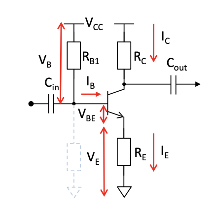

- As $I_B = (V_CC-V_{BE})/R_{B1})$, $I_B$ is limited by $R_{B1}$.

- $R_E$ will reduces the gain. 

- We can also use the $R_{B}$ to bias the $V_B$, while pay for extra loss of power.

- Add the $C_E$ as bypass capacitor.

#### 2.6: BJT CE amplifier - small model summary 

#### 2.7: BJT CE small model analysis

- First, remove the capacitors (treated as wires) and the DC Vcc.

- Second, rearrange to small model.

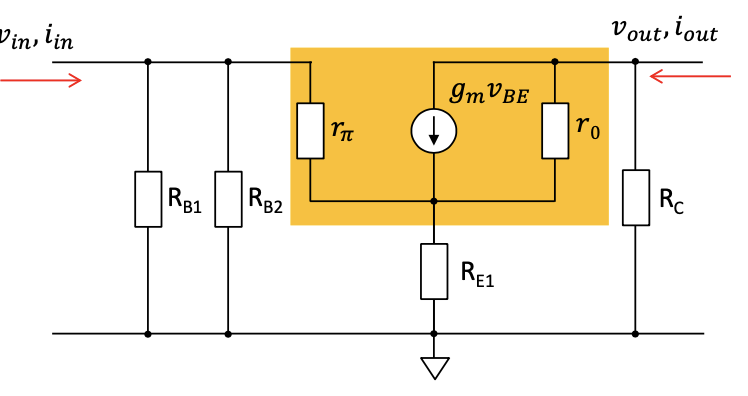

- $r_{\pi}$ and $r_0$ is the resistance of BJT.

- $g_m = \frac{i_c}{v_{BE}}$, so $g_m v_{BE}$ is the $i_c$.

- Consider the input impedance:

The input impedance $r_{in}$ is defined as $r_{in} = \frac{v_{in}}{i_{in}}=R_{B1}||R_{B2}||r_x$. $r_x$ is the impedance from transistor and $R_{E1}$.

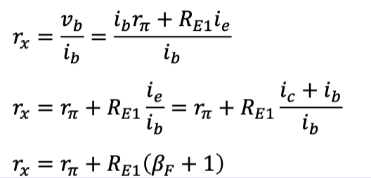

- $r_{in} = R_{B1} || R_{B2} || (r_{\pi}+\beta _FR_{E1})$

- Consider the output impedance, $r_{out} \approx R_C || (r_0+R_{E1})$, which is approx to $R_C$.

- The voltage gain is given by $A_V=\frac{v_{out}}{v_{in}}$.

- $v_{out} = -i_c R_c = -\beta_F i_b R_C$

$$
\begin{aligned}
    v_{in} &= v_{b} \\
    &= r_{\pi}i_b + i_eR_{E1} \\
    &= i_b(r_{\pi} + (\beta _F +1)R_{E1})
\end{aligned}
$$

so $A_V = \frac{-\beta _FR_C}{r_{\pi} + \beta _F R_{E1}}$

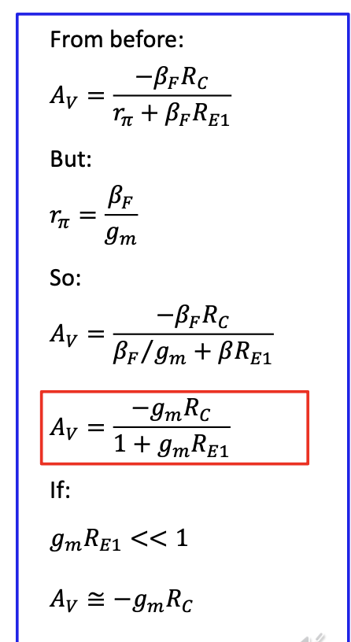

#### 2.8: Example of CE BJT analysis 

##### 2.8.1: Setting up the DC characteristics 

- The AC signal is assumed ton be small compared to the DC, so it can be considered later.

- The first step is to review the transistor data sheet and decide the Q point.

- The transistor curves can be generated using simulation software:

- First, we assume that $V_{cc} = 10V$ in this condition, then we choose $V_{CE} = 5V$, almost half of $V_{CC}$ is common. If we choose $I_b = 40\mu A$, then we can mark the Q point in the graph.  

- Then we can find that the $I_c$ value and the gain ($\frac{I_C}{I_B}$) can be defined.

- It would be reasonable to choose the line to make sure the Q point is in the m idle of the curve.

- The next step is to calculated the $R_C$, which control the gain (the larger the $R_C$ is, the larger the voltage $R_C$ have will be larger, so that increase the gain). According to voltage divider, we assumed that $V_{RE1} + V_{RE2} = 1 V$ to keep it small.

- The total voltage $V_{CC} = V_{RE1} + V_{RE2} + V_{CE} + V_{RC}$, then $V_{RC}$ can be calculated.

- Using the Ohm's Law, $R_C = \frac{V_{RC}}{I_C}$.

- **Up to now, we have defined the value of $I_B$, $I_C$, $R_C$ and the voltage cover two $R_E$.**

##### 2.8.2: Calculating the emitter resistors 

- We know the $I_E = I_C + I_B$ according to the KCL.

- Using Ohm Law on $I_E$, we can find that $R_{E1} + R_{E2}$ can be defined by $\frac{1}{I_E}$.

- We need a small value of $R_{E1}$ so we define that $R_{E1} = 5 \Omega$. The other resistor can be calculated.

##### 2.8.3: Calculating the Bias resistors

- The bias resistors are in the circuit to ensure the base voltage. The current flowing down the $\frac{R_{B1}}{R_{B2}}$ chain is chosen to be many times that of $I_B$. So we choose $I_{RB2} = 20 \times I_B$.

- As we know $V_{R_{B2}} = V_B = V_{RE1} +V_{RE2} + V_{BE} $, $V_{BE}$ is given if the type of the transistor is vested.

- Using Ohm Law, the $R_{B2} = \frac{V_{RB2}}{I_{RB2}}$

- Applying KCL, $I_{RB1} = I_{RB2} + I_B$.

- The voltage across $R_{B1} = V_{CC} - V_{RB2}$, so the $V_{RB1} = R_{B1} \times I_{RB1}$.

##### 2.8.4: Setting up the AC characteristics 

- Using the two-port model to simplify the CE BJT, we can get the formula of the voltage gain:

$$
A_V = \displaystyle\frac{-g_m R_C}{1+g_m(R_{E1} + R_{E2})}
$$

- We can find that the emitter resistors reduce the gain. However, the bypass capacitor helps as iof we choose the value of $C_E$, it will short-cut $R_{E2}$.

- The bypass capacitor is there making the effect of the larger emitter resistor disappear for the AC signal so it is in effect a kind of filter:

$$
f_C = \frac{1}{2\pi RC}
$$

So we can use:

$$
f_C = \frac{1}{2\pi R_{E2} C_E}
$$

- If we want the frequencies above 20 Hz to pass through so we can take $f_C=20$ Hz.

- Then we can calculate $C_E$.

- The value of $C_{in}$ and $C_{out}$ can be choose depends on the type of signal.

- The $R_L$ is also be chosen depends on conditions.

#### 2.9: Common collector amplifier 

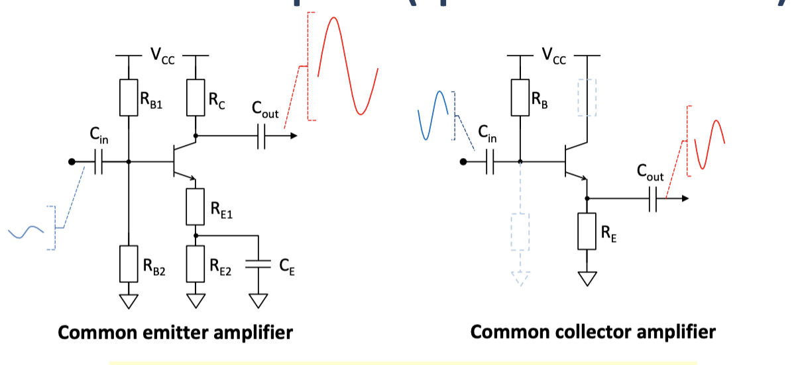

- The output of CC is connected to the emitter.

- The gain of CC is approx to 1.

- High impedance in and low impedance out.

## V: FET Transistors 

### 1: MOSFET large signal operation

- Note that we discuss the enhancement mode only.

#### 1.1: MOSFETs operation

|||
|----|----|

#### 1.2: BJT vs MOSFET 

#### 1.3: Saturation drain current variance with $V_{GS$

#### 1.4: Channel length modulation 

#### 1.5: Summary 

### 2: MOSFET small signal operation 

#### 2.1: MOSFET complete small signal 

#### 2.2: MOSFET simplified small model 

#### 2.3: MOSFET operational speed 

- Lets assume the dominant capacitance is the GS capacitance.

- The general formula for unity gain current frequency $f_T$ for an R-C combination is given by: 

$$
f_t = \frac{1}{2\pi RC}
$$

- $r=\frac{1}{g}$ where g is conductance.

So $f_t = \frac{g}{2\pi C}$

- If we only calculate the most significant $C_{GS}$:

$$
f_T = \frac{g_m}{2\pi C_{GS}}
$$

### 3: MOSFET single transistor amplifier 

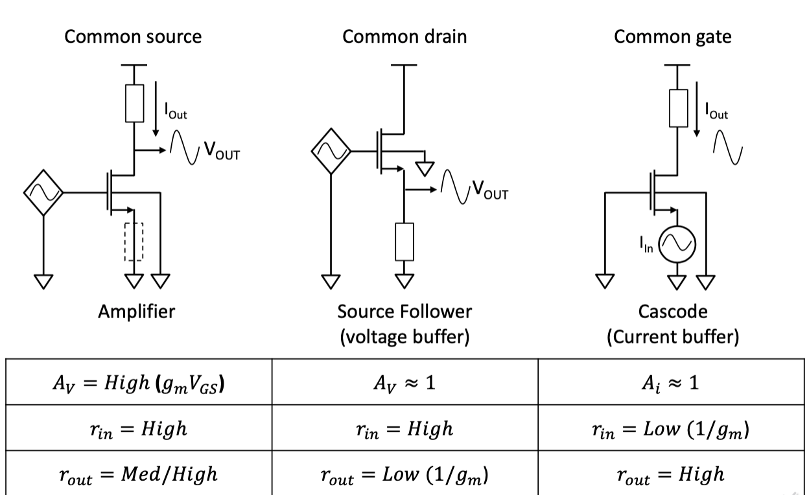

#### 3.1: MOSFET Common source amplifier 

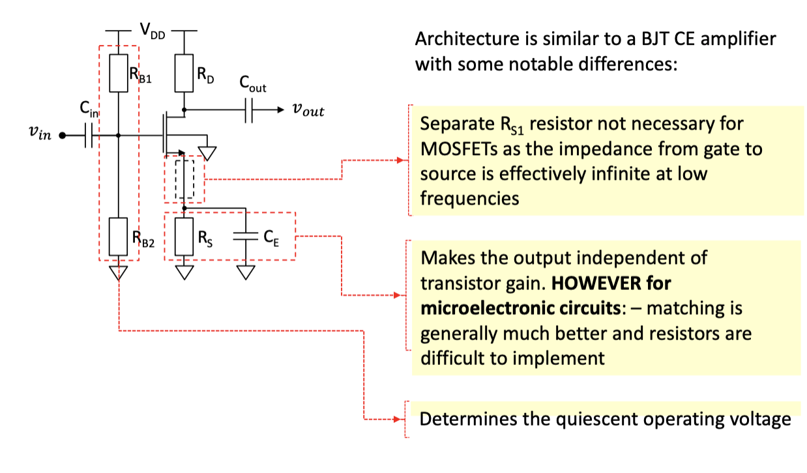

#### 3.2: MOSFET Common drain amplifier 

### 4: MOSFET as a Resistor (diode connected MOSFET)

#### 4.1: Diode connected MOSFET 

- $V_{DS} = V_{GS}$, so $V_{DS} > V_T$, device is always in saturation.

- As the device is in saturation, so the drain current is given by:

$$
I_D = K(V_{GS} - V_T)^2
$$

- But we want to find the output voltage:

$$
V_{OUT} = V_{DS} = $V_{GS$
$$

Then we get:

$$
V_{OUT} = V_T + \sqrt{\frac{|I_{sig}|}{K}}
$$

#### 4.2: Diode connected MOSFET as active resistor 

- Connecting the gate to the drain means that $V_{DS}$ controls $I_D$, therefore the transconductance becomes the channel conductance, the total resistance is given by:

$$
r = \frac{1}{g_m +g_{mb} + g_{ds}}
$$

- However, if the body effect is small, and we use long channel transistors, $g_m$ becomes dominant:

$$
r = \frac{1}{g_m}
$$

#### 4.3: Active resistor potential divider 

- $g_m = \frac{dI_D}{dV_{GS}} = 2K[V_{GS} - V_T]$.

- $K = \frac{\mu C_{ox}}{2}\frac{W}{L}$

- Lets consider the strong inversion case:

$$
r = \frac{1}{g_m}
$$

- So for a potential divider:

$$
V_{OUT} = \frac{R_2}{R_1 + R_2}V_{DD}
$$

- $V_{OUT}$ can be altered by varying W and L in each transistor, this is ideal for integration into a micro-chip.

##  VI: Power Amplifier 

### 1: Power Amplifier classes 

- Common emitter and common drain amplifier are considered as class A amplifiers - single active device (transistor)

- There are other classes:

### 2: Power Amplifier classes (by power usage)

#### 2.1: Class A - eg. Common Emitter 

##### 2.1.1: Efficiency 

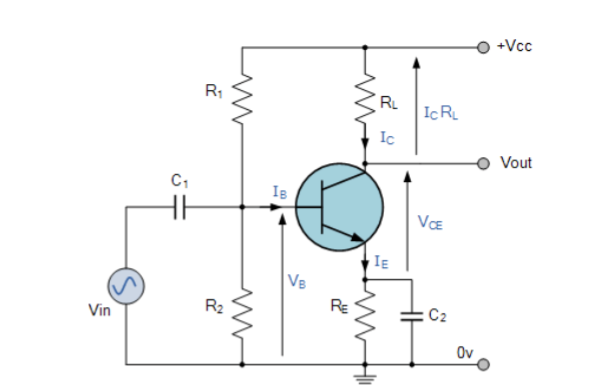

- we need to understand how efficient our amplifier are.

- Consider the common-emitter amplifier.

- To set up the amplifier, we first arrange the DC bias conditions, which puts the transistor at the Q-point and $I_B$:

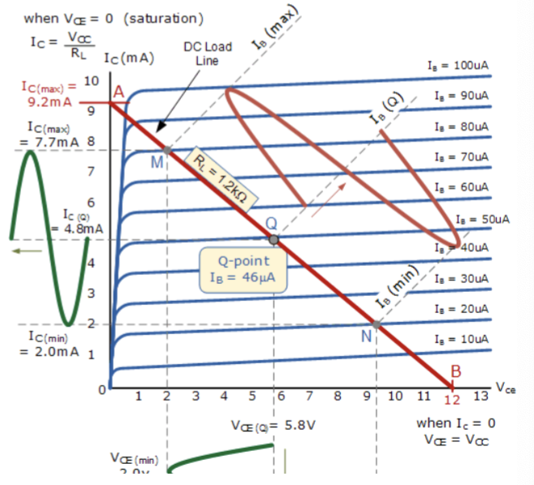

- The red line is the load line and $i_c$(max) is $\frac{V_{cc}}{R_L}$ and B is $V_{cc}$

- As an AC signal is applied on top of the bias, the base current $I_B$, travels up and down the load line. Imagine that the signal causes $I_B$ to vary between the points M and N for example.

- That will cause $V_{CE}$ and $I_C$ to vary as the green waves.

##### 2.1.2: Quality 

- There are other potential problems as well. The common emitter amplifier works well if the AC input signal is small.

- If the signal gets too large, then eventually the base current could "hit" either access axis ($V_{CE}$ or I_C axes)

- In fact this problem becomes an issue as soon as the output signal reaches $V_{cc}~V_{CE-SAT}$.

|||
|----|----|

##### 2.1.3: MOSFET clipping distortion 

##### 2.1.4: The Wrong Bias 

- if the transistor is biased wrongly then the signal might also get clipped even if the AC input is small.

- Suppose for example, the Q point was chosen to be N by mistake. Then even for a small AC input, the output might be clipped in the negative half.

##### 2.1.5: Frequency Effects 

- The transistor will not amplify all frequencies equally - that can distort a more complex signal that has multiple frequencies.

##### 2.1.6: Power analysis - class A 

- Imagine common-emitter amplifier powering a resistive load.

- Then load receives the amplified $I_c$ wave (green) with magnitude.

- The amplified wave is usually smaller than the quiescent current.

- In fact the amplified wave should never have a peak-peak current greater than 2$I_Q$. So output power is much smaller than that consumed.

##### 2.1.7: Class A amplifier: summary 

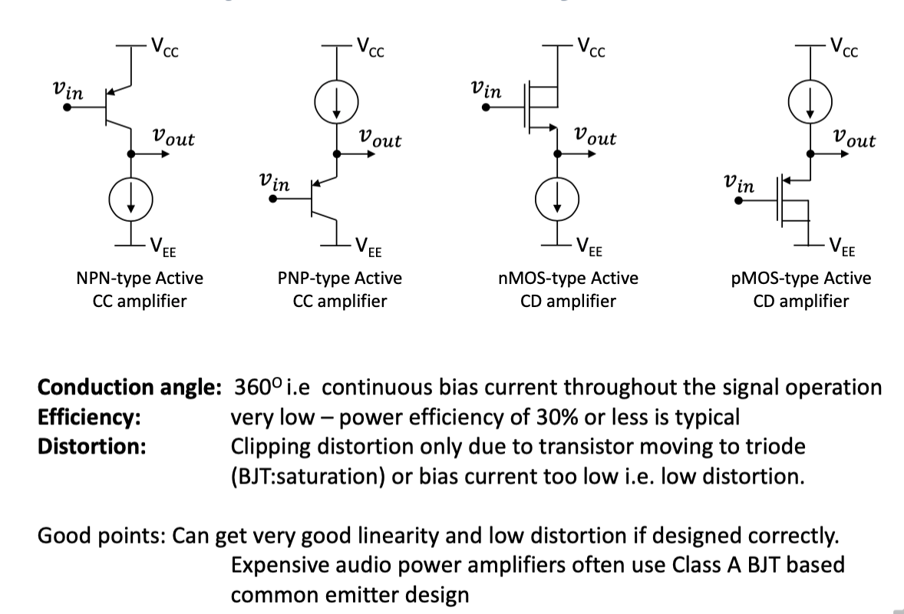

#### 2.2: Class B 

##### 2.2.1: Class B push pull amplifier

- To improve efficiency compared to a Class A amplifier, we may try to eliminate the dissipation at zero output. That means, we aim to design an amplifier whose dissipation is zero when $v_{in} = 0$

- The solution will be Class B push-pull output stage.

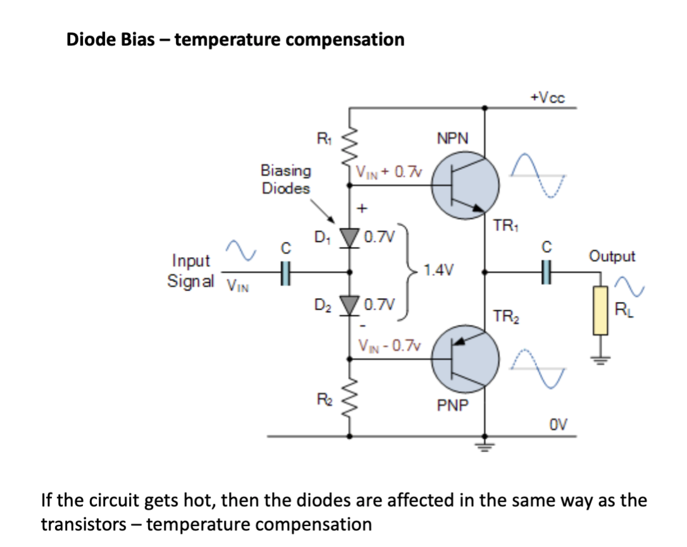

##### 2.2.2: Class B amplifier crossover distortion 

##### 2.2.3: Power analysis - Class B 

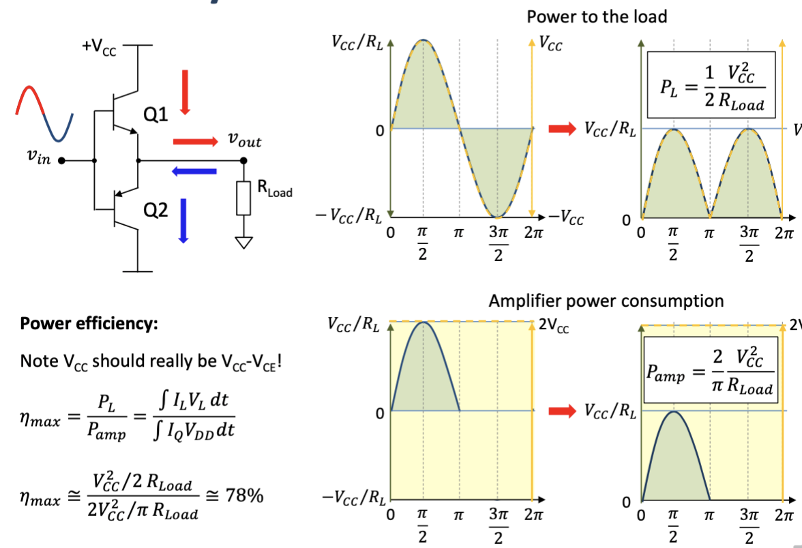

##### 2.2.4: Summary 

#### 2.3: Class AB 

##### 2.3.1: Class AB power amplifier 

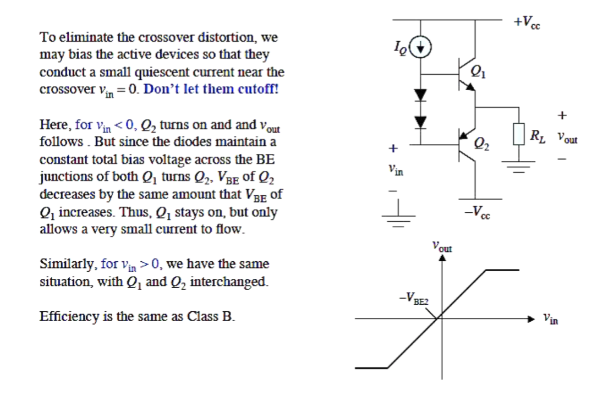

##### 2.3.2: Crossover distortion improvement in Class AB

##### 2.3.3: Summary 

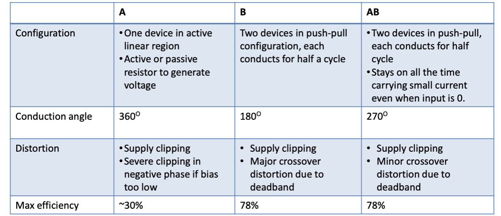

## VII: Operational Amplifier 

