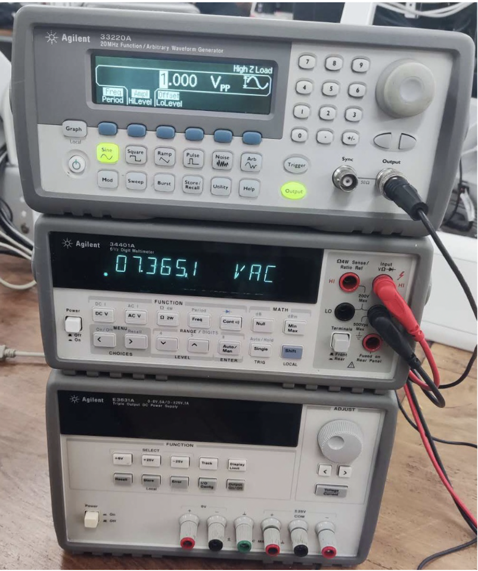

Operational Amplifier Lab Report 

Ziyu Tian 

## Abstract 

This experiment explored the properties of inverting operational amplifiers (op-amps in short), which contain the plotted frequency response graphs, gain-bandwidth product, slew rate and offset voltage, validated the mathematical function of the summing op-amp and difference op-amp, discussed how the Common Mode Rejection Ratio (CMRR in short) affect the efficiency of amplifier.

## Introduction 

The op-amp is a very high-gain (open-loop gain tending to infinity), DC-coupled differential voltage amplifier with very large (tending to infinity) input impedance and extremely low output impedance[1], which has six terminals: one non-inverting input is denoted by positive (+) sign, one inverting denoted by (−) sign, two where positive and negative power supplies (+VCC and −VCC or V+, & V−), as shown in Fig.1. As a active circuit element, op-amp is designed to perform mathematical operations of addition, subtraction, multiplication, division, differentiation, and integration[2].

Fig.1.[1] The Op-amp in symbolic (left) and IC (right) form  

This experiment aimed at validating the definition of bandwidth, cut-off frequency, slew rate, distortion phenomenon and the offset voltage of inverting op-amps, exploring the operation of the summing and difference op-amps with CMRR properties. To achieve the aims above, the tasks have been done as below:

- Calculate the total gain using the $V_{out}$ and $V_{in}$ in oscilloscope.

- Determine the bandwidth using the gain-bandwidth product provided in data sheet shown in Fig.2.

Fig.2. The Op-amp data sheet 

- Plot the frequency response and determine the cut-off frequency, then change another set of resistance ratio repeating the test above.

- Increase the frequency, observe the full power bandwidth then calculate the slew rate.

- Reconnect the circuit, determine the offset-voltage.

- Change the circuit to summing op-amp and difference op-amp, observe the operations and calculate the CMRR.

## Procedure 

- For inverting amplifier experiment, we use the op-amp designed as Fig.3 with $R_1=1$k$\Omega$. Apply the input as 1 kHz, 0.1 $V_{pp}$, then observe and record the $V_{in}$ and $V_{out}$ to calculate the gain using formula:
$$
A_{experiment}= \displaystyle\frac{V_{out}}{V_{in}}\tag{1.1}
$$

$$
A_{theory}= -\displaystyle\frac{R_2}{R_1}\tag{1.2}
$$

Fig.3. The inverting op-amp 

then compare the gain with theoretical value calculated by formula 1.2. Change $R_2$ to 470 $\Omega$ and voltage to 0.025 $V_{pp}$ do the above procedure again.

- Increase the frequency, measure the gain up to the cut-off frequency and plot the data. Observe the cut-off frequency from the graph and calculate the the bandwidth using the formula:

$$
Bandwidth = \displaystyle\frac{GBP}{Gain}\tag{2}
$$

- Change $R_2$ to 10 k$\Omega$ and repeat the steps measuring frequency response. Compare these result with the theoretical values in data sheet (Fig.2).

- Change the values of both $R_1$ and $R_2$ to 10 k$\Omega$ with the input signal of 1 kHz.

- Adjust the input signal until the output signal has a $V_{pp}$ of 10 V.

- Keep the input signal in same level, increase the frequency until the output signal distorts. Record the full power bandwidth at the frequency distortion begin point. Then keep increasing the frequency until the triangle wave occurs, record this value of frequency.

- Add $V_{pp}$ and period measurements in the oscilloscope, calculate the slew rate of this op-amp using the formula:

$$
Slew\quad rate = \displaystyle\frac{dV}{dt} = \frac{V_{pp}}{\frac{1}{2}T}\tag{3}
$$

then compare this value with the theoretical slew rate in data sheet Fig.2.

- Reconnect the circuit with Fig.4 and set $R_1$ = 1 k$\Omega$ and $R_2$ = 470 k$\Omega$. 

Fig.4. Off-set voltage Calculation 

- According to the formula:

$$
V_o = (1+\displaystyle\frac{R_2}{R_1})V_{off}\tag{4}
$$

measuring the output voltage $V_o$, then calculate the offset voltage.

- Construct the summing circuit designed as Fig.5, with $R_1$ = 10 k$\Omega$ and $R_2$ = 22 k$\Omega$.

Fig.5. Summing op-amp 

- Connect one of the summing op-amp input to 1 kHz sine wave with 100 $mV_{pp}$.

- Connect the lower terminal of potentiometer to ground and the upper terminal to +15 V pin, then connect the potentiometer output to another input of the summing op-amp. So that the input voltage of the op-amp can be adjusted easily.

- Increase the DC input using potentiometer, then observe and record the summing effect of the output signal.

- Construct the difference amplifier designed as Fig.6 with $R_1$ = 1 k$\Omega$, $R_2$ = 22 k$\Omega$.

Fig.6. Difference op-amp 

- Connect the both input of the op-amp to 1 $V_{pp}$, 1 Hz sine wave, which is the common mode of amplifier.Measure the output using multimeter, calculated the gain in this condition, $A_{CM}$.

- Keep one of the op-amp input 1 kHz sine wave, change another input to the ground. Measure the output using multimeter, calculated the gain in this condition, $A_{DM}$.

- Determine the Common Mode Rejection Ratio (CMRR) using the formula given by:

$$
CMRR = 20\log_{10}{\displaystyle\frac{A_{DM}}{A_{CM}}}(dB)\tag{5}
$$

## Results and Discussion 

In terms of the measured data of the inverting amplifier experiment, $V_{out1} = 980$ m$V_{pp}$ and $V_{in1} = 113$ m$V_{pp}$ when $R_2 = 10$ k$\Omega$ and $V_{out2} = 12.25$ $V_{pp}$ and $V_{in1} = 0.025$ $V_{pp}$ when $R_2 = 470$ k$\Omega$, as shown in Fig.7.1 and Fig.7.2. 

Fig.7.1 Gain when $R_2$ = 10 k$\Omega$ 

Fig.7.2 Gain when $R_2$ = 470 k$\Omega$ 

Using formula (1.1), the gain can be generate as:

$$
A_1 = \displaystyle\frac{V_{out1}}{V_{in1}} = \frac{980}{113} = 8.67
$$

$$
A_2 = \displaystyle\frac{V_{out2}}{V_{in2}} = \frac{12.25}{0.025} = 490
$$

These values follow the theoretical values calculated using formula (1.2), which validate the theory results.

According to formula (2) and GBP = 3 MHz from data sheet in Fig.2, we can calculate the bandwidth of these two sets of data:

$$
Bandwidth_1 = \displaystyle\frac{GBP}{gain_1} =346\quad kHz 
$$

$$
Bandwidth_2 = \displaystyle\frac{GBP}{gain_2}= 6\quad kHz 
$$

Using the data generated above, we can plot the frequency response of $A_1$ and $A_2$ in Fig 8.1 and Fig.8.2, respectively.

Fig.8.1 Frequency response of $A_1$ 

Fig.8.2 Frequency response of $A_2$ 

We can find the $f_{cut1} \approx 340$ kHz and $f_{cut2} \approx 6$ kHz according to the graphs, which almost equal to the calculated bandwidth above in acceptable error range.

In the distortion limit test, the Fig.9.1 shows the frequency which wave begin to distort, i.e. the full power bandwidth $f_{FPBW} = 528.8$ kHz.

Keep increasing the frequency, we recorded the triangle wave beginning frequency shown in Fig.9.2, which frequency is 700.3 kHz.

Fig.9.1 The frequency that distort begins 

Fig.9.2 The frequency that triangle wave begins 

As the $V_{pp} = 11.7$ V and $T$ = 1.89 $\mu s$ in Fig.9.1, the slew rate can be calculated using formula (3):

$$
slew \quad rate = \displaystyle\frac{11.7\quad V}{\frac{1.89}{2}\mu s} \approx 12.38 \quad V/\mu s
$$

This value is similar to the value in data sheet (Fig.2), which is 13 V/$\mu s$. 

Slew rate is defined as the maximum rate of change of the output voltage of an op-amp and is given in unit of volts per microsecond[3]. The large slew rate means the op-amp can respond the change rapidly, which is excellent for amplifier.

In the off-set voltage calculation test, the output voltage can be read from Fig.10, i.e. $V_{out} = 0.2$ V. 

Fig.10 Off-set voltage 

Using formula (4), the $V_{off}$ can be generate:

$$
V_{off} = \displaystyle\frac{R_1}{R_1+R_2}V_o = 0.42\quad mV
$$

During the exploring of the summing amplifier, we got two graphs which record the summing effect in Fig 11. We put the vertical cursor at the no summing op-amp and fix this cursor when increasing the DC input. As Fig.11 shown, the phase of wave shifted after the summing DC input, which shows the summing effect.

|||
|---|---|

Fig.11 Effect of summing effect 

The summing amplifier can add several weighted signal, which can be applied in summing operation of mathematical calculation. It can also be used as digital to analogue convertor (DAC).

For example, a binary weighted ladder can be designed as Fig.12

[4]Fig.12 Summing amplifier application in DAC 

In the difference amplifier experiment, the $V_{out}$ of difference mode and common mode were recorded using multimeter in Fig.13.1 and Fig.13.2. As $V_{in}$ = 1 $V_{pp}$, the gain of common mode and difference mode can be generated directly: $A_{DM} = 7.37$ and $A_{CM}$ = $0.5 \times 10^{-3}$. Using formula (4) the CMRR can be calculated:

$$
CMRR = 20\log_{10}{\displaystyle\frac{A_{DM}}{A_{CM}}} = 83.37\quad dB
$$

For a good op-amp, a very large change in common-mode voltage should change the output by 1 V, while a relatively much smaller differential voltage should change the output by 1 V. Therefore, a larger value of CMRR corresponds to a better op-amp quality.[5]

Fig.13.1 Difference-mode $V_{out}$ 

Fig.13.2 Common-mode $V_{out}$ 

## Conclusion

This experiment explored and validated the gain of inverting op-amps with two sets of different resistance ratio.

Using the data observed from oscilloscope, the frequency response was plotted with the bandwidth and cut-off frequency estimated. The results follow the theoretical rules in acceptable error range.

During the distortion test, the calculation of slew rate, full power bandwidth and offset voltage validate the phenomenon of distortion.

In the exploration of summing and difference amplifier, the graphed waves of summing effect verified the result of two weighted signal summing, which can be applied in DAC devices. From the difference amplifier, the calculated CMRR shows the importance property of op-amps.

## References 

[1]:R.Prasad, *Analog and Digital Electronic Circuits*. Springer, 2021, p.678.

[2]C.K.Alexander and M.N.O.Sadiku, *Fundamentals of electric circuits*. New York, Ny: Mcgraw-Hill Education, 2017, p.599.
‌
[3]:R.Prasad, *Analog and Digital Electronic Circuits*. Springer, 2021, p.690.
‌
[4]C.K.Alexander and M.N.O.Sadiku, *Fundamentals of electric circuits*. New York, Ny: Mcgraw-Hill Education, 2017, p.652.

[5]:R.Prasad, *Analog and Digital Electronic Circuits*. Springer, 2021, p.691.
‌

