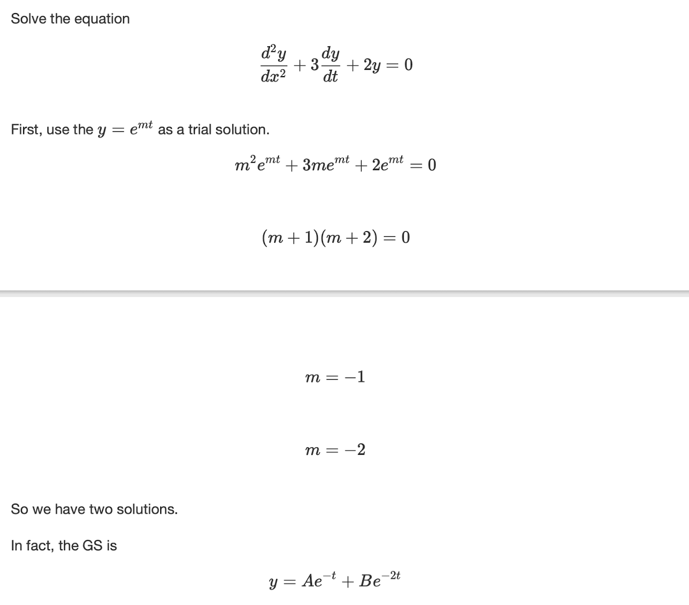
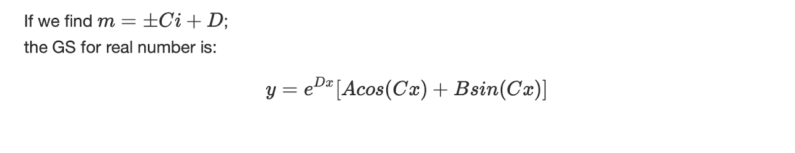
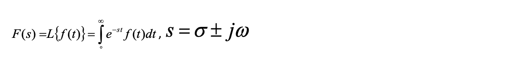
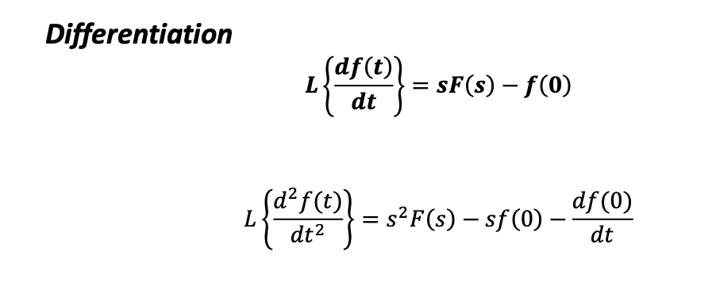

# Automatic Control Systems 

- **Control variables**: is the output of system that is measured or controlled.

- **Plant**: The plant is tge piece of equipment which performs a particular operation.

- **Dynamics**: properties describing the behavior of the system.

## 1: Dynamic Systems and Control 

### 1.1: System model 

- The model is derived from the ODE describing the system, which can be obtained by analyzing the physical processes.

#### 1.1.1: Electrical system 


#### 1.1.2: Mechanical System 


### 1.2: First-order ODE 

#### 1.2.1: Analytic Methods 

- Separating variables:


- Integrating factor:


#### 1.2.2: Numerical solution (using Simulink)

- For example of $Ax' +Bx = u$:


- Note that the initial condition can be changed in the integrator block.

#### 1.2.3: First-order ODE summary 

- The system is considered stable if reaches steady state.

- For sin input, output follows input after transient with changes in magnitude.


### 1.3: Second order ODE 

#### 1.3.1: Analytical solution 

- For real and not equal roots:



- For equal roots:


- For complex roots:




#### 1.3.2: Undamped system 


#### 1.3.3: Space of roots 


#### 1.3.4: Natural frequency, damping frequency and damp factor 

- For a second order ODE shown as below:

$$
x'' + 2\zeta \omega_n x' + \omega_n ^2x = 0
$$

- $\zeta$ is the damping factor and $\omega_n$ is the natural frequency of the system.

- The root can be gained from $\zeta$ and $\omega_n$.


#### 1.3.5: NonHomogeneous (NH) ODE 

- $x''+Ax'+Bx = u$


## 2: Transfer functions 

- Using the Laplace Transform, we can convert the the TF in time-domain to s-domain.



- Formula for differentiation:



### 2.1: Characteristic Equation and Order 

- The Characteristic equation (CE) is the denominator of transfer function.

- The order of the ODE is the order of the system.

- In s-domain, it can also be determined by the order of 's'.

### 2.2: Pole location in s-plane 

- In $G(s) = \frac{N(s)}{D(s)}$, the roots of numerator are called zeros and the roots of denominator is called poles.


- MATLAB methods to find roots of polynomial:

```MATLAB
num = [1 4];
den = [1 3 -6];
roots(num);
```

- MATLAB methods to find poles/zeros plot:

```MATLAB
num = [1 4];
den = [1 3 6];
G = tf(num,den);
pzmap(G);
[p,z] = pzmap[G];
```


- The function 'conv' can be used to combine two terms.

### 2.3: Final value theorem 

- The final-value theorem can be used to determine the ss value.


### 2.4: Block diagram 


- In matlab,

```MATLAB 
G = series(g1,g2);
G = parallel(g1,g2);
```


## 3: Time domain Characteristic 

- The input signals can be one of below:


- To find the step response using matlab:

```MATLAB
step(num,den,15);
```


- The transfer function can be expressed as form of:
$$
\displaystyle\frac{Y(s)}{X(s)}=\frac{k}{\tau s+1}
$$

- $\tau$ is the time constant.

### 3.1: Second order systems 

- The second order system can be expressed in the form of:


### 3.2: Time-domain Characteristic in graph 


### 3.4: Extra poles and zeros