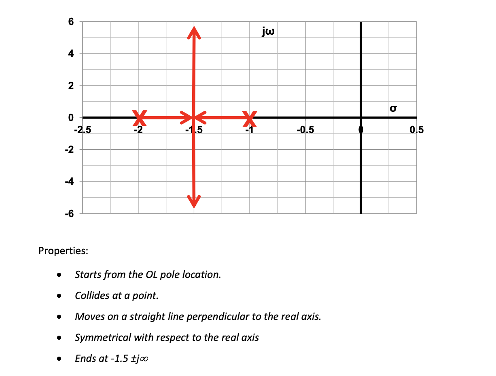
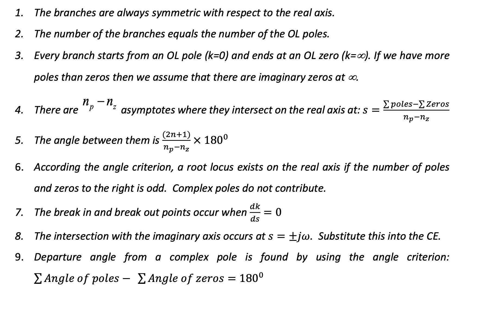
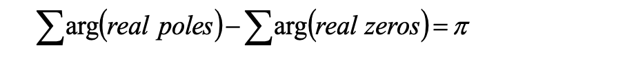
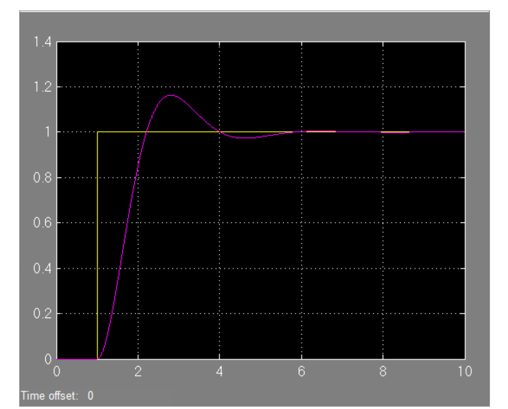
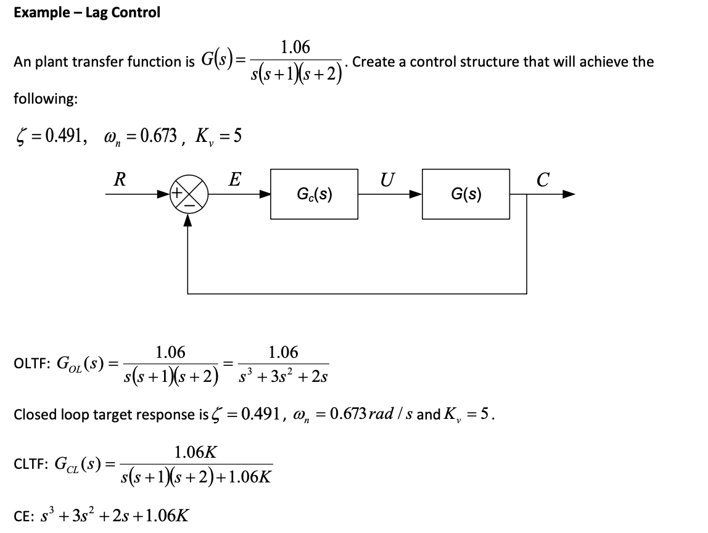

# Automatic Control Systems 

- **Control variables**: is the output of system that is measured or controlled.

- **Plant**: The plant is tge piece of equipment which performs a particular operation.

- **Dynamics**: properties describing the behavior of the system.

## 1: Dynamic Systems and Control 

### 1.1: System model 

- The model is derived from the ODE describing the system, which can be obtained by analyzing the physical processes.

#### 1.1.1: Electrical system 


#### 1.1.2: Mechanical System 


### 1.2: First-order ODE 

#### 1.2.1: Analytic Methods 

- Separating variables:


- Integrating factor:


#### 1.2.2: Numerical solution (using Simulink)

- For example of $Ax' +Bx = u$:


- Note that the initial condition can be changed in the integrator block.

#### 1.2.3: First-order ODE summary 

- The system is considered stable if reaches steady state.

- For sin input, output follows input after transient with changes in magnitude.


### 1.3: Second order ODE 

#### 1.3.1: Analytical solution 

- For real and not equal roots:


- For equal roots:


- For complex roots:


#### 1.3.2: Undamped system 


#### 1.3.3: Space of roots 


#### 1.3.4: Natural frequency, damping frequency and damp factor 

- For a second order ODE shown as below:

$$
x'' + 2\zeta \omega_n x' + \omega_n ^2x = 0
$$

- $\zeta$ is the damping factor and $\omega_n$ is the natural frequency of the system.

- The root can be gained from $\zeta$ and $\omega_n$.


#### 1.3.5: NonHomogeneous (NH) ODE 

- $x''+Ax'+Bx = u$


## 2: Transfer functions 

- Using the Laplace Transform, we can convert the the TF in time-domain to s-domain.


- Formula for differentiation:


### 2.1: Characteristic Equation and Order 

- The Characteristic equation (CE) is the denominator of transfer function.

- The order of the ODE is the order of the system.

- In s-domain, it can also be determined by the order of 's'.

### 2.2: Pole location in s-plane 

- In $G(s) = \frac{N(s)}{D(s)}$, the roots of numerator are called zeros and the roots of denominator is called poles.


- MATLAB methods to find roots of polynomial:

```MATLAB
num = [1 4];
den = [1 3 -6];
roots(num);
```

- MATLAB methods to find poles/zeros plot:

```MATLAB
num = [1 4];
den = [1 3 6];
G = tf(num,den);
pzmap(G);
[p,z] = pzmap[G];
```


- The function 'conv' can be used to combine two terms.

### 2.3: Final value theorem 

- The final-value theorem can be used to determine the ss value.


### 2.4: Block diagram 


- In matlab,

```MATLAB 
G = series(g1,g2);
G = parallel(g1,g2);
```


## 3: Time domain Characteristic 

- The input signals can be one of below:


- To find the step response using matlab:

```MATLAB
step(num,den,15);
```


- The transfer function can be expressed as form of:
$$
\displaystyle\frac{Y(s)}{X(s)}=\frac{k}{\tau s+1}
$$

- $\tau$ is the time constant.

### 3.1: Second order systems 

- The second order system can be expressed in the form of:


### 3.2: Time-domain Characteristic in graph 


### 3.4: Extra poles and zeros

- If we have only one pole (or pair of complex roots) that is closed to the real-axis then we say this pole is the **DOMINANT** pole for the system.

- The dominant poles must be at least five to ten times closer to the imaginary axis than others.

- If the pole is far away from i-axis, it can be ignored in TF.


## 4: Closed loop system 


- For the system, with inputs back to system to sees output, this is called Feedback.

- A system with feedback is called a closed-loop system.


- For a general CL system:


- Use the MATLAB instruction to calculate feedback CLTF:

```MATLAB 
gcl = feedback(gol,h);
```

- $\omega_n$ and $\zeta$ can also be found:


### 4.1: Systems classification 


- The systems can also can be classified by the number of poles at the origin OL system:


### 4.2: Error constants 


- Marginally stable means the poles are in the i-axis, so $ s = j\omega$:


## 5: Root Locus 


- For example of a first-order system:


- For a second-order system:




- Matlab instruction to draw root locus:

```MATLAB 
rlocus(g1);
```

### 5.1: Graphical method 


### 5.2: Angle and magnitude conditions 

- For the transfer function:

$$
G_{CL}(s) = \displaystyle\frac{G(s)}{1+G(s)H(s)}
$$

- To make sure the poles in the roots locus:

$$
|G(s)H(s)| = -1
$$

and 


### 5.3: The graphical and analytic method to justufy the root-locus point 

- Graphical methods:


- Analytic methods:


### 5.4: Design Summary of root locus 




## 6: PID control 

- 'P' for proportional, 'I' for integration, 'D' for differentiation.


- For a PID controller:


### 6.1: PID tuning 

- Ziegler Nichols I:


- Ziegler Nichols II:


## 7: Design Based on Root Locus 

### 7.1: Lead Control 

- Lead control is similar to PD control. It is used when ss properties of the system is fine but poor performance of response time, i.e. we want to move poles without changing the gain very much.


- The method is add a zero and a pole simultaneously (according to the Argument Criterion, $\sigma \arg{poles} - \sigma \arg{zeros} = \pi$).

- The pole would be moved left, so that increase the response time.

#### 7.1.1: Design Strategy 

- Using the desired condition of $\omega_n$ and $\zeta$ to find the roots of CLTF.

- Check if a P-controller is enough.

- Place the zero at the real-part of the desired pole location (diminished pole and zero argument).

- Using Magnitude Angle Criterion finding position of compensated pole:



- Using Magnitude Criterion ($|GH| = 1$)finding the K.

#### 7.1.2: Example of lead control 


- Try P-controller firstly.

- The CL poles can be found:


- Finding the K:


- The result not suitable for the desired system:



- Try Lead-Controller:

- The desired roots of poles:


- Finding compensated pole location:


- The system response faster compared to the P-controller:

|---|---|
|||


### 7.2: Lag Control 


### 7.2.1: Example of Lag Control 




