# Computer Systems and Microprocessors 

## I: Background

### 1: Fundamentals of CMOS 

#### 1.1: Transistor fundamentals: NMOS 

* NMOS, i.e. Negative Metal Oxide Field Efficient Transistor.

* The drain / source area are both doping with electrons (n-type doping), while the substrate is doped with holes.

* The insulator is filled with oxide.

* The gate is a switch which controlled by the $V_{GS}$ (voltage between gate and source). The high potential voltage will attracts the minor electrons in substrate so that form the channel.

* The electrons will move from the source to the drain and inverse for the current.

* The symbol of NMOS is below (sometimes using 'inlet' arrow ):

#### 1.2: Transistor fundamentals: PMOS 

* The same mechanism as NMOS. 

|||
|---|---|

#### 1.3: CMOS: complementary MOSFET

### 2: CMOS logic Circuits: Inverter

* Note that the positive voltage for gate for NMOS is ON, the negative voltage for PMOS is ON.

 * 2 transistors needed.

### 3: CMOS Logic Circuits: NAND 

- If we fix one input as '1', this can also be used as an inverter. 

### 4: CMOS Logic Circuits: NOR 

- If we fix one of the input as '0', this can be used as an inverter.

### 5: D-type flip-flop (Latches)

- '0' for reset and '1' for set when clock is '1'.

## II: Computer Systems 

### 1: Modern Computing Systems 

* High Performance Computing 

* General Purpose Computing

* Embedded Computing 

* Ubiquitous Computing 

### 2: Computer Architecture 

* Core to the computation is the processors and memory organization.

* IO devices allow various user-interfaced.

* Modulation keeps the things simple.

- Key components of a Microprocessor:
    - Memories 
    - Busses / Interconnects
    - Processors (CPU,etc.)
    - IOs and controllers.

### 3: Memory 

* Provides the temporary or permanent storage needed by the processors/ IOs.

#### 3.1: Type of Memory 

- A. Register:
    - Small and fast; consists of a number of flip-flops
    - Flashed out when powered off.
- B. Cache Memory:
    - Large but slower memories, usually Static Random Access Memories (SRAMs)
    - Flashed out when powered off.
- C. Main Memory:
    - Even larger and slower.
    - Usually Dynamic Random Access Memories (DRAMs)
- D. Secondary Storage:
    - Larger and even slower.
    - Usually disk drives.
- E. Other Memories: Offline/Flash Memories
    - Used to store offline information.

#### 3.2: Memory Trade-offs 

#### 3.3: Memory Hierarchy 

- The memory elements close to CPU are generally the fastest and costliest.

#### 3.4: Register 

- A register is a parallel set of N flip-flops, with all clock lines connected with the CPU clock.

- Size N is equal to the CPU word length. In 32-bits CPU, you can find 32-bits registers.

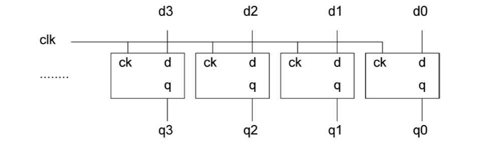

- Registers can be different types:
    - *Accumulators*: register that directly stories/retrieves from memory.
    - *General purpose*: store data during execution.
    - *Special purpose*: used by the computer systems instead of the user:

- Different architectures have different number of registers depend on the **Instruction Set Architecture**.

#### 3.5: Cache Memory 

- Cache memories are usually static random memory (SRAM) (6 transistors)

- SRAMs have three operations:
    - Hold (WL = 0), Write and Read (WL = 1)
- BL: bit line feeds data into the cell.
- WL: word select line

- BL/WL basically feed two inverters.

- Back to back inverters in the red circles.

- M4 and M5 are access transistors as switches.

#### 3.6: Cache Memory: SRAM basics

- Hold
    - WL=Low, M5 and M6 (access transistors) are OFF.
    - data held in latch.(back to back inverter)
- Write: (BL = High and WL = High, write 1)
    - M5 and M6 are switched on.
    - M6 allows the current through (High) and feeds the inverter $I_2$.
    - $I_2$ generates Low output; then the output is fed back to $I_1$; $I_1$ generate High output.
    - The high and low loop between the inverters remember the logic ($I_1$ output).

- Read: (WL = High select the word line)
    - M5 and M6 are switched on.
    - If $I_1$ is high - M4 is on, causes current ($V_{dd}$) to flow through M4 to the BL.
    - The current and its direction is read by a current sense amp (detect logic high).

#### 3.7: Cache Memory Operation 

- Cache exploits the **principle of locality**: programs tends to execute the same small set of instructions and data repeatedly.

- When the processor needs data for execution, first checks the cache:
    - If the data in the cache, it is called a HIT.
    - If else, it is called a MISS.

- Size and Performance trade-offs:
    - Larger cache may increase HIT ratio, but the overall access time may increase.
    - Smaller cache may increase MISS ratio, which may affect the performance.

- The first write is slow and the following writes are faster as you just need to write or update cache.
- The speed-up factor using cache is almost 10.
- When the cache becomes full, 'old' entries can be overwritten by randomly chosen.
- When cache entries are more updated than main memory, the entries marked as **dirty entries**.
    - Dirty lines are updated in the main memory soon.
    - The process of ensuring integrity of data is called **cache coherence**.

#### 3.8: Cache Size Tradeoff 

- The word 'latency' means the latency time for the computer to read the data.
- Effective Latency = Hit ratio * Hit Latency + Miss Ratio * Miss Latency
(the average time required for memory access)
- If the caches missed in the L1 Cache, then it will come to L2 cache.

- Note if we treat the miss ratio is fixed in every level as p, then the hit ratio will be 1-p.

- 'Temporal locality' refers to the reuse of the data which are time relatively.
- 'Spatial locality' refers to use of the data within close storage locations. When am instruction or a data is repeated a number of time it manifests spatial locality.

- Caches contains several blocks.
- For the same caches size, larger block size lead to good temporal locality.

#### 3.9: Main Memory 

- Generally DRAMs:
    - Dynamic: refreshed needed (the electrons may discharge when time past)
    - Volatile: loses data when power is removed.
- Comparison to SRAMs:
    - Smaller but more expansive.
    - Not fast as SRAMs.(more refreshing circuitry)
- Main memory is the primary storage - all changes in registers and caches must be coherent with the mai memory.

- In theory, when the word line is '0', the electrons in the capacitor may keep. However the electrons may leap, if the original voltage is 1 V, the electrons will not be detected when V = 0.5. So we need a charging after the 0.5 point, which is the freshing.

##### 3.9.1: The DRAM basics

- Write:
  - BL = '1' and WL = '1':
  - Access transistor ON, C charge to Vdd (HI).
  - After refresh period, rewrite the data.
- Read:
  - WL = HI
  - Access transistor is ON, assume C has ~Vdd(HI) charge.
  - Bit line read the voltage across C.
- Hold:
  - C will retain the charge.
  - The leakage current cause the discharge.
  - Refresh needed.

##### 3.9.2: DRAM Read: Sense Amplifier 

- To read '1':
  - WL = '0', the up and down BL keep 0.5 V.
  - WL = '1', the BL connected with C (HI), the discharging begin.
  - In the side with BL, the voltage increased and other side decreased.
  - Then the signal '1' in BL side can be detected.
  - The voltage will soon charge the C again.
- To read '0':
  - WL = '0', the up and down keep 0.5 V.
  - WL = '1', the BL connected with C (LOW), the charging begin.
  - In the side with BL, the voltage decreased and other side decreased.
  - Then the signal '0' in BL side can be detected.
  - The voltage will soon discharge the C again.
- To write dada:
  - The double side pre-charged to 0.5 V.
  - Activate the WL, set BL to '0' or '1'.
  - Data wrote to cell.

##### 3.9.3: DRAM Array 

- Several memory cell consist the memory array.

#### 3.10: The Memory Wall

- Faster and parallel processor reducing CPI (clocks per Instruction).

- Complicated memory hierarchy is increasing the memory latency.

- The memory will limit the core efficiency.

#### 3.11: Other Memories: ROM 

- Read-only Memory
    - No capability for memory write.
    - Data programmed
    - Stable storage even when power is off
- Example: NOR-based ROM 
    - 8 bits words
    - Address selects active (HI) row 
    - The row selects lines program which line is HI, so teh data stored is fixed.

#### 3.12: Secondary Storage: Magnetic Disks

- Non-volatile memory, large and slower
- The disc is coated with magnetic material。
- Data is written serially in CW direction.
- Magnetise for '1', demagntise for '0'.

- The magnetic disks are consisted of:
    - Head: the head detector to read the magnetic direction.(hovering)
    - Track: the circle track drawn by head.
    - Cylinder: consist of different surface located in same radium circle, is a cylinder surface.
    - Sector: the different sector area divided by gap.
- Total disk capacity = sector size x sector per track x number of tracks per cylinder x number of cylinder.

- The sector is the actual data container:

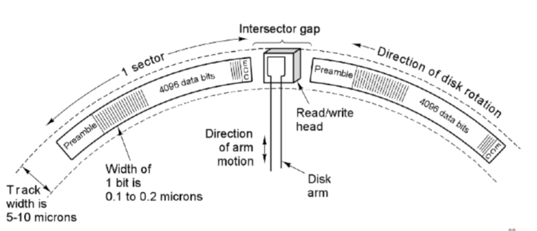

#### 3.13: Off-line Storage: CD-ROM, DVD 

- Optical non-volatile, for long-term storage.
- Coated in metal with the area reflect light differently.
- Normal surface called the 'land'.
- Surface affects by laser is called the 'pit'.
- The pit and land can be read by weak laser beam.
- From inside to outside.

#### 3.14: Tertiary Storages: Flash memories 

- Non-volatile; can be electronically erased and reprogrammed.
    - Modern solid-state drives (SSD) for secondary storage.
    - Secure Digital (SD) Cards.
- Semiconductor non-volatile, non-rotary devices.
    - Faster than HDDs.
- Flash memories are made of storage cells:
    - Eg. Single-level cell (SLC)
    - Control Gate is the MOS gate.
    - Floating Gate electrically isolate the channel.
    - Higher threshold  voltage need to charge FG for write.
    - A voltage lower than threshold for reading.
    - For higher electron biasing hot electrons injection needed.
- 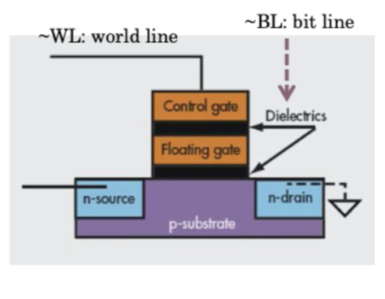

- Two charge states:
    - By default non charge in the float gate means '1'.
    - If the electrons injected to float gate, means '0'.

- Operations (NOR-based flash)
    - Reading:
        - For the '0', higher CG bias ($V_{T0}>5V$) required. (high voltage required to overcome the channel potential and the trapped charged impact)
        - For the '1', lower CG bias ($V_{T1}<V_{T0}$) required.
    - Writing:
        - Need hot electrons injection (HEI)
        - HEI follow the quantum tunnelling.
        - Write '0': HEI applies HI (+ve) across the gate-source to allow FG to be charged negatively with low bit line.
        - Write '1': HEI applies HI (-ve) across gate-source to allow FG data to be erased with low bit line.
    - Hold:
        - The FG dictates the hold operation.
        - Negative charge for bit value = 0
        - No FG charge for bit value = 1
        - HEI causes oxide layer damage and this limit the lifetime of flash memories.
        - SLC have ~100k write cycles.

#### 3.15: NOR Multi-Level Cells

- Multi-level Cell (MLC)
    - Popular and high packing density
    - Multiple SLC in parallel give multiple logic levels.
    - MLC have typically ~10k cycles
- REading 
    - SImilar to the SLC, but with different biasing for different cells and configuration.

#### 3.16: Emerging Non-volatile Memories: Memristors

- Also called RRAM or register-RAM.
- T

- Two terminal element with variable doping:
    - The width and resistance of doped region varies with biasing.
    - When biasing makes w=D (device width) it is ON with $R_{ON}$
    - When biasing makes w=0 it is OFF with $R_{OFF}$.
    - The resistance cannot change without biasing.
- Resistive Memory: Meristor
- Current-Mode In-Memory Circuits: A *multiplier*
    - 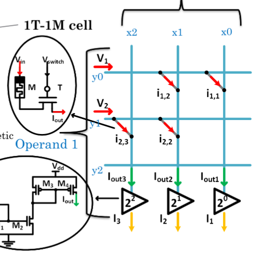

### 4: Interconnects

#### 4.1: Computer Interconnect

- Interconnect is a critical component in modern computer systems as it defines the underlying performance of the systems.
- Interconnects are used to connect various components in the system.

#### 4.2: The Importance of Interconnects

- Affects performance and energy efficiency
- Affect the scalability of a system.

#### 4.3: Managing Interconnects

- Driving an interconnect is hard for devices, which contain lots of buffers and wiring.

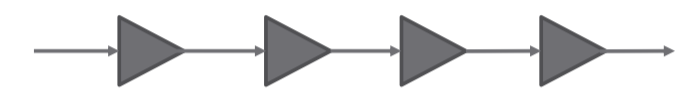

- Every system has an interconnect topology and protocol to manage how to:
    - **accessed**:(IO pin counts, and handshakes)
    - **shared**
    - **power managed**
- Different vendors like different bus architectures and protocols
    - ARM: AMBA 
    - Freescale: VME 
    - Intel: QuickPath

#### 4.4: Interconnect Skew

- All interconnects suffer from interconnect or bus **skew**, because the differences in wire length.
- Consider the following interconnect:

- Uneven wire lengths between send and receive nodes.
- Bound to cause skew between them.
- Designer need to design protocols addressing worst case skew times.
- Also affects the interconnect clock frequency.

#### 4.5: Interconnect Types

There are two fundamentally different bus protocols:

- Synchronous:
    - Includes a clock in the control lines.
    - A fixed protocol for communication relative to the clock.
    - Advantage: involves very little logic and can run fast.
    - Disadvantages: every device on the bus must run at the same clock rate to avoid clock skew, it cannot be very long.

- Asynchronous:
    - It is not clocked.
    - It can accommodate a wide range of device.
    - It can be lengthened without worrying about clock skew.
    - It requires a (rather complicated) handshaking protocol with overhands.

#### 4.6: Synchronous interconnects

- Having a clock line, which drives the interconnect transactions based on cycles.
- Interconnect cycles = several CPU cycles (typically 4-10)
- Example timing diagram: CPU reads data from device 
- Slanted line mean the possible change.

- At T0, the CPU sets the address lines and sets the mode bits to "read".
- The clock pulse width (T1-T0) must be long enough to:
    - accommodate propagation delay (skew)
    - allow the receiver to read the address 
- The receiver is ready to receive at T1. It sets the data lines.
- The data is read into the interconnect. At A2, the CPU reads the data.
- All lines are cleared for a new bus cycles at T3.

#### 4.7: Asynchronous interconnects

- Do not have a global/master clock, BUS cycles can have any length, depending upon the master/slave.

- Transfer is achieved by means of **handshaking**.

- Input (i.e.Read) operation:

- (T5-T0) is one interconnect cycle. At T0, the CPU sets the address and mode lines.

- The CPU allows until T1 for bus skew. It then sets the Ready signal. The addressed device receives the Ready signal shortly before T2. It sets the data line, and raises the Accept line to **acknowledge**  receipt.

- When the CPU sees the Accept, it allows for skew. At T3, it lowers Ready and read the data. After a bus skew delay, the CPU removes the address T4.

- At T5, the addressed device sees Ready going down. It lowers Accept and removes the data.

- The bus cycle is then finished.

- Output (Write) operation form CPU to device

- The CPU provides the data, so this is made immediately.

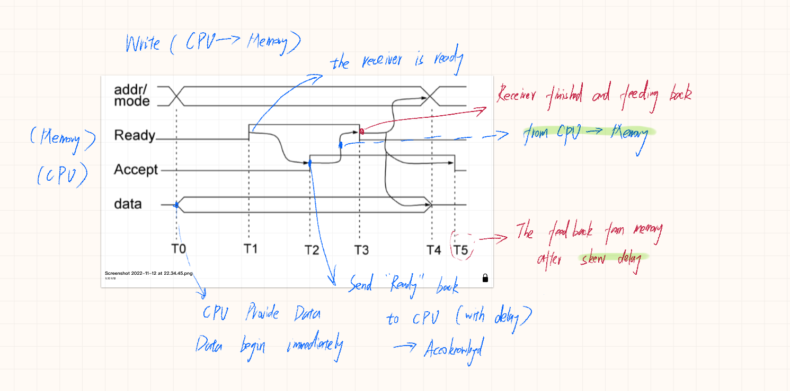

#### 4.8: Interconnect Topology 

- Topology: Specifies the way interconnect are wired.

- Different Topologies:
    - Shared bus:
        - Simplest, State-of-the-art 
        - Simpler arbitration protocols 
        - Scalability issues 
    - Point-to-point
        - ideal but high cost 
        - lots of wires 
        - Poor scalability
    - Cross bar or Network-on-chip 
        - emerging modular architectures
        - Packet switching based
    - Irregular interconnect 
        - Highly customized for given application 
        - not good scalability

#### 4.9: Shared Bus 

- Simple and Cost effective.
- Easy to implement coherence.

- A bus transaction or bus cycle includes two parts:
    - Issuing the command and address.
    - Transferring the data.

- The **master** starts the bus transaction through command & address.

- The **slave** is the one who responds to the address by:
    - Sending data to master upon request.
    - Receiving data from the master.

##### 4.9.1: Shared Bus Example: ARM AMBA 

- AMBA: Advanced Microprocessor Bus Architecture。

##### 4.9.2: AHB Architecture

- The red squared area is the bus.

- The three masters shared the one address bus, one write bus and one read bus.

- The three masters and slaves shared one bandwidth.

##### 4.9.3: AHB Basic Transfer 

- The transfer is divided into two parts: Address phase and Data phase.

- One cycle for address and the other or data (read/write).

- However, the slave may have different wait states (the bus skew or have busy state).

- The first two data phases are meaning waiting time.

##### 4.9.4: AHB Pipelining 

- Transaction pipelining increase bus bandwidth.

- As the AHB have different address and data controller, in one cycle time (for example the second cycle in picture), instruction B is getting address while A is doing data writing.

- During the transactions shown in picture, A,B and C three transactions (instructions) finished, which have 5 cycles. So the CPI (cycles per instruction) is 5/3.

##### 4.9.5: Shared Bus: Multi-core Dilemma 

- Achieving parallelism using a shared global bus is hard with multi-core or multi-masters:

- We use new AXI4 (Advanced exXtensible Interface) AMBA standards feature:
    - multi-layering, simpler handshaking
    - Higher performance.
    - Each master have own bandwidth which no need to share as AHB.

##### 4.9.6: Shared Bus Example: Intel PCI 

- PCI: Peripheral component interconnection
    - High-speed shared bus
    - Intel released PCI in 1990s 
    - Bit-width / speed depends on the Peripherals 

#### 4.9.7: PCI Arbitration 

- PCI uses a centralized, synchronous arbitration scheme.
    - Each device has its own unique GNT(Grant) & REQ (Request) line.
    - Simple request-grant handshake is used to grant bus access.

#### 4.10: USB: Universal Serial Bus 

- Shared bus for low-speed I/O device.

- Expandable
    - through other buses 
    - up to 127 devices (one for root)
    - serial data-in and data-out 
    - Simple design:
        - Also supplying power
        - Support for real-time device 
        - Simple to manufacture 
- Cable contain four wires 
    - 2 data lines 
    - 1 power (+5V) and 1 GND 
- Data transmitted as:
    - '0' is transmitted as a voltage transition (0 to 1 or 1 to 0).
    - '1' as the absence of transition (keep).
    - Sequence of '0' forms a regular pulse stream.

- Has a root hub connected to the main bus 
    - Following hubs connected to this hub forming a tree-topology.
- USB root hub multiplex data from devices and transmits data through regular polling.

#### 4.11: Point-to-Point

Every node connected to every other.

- Lowest contention.

- Lowest latency 

- Ideal except of the cost.

- Not scalable.

- O($n$) connection per node

- O($n^2$) links

- eg. Nvidia GPU 

#### 4.12: Crossbar 

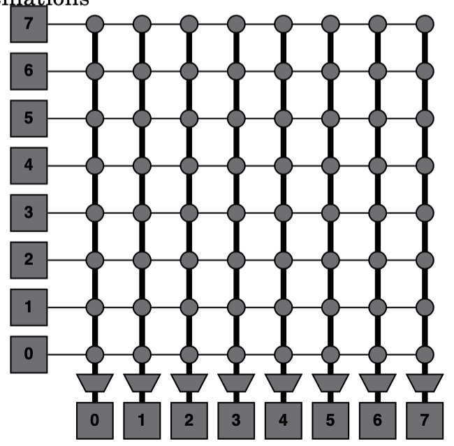

- Every node connected to every other busy node.

- Good for small number of nodes. 

- Low latency and high throughput (data in and out)

- Expansive and not scalable.
    - lots of switches to scale up

- O($n^2$) cost

#### 4.13: Network-on-Chip 

- Tile-based scalable architecture:
    - Each core is connected via a network interface, router (switch).

- Enable concurrent (parallel) sends to non-conflicting destinations.

- Low latency and high throughput.

- Expansive.

- Scalable.

##### 4.13.1: NoC Router 

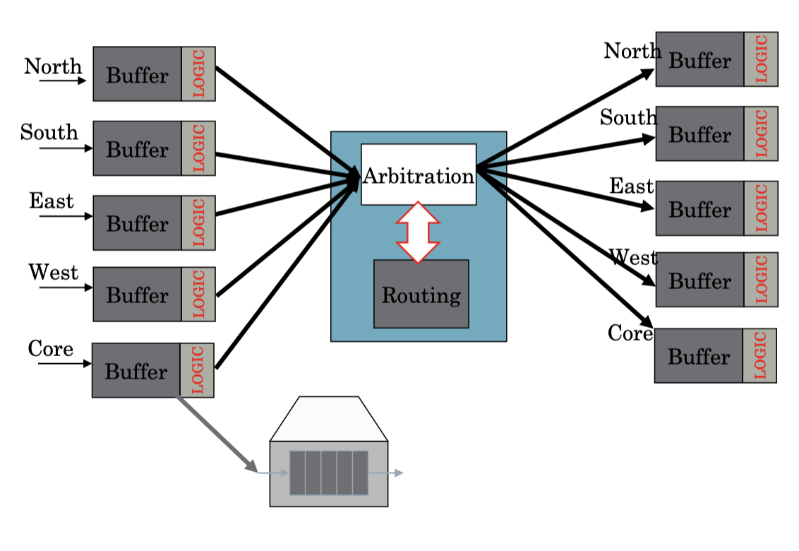

- The router can receive and send the direction of last and next step (eg. south-in and north-out).

- There is also buffer in router to store the data in order to read or write in one time to protect the device.

##### 4.13.2: NoC Network Interface 

- FIFO means the first-in / first-out controller.

- Packet is an assemble of data, like the packed mail parcel.

- The NI add headers for packetising and to remove headers when depacketsing.

##### 4.13.3: NoC routing 

- Affects performance and communication scalability.

- Example routing algorithm on-chip:
    - Source routing 
        - Source tile tells the packet specifically how to reach the destination.
        - Simple but not scalable.
    - XY routing 
        - Go as far close to destination in X direction first, then in Y direction.
        - Adaptive to NoC congestion.

##### 4.13.4: XY routing 

##### 4.13.5: Fault-tolerant XY routing 

##### 4.13.6: A typical modern system-on-chip 

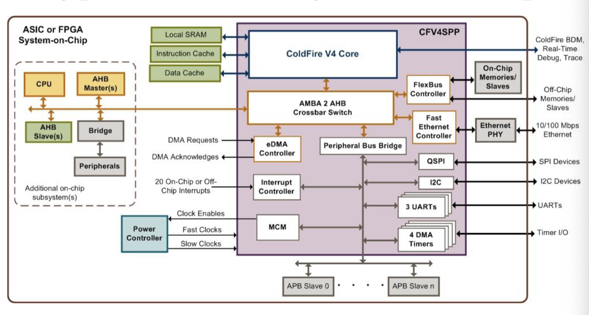

### 5: Processors 

#### 5.1: Introduction to Processors 

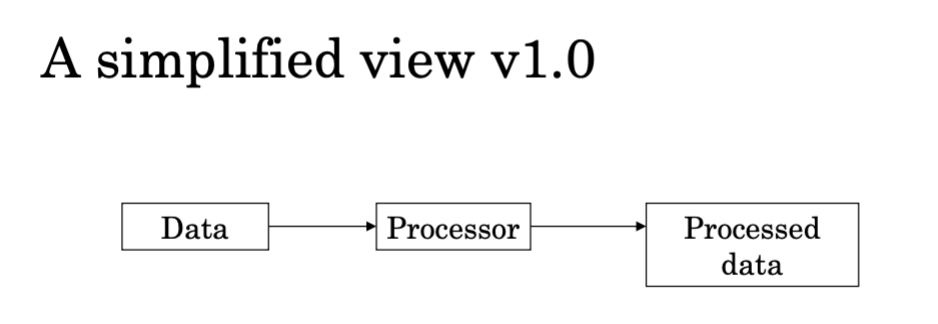

- Opcode: the binary code of operation.
- Mode: whether privilege allowed (user or administrator)
- Address: address denote to the memory as caches.

#### 5.2: Functional View 

#### 5.3: Structure of a computer - top level 

#### 5.4: Structure of CPU 

#### 5.5: Revisiting Resisters 

- Types:
    - User visible registers
        - General Purpose registers 
        - Data registers
        - Address registers 
        - Status and condition code register
    - Internal (system) registers 

#### 5.5.1: User Visible Registers 

- General Purpose:
    - true general purpose
    - occasional use for data or addressing
    - restricted use 
- Data 
    - Primary data holders 
    - Accumulators
- Address
    - segment or address
- Condition Codes (Jump register)
    - used for storing jump labels and address 

#### 5.5.2: General Purpose Register 

- Typically 8, 16,32 or 128 (Itanium)
- Fewer $\rightarrow$ more memory references 
- More $\rightarrow$ does not reduce memory references (make more complex) and takes up processors space 

Each processor needs to be:

- Large enough to hold full address
- Large enough to hold full word

#### 5.5.3: Data and Address Register 

- Data registers can hold numeric values such as integer and , in some architecture, floating-point values and other data.
    - In some older and low-end CPUs, a special data register, known as the accumulator.
    - The number required is determined by cost and architectural aspects, such as parallelism, the number of ALUs, etc.

- Address register hold addresses and used by instructions that indirectly access primary memory.
    - Some processors contain registers that may not only be used to hold an address or only to hold numeric values.
    - The number required is determined by the cost consideration and architecture.

#### 5.5.4: Condition Code Registers 

- Sets of individual bits.

- Can be read by programs.

- Can not be set by program.

- Two kinds: Control and Status registers:

#### 5.5.5: System register

### 5.6: Control Unite: Data Flow 

#### 5.6.1: CPU Control Steps: Data Flow 

- Fetch instructions 
- Interpret instructions 
- Fetch data 
- Process data 
- Write data 

#### 5.6.2: CPU Instruction cycle

- PC: (program counters) count the number of memory address number.

- MAR: (memory access registers) access the address of memory transferred from PC.

- MDR: (memory data registers) fetch the data or instruction from memory according to the address transferred for MAR.

- MBR: memory buffer registers

- IR: instruction register 

- CIR: (current instruction register) decode and execute the instruction or data.

- CC: Condition code register 

- **Fetching**: The next instruction is fetched from the memory address (that is currently stored in the PC), and stored in the instruction register (IR). At theend of the fetch operation, the PC points to the next instruction that will be read in next cycle.

- **Decode**: during the cycle the encoded instruction in the IR is interpreted by the decoder.

- **Execute**: The CPU and ALU (Arithmetic Logic Unit) receive the signal and PC may be updated to a different address from which the next instruction will be fetched.

#### 5.6.3: Data Flow (Execute)

- Fetch and Decode are very common in all CPU architectures, **while Execute flow may vary**.

- **Execute** usually does nit access main memory.

- May include:
    - Memory read / write 
    - IO
    - Register transfer 
    - ALU operation 

#### 5.6.4: Data Flow (with interrupt)

- CPU data flow can be interrupted by IO or others.

- Current PC saved to allow resumption after interrupt.

- Data contents of the current instruction copied to MBR/MDR form memory.

- Instruction address saved in special memory location via MAR.

- After loaded the current flow then fetch the next instruction.

#### 5.6.4: Prefetch 

- Some architectures can fetch next instruction during execution of current instruction (pipelining).

- Prefetch can require accessing main memory.

- Prefetch offers good performance as it reduces the latency between CPU and the main memory.

#### 5.6.5: Pipelining 

- Fetch instruction (memory read)

- Decode instruction (internal decode)

- Control operand addresses (internal control)

- Fetch operand (memory read)

- Execute instructions (ALU)

- Write result (write memory)

- **Overlap these operations.**

#### 5.6.6: Timing of Pipelining 

#### 5.6.7: Branch in Pipelining 

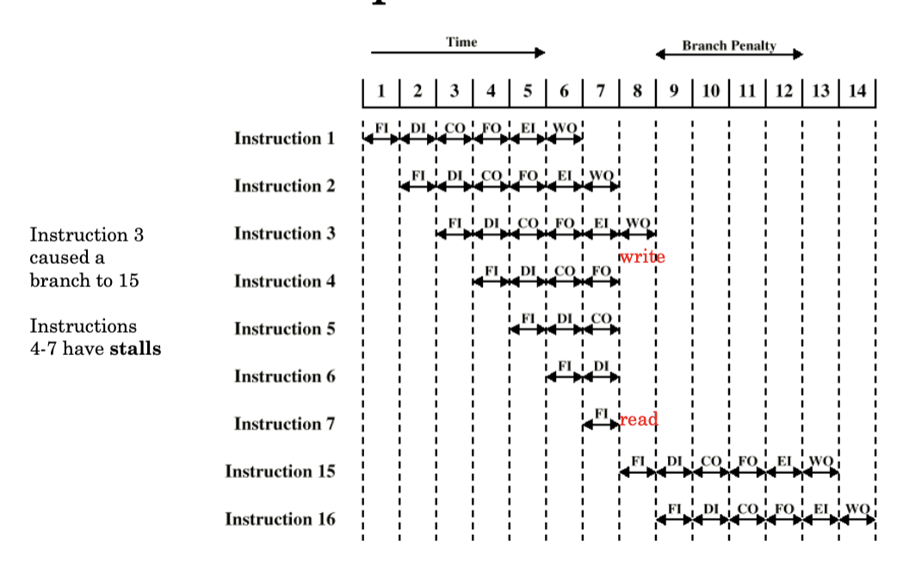

#### 5.6.8: Branch Prediction 

- Predict the next jump.

- Predict never taken (bad condition, pessimistic)
    - Assume the jump will not happen.
    - Always fetch next instruction.
    - Do not prefetch after branch.

- Predict always taken (good condition, optimistic) 
    - Assume the jump will happen during fetch.
    - Next fetch the branch target instruction.
    - Newer processors.

- Predict by Opcode:
    - Some instructions are more likely to jump than others.
    - Can get up to 75% success.

- Taken/Not taken switch
    - Based on a previous history.
    - Good for loops.

- Delayed Branch 
    - Do not take jump until you have to.
    - Do all current in sequency until jump instruction.
    - Rearrange instructions.

#### 5.6.9: Pipeline stalls - 5 stages example

#### 5.6.10: Speed up Equation for Pipelining 

Without pipelining, cycles per instruction is equal to the number of stages in Data Flow; assuming each stage requires 1 cycle (=Ideal CPI x Pipeline depth)

// Formula of Speedup 

For example, dual port means there will no conflict.

