# Digital Electronics 

## I: Logic Design Part-1

### 1: Introduction 

- Design based on **Boolean algebra** using combinatorial logics gates and sequential logic.

- Computer-aided design used and hence the inclusive of VHDL for hardware description.

#### 1.1: Building blocks

- Basic logic gates and their inverses:

#### 1.2: Logic Integration 

- Discrete elements:
    - Assemble gates from transistors, diodes, etc.

- SSI, MSI - integrated circuits. 

- LSI, VLSI (very large IC)
    - More gates on a chip 

- Design style progress:
    - Programmable, semicustom and custom.

#### 1.3: Digital logic Structure 

#### 1.4: CMOS transistors

- MOSFETs are voltage-controlled switches used to make logic gates.

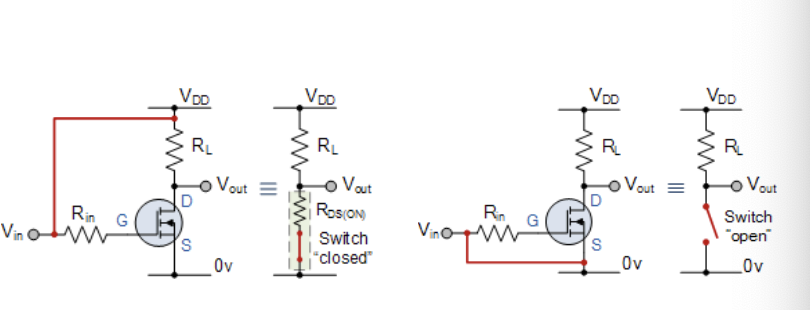

- CMOS Inverter can be built using two transistors.

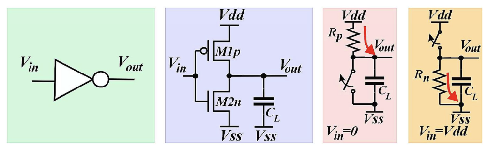

- CMOS two input NOR Gate:

- CMOS four-input NAND Gate:

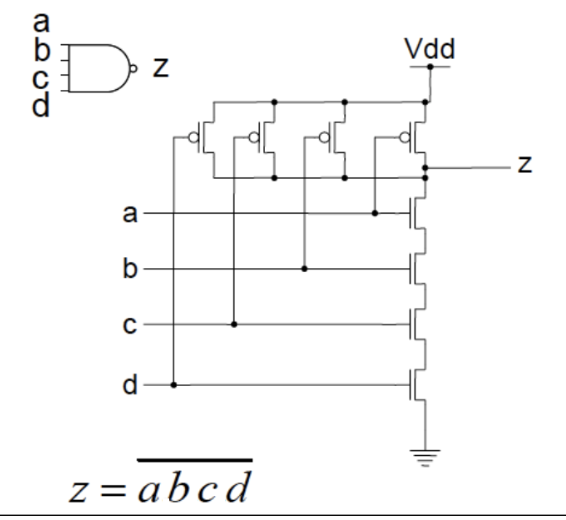

- Gates with more than four inputs are rarely implemented directly, which can be composed of multiple gates with fewer inputs.

- **The negative logic gates can used as universal gates.**

### 2: Programmable logic

#### 2.1: Programmable logic 

- The generalized logic circuits can lead to a possibility of arbitrary logic, hence the **Programmable Logic Array (PLA)**.

- Based on the fact that nay Boolean function can be represented as a sum of products.

- PLD based on a PLA consists of a programmable array of AND gates and a fixed array of OR gates.

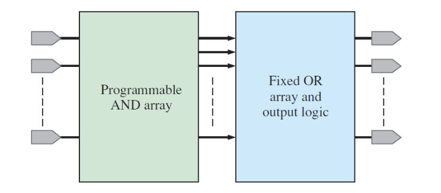

#### 2.2: Sum of products 

- Any Boolean function can be represented as a sum of products.

- And a boolean function can be found through a truth table.

#### 2.3: Sum of products direct implementation 

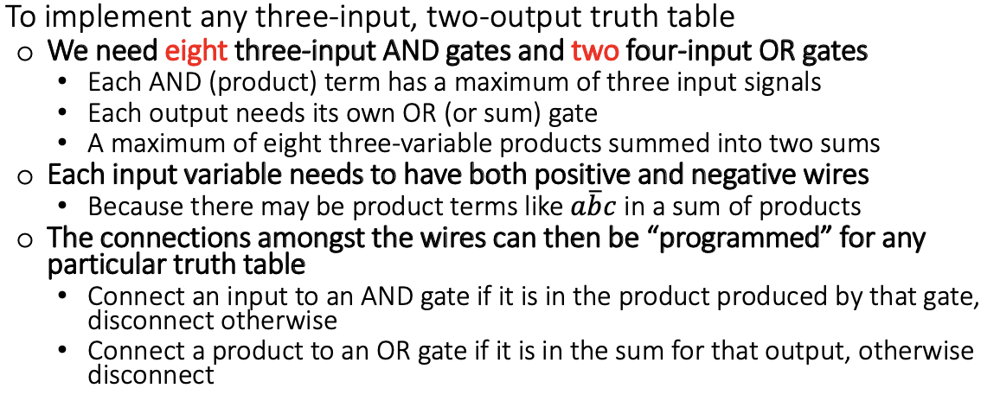

- The PLA is divided into the AND plane and OR plane:
    - The outputs of the AND plane are the product terms.
    - Then these products terms become the inputs of the OR plane.

#### 2.4: Buffering implementation 

- Each input variable needs to have both positive and negative wires:

#### 2.5: Programmable Gates 

For example of an AND gate with $x_0$, $\bar{x_1}$, $x_2$ three inputs:

if connects to the OR array:

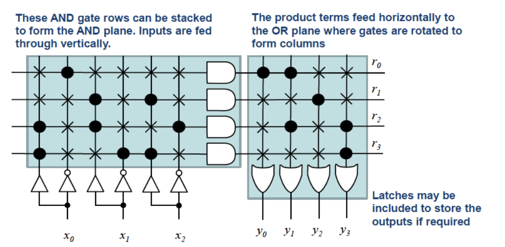

We can also use the textual description:

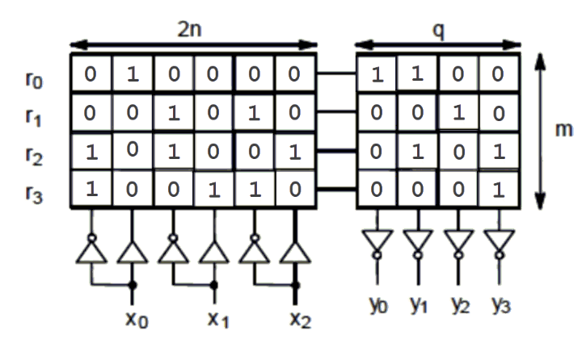

This plane is then defined by this "bit map".

With n inputs and m outputs, the size of PLA can be calculated as *m(2n+q)* cells.

#### 2.6: Minimization of PLA equations 

- For special-purpose PLA, their size can be minimized.

- The target of minimizing are:
    - The total number of gates and as few gates as possible.
    - Then number of inputs **into** each gate as small as possible.

- For PLA, the following wires going into each gates (n) and number of OR gates (q)

- The number of AND gates and the inputs into each OR gates can be **reduced**.

For example, $y_0 = r_0$ and $y_1 = r_0 + r_2$, $r_0$ appears twice in outputs. To minimize, it only needs to be created once.

- PLA minimization is finding equivalent formulas to reduce *m*.

#### 2.7: From truth table to PLA bitmaps

- Using the RHS of truth table forming the OR plane:
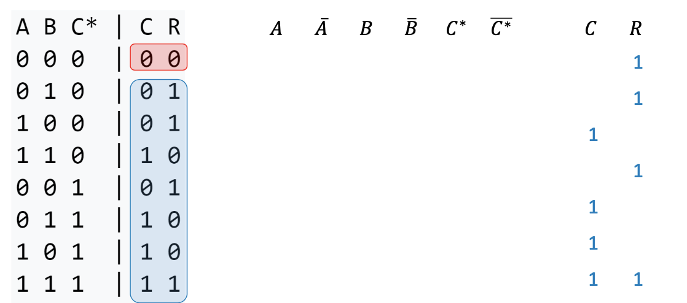

- Using all the value '1' in LHS forming AND plane positive column:

- Using all value '0' in LHS forming AND plane negative column:

#### 2.8: Sum-of-Product SOP 

We can deduce the sum-of-product formula from the truth table value:

- Firstly, find out the SOP using result '1' lines:

$$
z = \bar{a}\bar{b}c + \bar{a}bc + a\bar{b}\bar{c} + a\bar{b}c + abc
$$

- Next step, rewrite the formula to product-of sum form (POS):

$$
z = (a+b+c).(a+\bar{b}+c).(\bar{a}+\bar{b}+c)
$$

#### 2.9: Basic rules of Boolean algebra 

#### 2.10: AND/OR vs NAND/NOR implementation of SOP expression 

- Implementing an SOP expression simply requires ORing the outputs of AND gates.

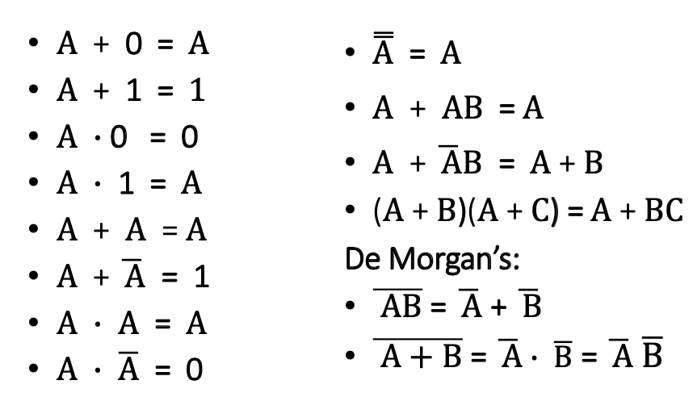

- NAND gates can be used to implement an SOP expression:

#### 2.11: The Karnaugh Map (K-map)

- The Karnaugh map can be used to minimize the Boolean function z(a,b,c).

- First write down the true table in K map:

- Then draw the circle to combine the nearly blocks:

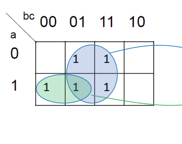

- The result will be $z = a\bar{b}+c$

- The same for 4 variable K-map:

- The result will be $z = a\bar{b}+a\bar{c}+\bar{b}\bar{c}$

#### 2.12: Multiple output minimization 

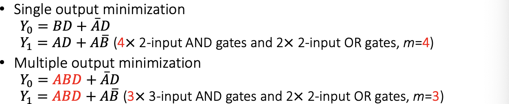

- The key point is to find common-product term.

- Increase the number of AND gates, decrease the number of *m*.

- For example of:

- The first step is to find all ANDs:

- Finally we find that *m* reduced to 2:

#### 2.13: Hardware implementation of connection bitmaps 

- Hard-wired: NOT programmable.

- Single-time programmable: WORM (Write once read only).

- Multiple-time programmable: connections done through transistors switches controlled by external signals.

#### 2.14: Diagram review of PLA

- Fuses used for non-programmable and single programmable.

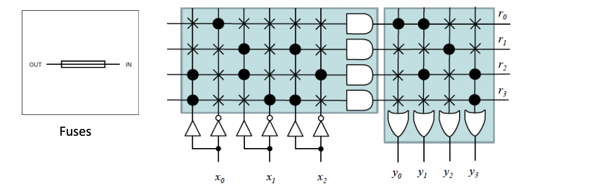

- CMOS (transistors) used in multiple programmable device.

#### 2.15: Full programmability 

- Full programmability only requires one of the plane to have programmability:
    
- AND gates fixed and programmable OR gates are enough for full programmability.

#### 2.16: More complex K-maps 

- Minimize the 5-variables expression fro example:

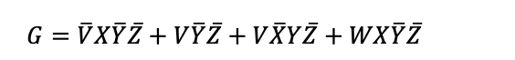

- We can go with a **3D presentation** of the K-map.

- $z = f(a,b,c,d,e)$ can be expressed as $ z= f_{e=0}(a,b,c,d) + f_{e=1}(a,b,c,d)$.

- For six variables:

- To solve the problem in example, we can rewrite to:

$$
G =G_{V=0} + G_{V=1}
$$

then 

$$
G_{V=0} = X\bar{Y}\bar{Z} + WX\bar{Y}\bar{Z} \\
G_{V=1} = \bar{Y}\bar{Z} +\bar{X}Y\bar{Z} +WX\bar{Y}\bar{Z}
$$

- The result finally be $G = X\bar{Y}\bar{Z} + V\bar{X}\bar{Z}$

## II: From PLAs to FPGAs 

### 1: PLA Usage 

- General PLA in CPU:

The control PLA takes in information and play a role as the controller.

Usually not optimizable, but fully programmable at design-time to accommodate CPU.

|||
|---|---|

- General and Custom PLA:

### 2: Complex Programmable Logic Device (CPLD)

- Complex devices extend the idea of programmable logic further.

- A matrix of PLAs and programmable interconnection array (PIA)

### 3: Field programmable gate array (FPGA)

- FPGA employs another approach programmable logic (not based on PLA)

- The three basic elements are **configurable logic block (CLB)** or **logic array block (LAB)**, the **interconnections**, and the **IO Blocks**. 

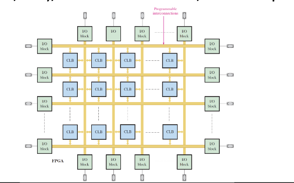

- Each CLB is made up of **multiple smaller logic modules** and a lo**cal programmable interconnect** used to connect logic modules within CLB.

- General FPGA cell:

- SRAM -Based FPGAs 

     - FPGAs are either non-volatile because they are based on SRAM.

- FPGA Cores:
    - A hard core is a portion of logic in an FPGA that is put in by the manufacturer to provide a specific function and that cannot be reprogrammed.

- Specific FPGA Devices:
    - Example FPGA block diagram: Several manufacturer produce FPGAs as well as CPLDs.

## III: Memories in logic design 

### 1: Introduction 

- Gate-level memory cells (latches, flip-flops), used in CPU registers.

- Transistor level volatile memory cell:

    - SRAM, used in cache memory.
    - DRAM, used in main memory.

- Floating-gate memory cells (flash), non-volatile.

- FRAM, MRAM, Memristors: non-volatile.

### 2: SR Latch 

- Simplest memory elements based on a cross-paired of two input NAND or NOR gates.

#### 2.1: Gated SR Latch 

- The enable input E can define whether it is enabled for SR latch to receive signals.
(only E = '1')

### 3: Gated D Latch 

- D latch only have one input D in addition to E.

#### 3.1: D flip-flop 

- Controlled by a periodic control signal, eg. CLK
    - Memory for single bit.
    - Fast, high power.
    - 20 transistors as below design.

- Operation:

### 4: SRAM 

- Simple single-bit memory

#### 4.1: 6T SRAM 

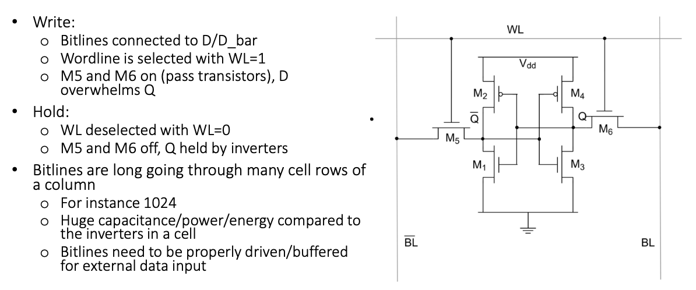

### 5: DRAM 

### 6: Floating gate memory cells 

- Flash is based on floating gate.
    - FGMOS transistor 

## IV: Arithmetic Logic-Adders 

### 1: Digital arithmetic  

- Data path in charge of arithmetic operations.

- Controller defines the sequence of operations.

- Data path operation include:
    - addition
    - subtraction 
    - multiplication 
    - division 
    - AND, OR, etc.

### 2: The case of addition 

- Subtraction
    - implemented by addition through the use of 2's complement.
    - A - B = A + (2's complement of B)

- 2's complement 
    - A bit string considers two interpretations:
        - Natural interpretation
        - 2's complement 

- Multiplication:
    - Multiplication is repeated addition.

- Division:
    - The division can be divided into **comparison** and **subtraction**.

- Integer power and roots:
    - $A^n$: repeated multiplication / division.
    - $\sqrt[n]{A}$: successive approximation (monotony functions only)

- Functions not amenable for successive approximation:
    - Power series and lookup table approach.

### 3: Single-bit full adder 

Simplify the boolean expression of full-adder:

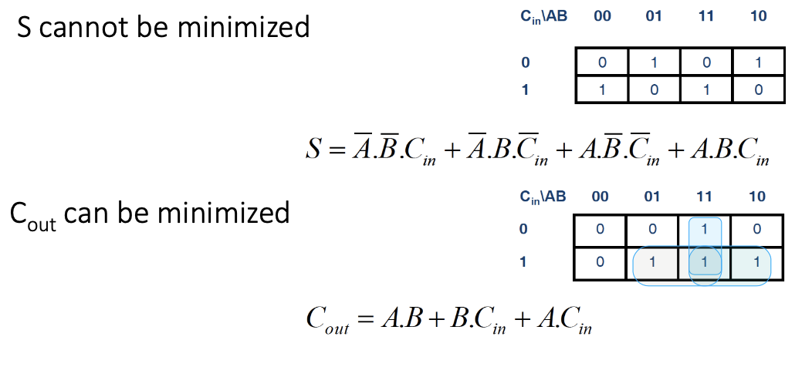

#### 3.1: Adder as a Sum of Products 

- No common product terms for random logic solution.

- AND and OR can be made using NAND.

#### 3.2: A more modular approach 

- A half adder adds two operands A and B without taken in carry in $C_{in}$.

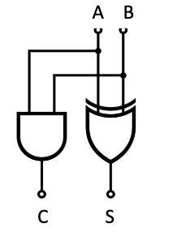

- The practical point of the half adder is you can assemble a full adder using two half adders in modular fashion and end with smaller gates.

- Fewer gates, smaller gates but delay more from B to $C_{out}$.

#### 3.3: Ripple carry adder 

- $C_{in}$ of next bit is $C_{out}$ of current bit.

- If no $C_{in}$, just wire $C_{in}$ to 0.

- An n-bit adder can add two n-bits number.

- Delay problem:

