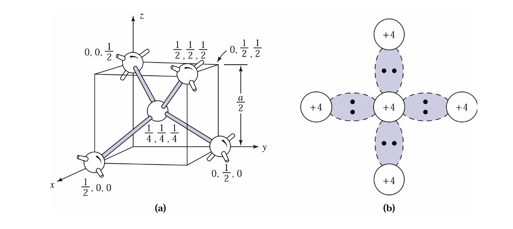
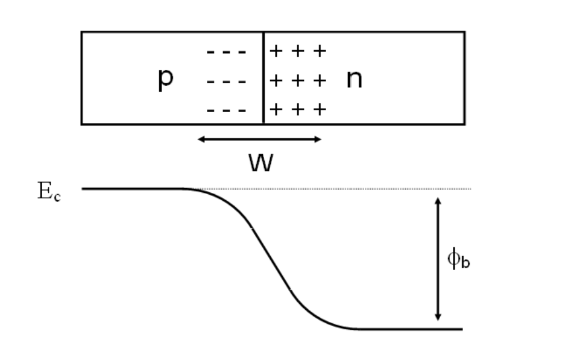
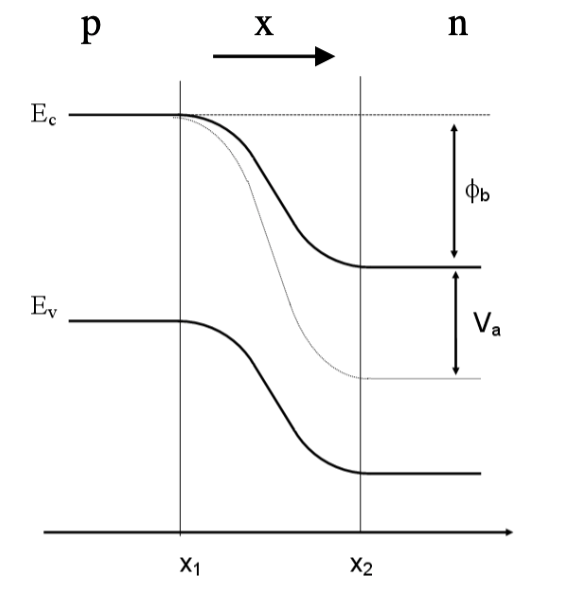
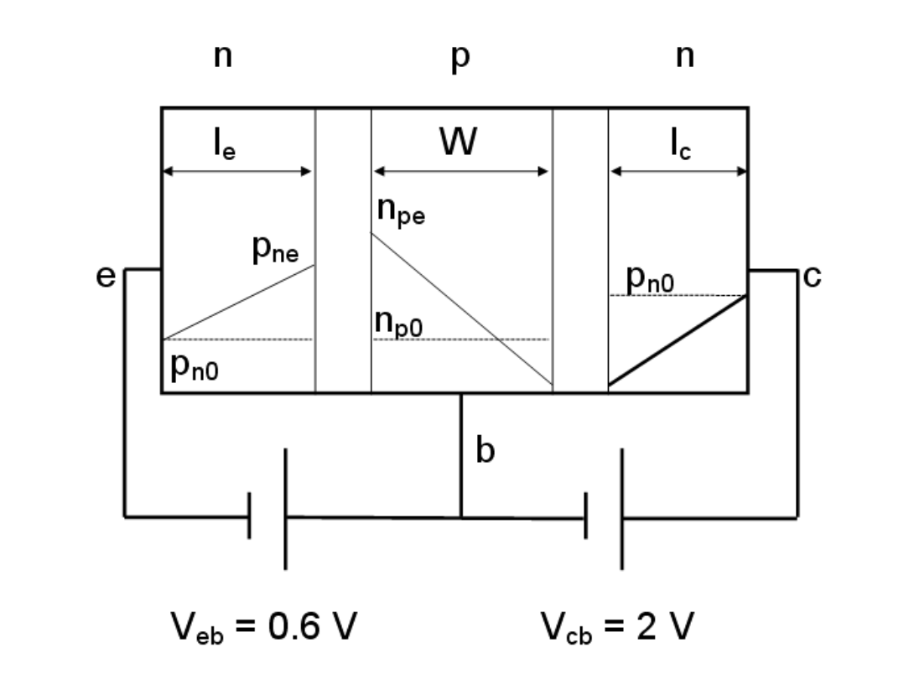
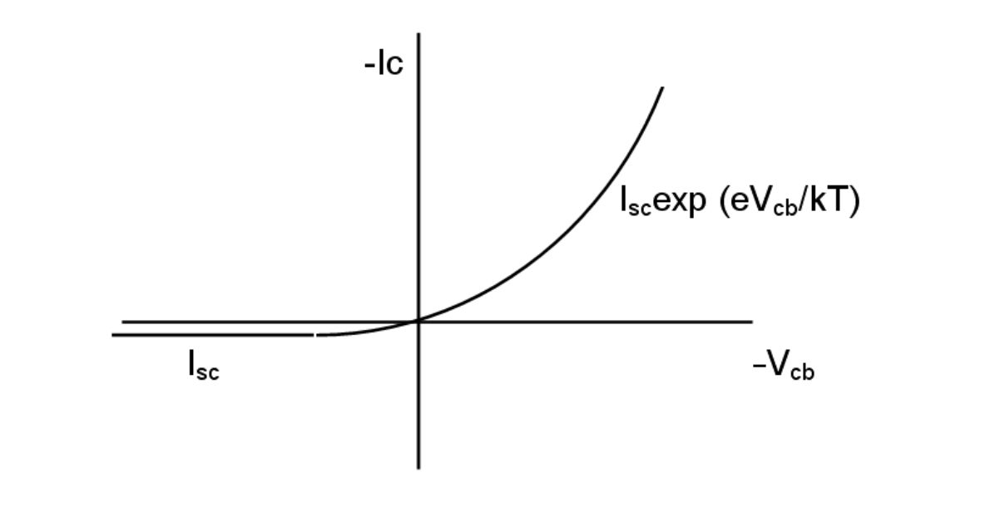

# Semiconductors Devices 

## I: Introduction 

### 1: Silicon Electronic Devices 

- Si is teh workhorse technology. (-99% of the market)
- Cheap.
- High Performance. 
- Challenges ahead,

### 2: Transistors-- the building block 

- 2 types:
    - Bipolar (NPN, PNP), 20% of the market 
    - MOSFET (CMOS), 80% of the market 
- Used for:
    - Analog - eg. Amplification 
    - Digital: ON or OFF

## II: Electrical Conduction in Solid 

### 1: Conduction in Solid

#### 1.1: Bond and Band Models 

* In the *bond model*, atoms is connected with bonds (electron pairs). Conduction is possible when sufficient energy is given to break the bond and free the electrons to holes.

* In the *band model*, the bonding electrons are in the valence band. Conduction will be possible when moving electrons to into the conduction band.
* To cross the energy band between conduction band and valence band, the efficient energy $E_G=E_C-E_V$ should be given (same to the Si-Si bond energy).

* The band-gap Energy is 0 for metals, but it is very large for insulators.

* The intrinsic number of electrons can be found using the formula below:

$$
    n_i^2 = N_cN_v\exp{\frac{-E_g}{k_B T}}
$$

* $N_c$, $N_v$ is the **effective density of states in conduction Band / valence band**.
* $k_B$ is the **Boltzmann Constant**.
* $E_g$ is the energy gap.

#### 1.2: Doping 

* The conduction properties of semiconductors can be influenced by n-type or p-type doping.

### 2: Electrical Conduction

#### 2.1: Drift Current: Ohm's Law

* The drift current occurs because of the charge carriers in solid experience a force from the external E-field so that have a tendency of drifting in one direction.
* The Ohm's Law defined for drift current per unit volume can be written as:

$$
J=\sigma E
$$

* $J$ is the drift current per unit volume, $\sigma$ is the conductivity (S/cm) and $E$ is the electric field.

* According to the $I=nesv$ in general current, we can define the drift current as:

$$
J=env
$$

* $n$ is the carrier density per unit volume and $v$ is the electron velocity.

* The carrier velocity can also be defined as:

$$
v = \nu E
$$

* $\nu$ is the **drift mobility**

So we can get:

$$
J= en\nu E
$$

We also found the relation below:

$$

\sigma = ne\nu 
$$

Which can be finally written as:

$$
J = \sigma E
$$

If we consider the minor carriers in semiconductors:

$$
\sigma = e(n\nu_n+p\nu _p)
$$

#### 2.2: Diffusion Current 

* Diffusion current only exit in semiconductors due to the uneven distribution of carriers (electrons or holes).

* The carriers will diffuse from the high concentration side to another.

* That diffusion depends on the concentration] gradient $-dn/dx$, the electronic charge $e$ and the diffusion coefficient $D$:

$$
J = -eD_n(-\frac{dn}{dx})
$$

or 

$$
J = eD_n(\frac{dn}{dx})
$$

* Both the diffusion processes (D) and the collision limit the $\mu$, this is called the *Einstein Relation*:

$$
\mu = D\frac{e}{k_BT}
$$

#### 2.3: Drift-Diffusion Current 

Drift and diffusion current both exist in semiconductors:

$$
\begin{align*}
J_n &= e\nu _n En +e D_n \frac{dn}{dx} \\
J_p &= e\nu _p En -e D_p \frac{dn}{dx}
\end{align*}
$$

* The drift current direction is only related to the external voltage direction.

#### 2.4: Mechanism of drift-diffusion current 

* There is a *Fermi Level* between the conduction and valence band, which is a energy level have 50% to be fulled with electrons, the energy of it called $E_F$.

* Cause the *Fermi level* is the level of electrons, in n-type semiconductors the $E_F$ will be higher than p-type, which means closer to the conduction band.

* The diffusion and drift current will reach a balance for a p-n junction.

* If drift current < diffusion, it will be 
**Forward Biased**:

* If drift current > diffusion, it will be **Reverse Biased**:

#### 2.5: The size of drift and diffusion current for p-n junction 

* Use the equation below, we can calculate the size of the electric potential form the drift current:

$$
\phi _b = \frac{E_g}{e}+\frac{kT}{e}\ln{(\frac{N_d N_a}{N_c N_v})}
$$

* $N_d$ for density of donor and $N_a$ for the accepter.

* The depletion width can also be calculated using:

$$
W=\sqrt{\frac{2\varepsilon _0 \varepsilon _r \phi _b}{e}(\frac{N_d N_a}{N_c N_v})}
$$

* Then the electric field $E$ can be estimated. 
* The $\phi$ is the build-in voltage generated in the depletion area.

## II: P-N Junction

### 1: Relation between carrier concentration and potential difference

The drift and diffusion current are almost equal and opposite for a p-n junction, so the current of the junction for electrons will be:

$$
J_n \approx en\mu _n E_n + eD_n\frac{dn}{dx} = 0
$$

Using the Einstein Relation $\mu _n = D_n \frac{e}{k_B T}$:

$$
-\frac{e}{k_B T}n E_n = \frac{dn}{dx}
$$

Since $E=-=\frac{dV}{dx}$ ('-' as for electrons), we can get:

$$
\frac{e}{k_B T}(\frac{dV}{dx}) = \frac{1}{n}(\frac{dn}{dx})
$$

If we integrate over all of the junction:

$$
\begin{align*}
\int{\frac{e}{k_B T}\frac{dV}{dx}}{\rm d}x &= \int{\frac{1}{n}\frac{dn}{dx}}{\rm d}x \\
\int_{V(x_1)}^{V(x_2)}{\frac{e}{k_B T}}{\rm d}V &= \int_{n(x_1)}^{n(x_2)}{\frac{1}{n}}{\rm d}n 
\end{align*}
$$

|||
|---|---|

- The left picture is the voltage drop across the junction.
- The right one is the carrier concentration varies from p-side to n-side at the zero bias.

if no applied voltage (the difference of voltage will be initial $\phi _{bi}$):

$$
\int_{n(x_1)}^{n(x_2)}{\frac{1}{n}}{\rm d}n = \frac{e}{k_B T}\phi_{bi}
$$

So we can get: 

$$
\frac{e}{k_B T}\phi_{bi} = \ln{\frac{n_{no}}{n_{po}}}
$$

- $n_{po}$ and $n_{no}$ means the initial concentration of electrons in p-side and n-side.

So that we can get:

$$
\frac{n_{no}}{n_{po}} = \exp{(\frac{e\phi _{bi}}{k_B T})}
$$

Same for the holes:

$$
\frac{p_{po}}{p_{no}} = \exp{(\frac{e \phi_{bi}}{k_B T})}
$$

We can combine the result and get:

$$
\frac{n_{no}}{n_{po}} = \frac{p_{po}}{p_{no}}
$$

- Now if we apply an external bias on the p-n junction:

$$
\begin{align*}
\frac{n_n}{n_p} &= \exp(\frac{e}{k_B T}(\phi _{bi} -V_A)) \\
\frac{p_p}{p_n} &= \exp(\frac{e}{k_B T}(\phi _{bi}-V_A))
\end{align*}
$$

- This graph shows the condition of the reverse bias and forward bias.

Combine the formula above, we can get:

$$
np=n_i^2 = N_cN_v \exp(\frac{-E_g}{k_BT})
$$

- While 'n' ,'p' can be both n-side or p-side, $n_i$ is the concentration of the intrinsic semiconductor.

### 2: Current flow in p-n junctions 

If we neglect the effects of recombination, the electrons current in the n-side is equal to that in the p-side and for holes are the same.

There are two possible types of current flow:

- Drift: $e\mu _n En$
- Diffusion: $eD_n\frac{dn}{dx}$

* For electrons, according to the calculation result, the minority carrier diffusion current control the conduction mechanism.

### 3: Current-Voltage Relationship 

Hole diffusion in the n-type is given:

$$
\begin{align*}
I_p &= AeD_p \frac{dp}{dx} \\
&= AeD_p (\frac{p_n-p_{no}}{l_p})
\end{align*}
$$

And same for p-type:

$$
\begin{align*}
I_n &= AeD_n \frac{dn}{dx} \\
&= AeD_n (\frac{n_p-n_{po}}{l_n})
\end{align*}
$$

So that we can get:

$$
\frac{n_p}{n_{po}} = \exp{(\frac{e}{k_B T}V_A)}
$$

If we add the $I_n$ and $I_p$, the Shockley's Equation will be got:

$$
I = I_o(\exp{(\frac{eV_A}{nk_B T})}-1)
$$

$n$ is a non-ideal fiddle factor.

This analysis is valid only for thin p and n bulk regions. Or else (bulk length > diffusion length) the length of layers has to be replaced by $l=\sqrt{D\tau}$.

### 4: Junction Breakdown 

When the sufficient high field is applied to a p-n junction, the junction may break down and conducts a very large current.

#### 4.1: Thermal Instability 

At high reverse bias the reverse current cause considerable heat dissipation. The effect is known as thermal instability and occurs at the turn over voltage $V_n$.

#### 4.2: Tunneling (Zener Breakdown)

For a p-n junction under reverse bias:

both electrons and holes need significant barrier so the current is low.

At sufficiently large applied bias, the picture changes:

The electrons may tunnel from valence band to conduction band if the junction is heavily doped.

The band gap in Si and GaAs decreases with increasing temperatures, the negative temp coefficient can be used to recognize this mechanism.

#### 4.3: Avalanche Multiplication (Impact Ionization)

If the electric field in the depletion region is high enough, current gain enough energy to ionize collisions which create electron-hole pairs.

The avalanche breakdown voltage imposes an upper limit on reverse bias for diodes, collector voltage of BJT and drain voltage for MOSFET.

Avalanche breakdown has a positive temp coefficient.

## III: Bipolar Transistor

### 1: Bipolar Transistors
- PNP and NPN depend on the base material.

- The majority of the emitter current flows through to the collector, rather than the base ($I_B$), so we have a small base current.

- $\frac{I_C}{I_E}$ Common Base DC Current Gain $\alpha \approx 1$
- $\frac{I_C}{I_B}$ Common Emitter DC Current Gain $\beta \approx 50$

### 2: BJT: Principle of Operation 

For a NPN device, the majority carrier will be: emitter heavily doping (with e), base moderate doping and collector low doping.

For the minority carrier densities will be:

($n_{pe}$ the 'e' means the emitter side)

If we forward bias the emitter-base junction and apply no bias to the collector-base junction (short circuit):

which we can get:

$$
\frac{n_p}{n_{po}} = \frac{p_n}{p_{no}}=\exp{(\frac{eV_{EB}}{k_B T})}
$$

Ignore the recombination, this hole current due to $p_{ne}$ is the only base current cause holes cannot pass the reverse c-b junction. So by controlling the doping ratio
$\frac{N_e}{N_b}$ we can control the current gain $\beta = \frac{I_C}{I_B}\approx \frac{I_E}{I_B}$. (the most effective situation is all the electrons from emitter move to the collector)

For the collector current, we can get:
(Same as the diffusion current)
$$
I_C = AeD_n(\frac{n_{pe}-n_{po}}{W})
$$

The emitter efficiency $\gamma$ can be defined as:

$$
\displaystyle\frac{Electron\quad Current\quad in\quad Emitter}{Total\quad Emitter\quad Current} = \displaystyle\frac{I_{En}}{I_{En}+I_{Ep}}=\gamma
$$

$I_{En} is the $I_C$ and $I_{Ep} = I_B$

Note that for no-recombination $\alpha = \gamma$.

Now if we apply a bias to the C-B junction:

So we have a proportion of the emitter current reaching the collector, $\alpha I_E$. And the total collector current can be:

$$
-I_{SC} = I_{SC}(\exp{(\frac{eV_{CB}}{k_B T})-1})-\alpha I_{SE} = I_{SC}(\exp{(\frac{eV_{EB}}{k_B T})-1})
$$

Note that the sign convention follow the $V_{CB}$.

### 2: DC Characteristic 

For the $I_E = 0$, we got a diode characteristic:

If $I_E$ is not 0 but defined by $\alpha I_E$. $I_{SC}$ is called the collector cut-off current.

