# Signals and Communications 

## I: Introduction to a Communication System

### 1: Communication Systems

- Noise in the systems: external noise and circuits noise reduces the quality of the output. 

### 2: General Digital Communication System Model 

- Source coding: compressing the signals 
- Error control coding: add extra bits (randoms)

#### 2.1: Coder/Decoder (CODEC)

- Sampling: signals at the particular time 
- Quantitation: reducing the binary code 

#### 2.2: Modulator/Demodulator (MODEM)

- Made of modulator and demodulator 

### 3: Radio Transmission 

-  Aerial dimensions are of the same order as the wavelength $\lambda$ of the signal.
-  $\lambda = \frac{c}{f}$, for $c=3\times 10^8$ m/s in free space. 

### 4: Modulation 

- A message information contains the control parameters of a carrier signal, so as to impress the information onto the carrier.

#### 4.1: The Message 

- The message can be digital, analogue or multiple.
- Analogue message, demoted by *m(t)*.
- Digital message, denoted by $d(t)$.

#### 4.2: The Carrier 

- The carrier can be a 'sin' or a 'pulse train'.
- If we use a 'cosine' carrier:

$$
v_s(t) = V_c\cos{(2\pi f_c t+\phi _c)}
$$

- The message can varies in amplitude, frequency and  phase, i.e the AM, FM and PM.

## II: Amplitude Modulation 

### 1: Schematic Diagram of AM 

- $v_s(t)=(V_{DC}+m(t))\cos {(2\pi f_c t)}$
- $V_{DC}$ is a variable voltage, which can be 0 to infinite volts.

### 2: Equations for DSB-AM 

* **Double Sideband Amplitude Modulation - DSBAM**:

- If we note the message: $m(t)=V_m\cos{(2\pi f_m t)}$.
- The trigonometric way can be usd to expand:

$v_s(t)=V_{DC}\cos{(2\pi f_c t)}+\frac{V_m}{2}\cos{(2\pi (f_c+f_m)t)}+\frac{V_m}{2}\cos{(2\pi (f_c-f_m)t)}$

### 3: Spectrum and Waveforms 

- It can be found that the message is stored twice in the double **envelope**.

### 4: Modulation Depth 

- The $\frac{V_{m}}{V_{DC}}$ is defined as the **modulation depth**.
- Modulation Depth $m=\frac{Message}{Carrier}$.

### 5: Double Sideband Modulation Types 

- Double Sideband Amplitude Modulation, DSB-AM, with carrier 

- Double Sideband Diminished (Pilot) Carrier, DSB-DimC ($V_{DC}$ is small)

- Double Sideband Suppressed Carrier, DSB-SC (no $V_{DC}$, no carrier).

### 6: Graphical Representation of Modulation Depth and Modulation Types 

- The phase shift may exist, while the information is stored.

### 7: Trapezoid Method of Measuring Modulation Depth 

- For the multiple message signals instead of only one 'sin' single tone, it is difficult to determine the modulation depth.
- So we use the X-Y mode in the oscilloscope, connecting the message signals
to the x-input and AM signals to y-input.
- The trapezoid can be used to justify the modulation depth.

#### 7.1: Trapezoid when m < 1 

#### 7.2: Trapezoid when m = 1

#### 7.3: Trapezoid when m > 1

### 8: DSB-SC from a Balanced Modulator (Used in AM experiment)

### 9: Bandwidth Requirement for DSB-AM 

- The message signals $m(t)$ will not be a single sine, but a band of frequencies extending up to $B$ Hz as shown.

- Bandwidth is two times of the highest frequency in the message.

### 10: Power Considerations in DSB-AM 

- For the AM: 

$$
v_s(t)=V_{DC}\cos{(2\pi f_c t)}+\frac{V_m}{2}\cos{(2\pi (f_c+f_m)t)}+\frac{V_m}{2}\cos{(2\pi (f_c-f_m)t)}
$$

- Noted that the $P_{RMS}=(\frac{V}{\sqrt{2}})^2\times \frac{1}{R_L}$ is only suitable for sin (cos) functions.

* $P_T=\frac{V_{DC}^2}{R_L}(1+\frac{m^2}{2})$

* If we note $P_C=\frac{v_{DC}^2}{2R_L}$

$$
\frac{P_{USB}}{P_T}=\frac{P_c\frac{m^2}{4}}{P_c(1+\frac{m^2}{2})}=\frac{m^2}{4+2m}
$$

### 11: Single Sideband Amplitude Modulation 

- We use BPF to filter one of the sideband.

- After the BPF:

* The BPF filter removes the LSB then the SSB-AM will be:

$$
v_s(t)=V_{DC}\cos{(2\pi f_ct)}+\frac{V_m}{2}\cos{(2\pi (f_c+f_m)t)}
$$

* For SSB-SC, output signal will be:

$$
v_s(t)=\frac{V_m}{2}\cos{(2\pi (f_c+f_m)t)}
$$

### 12: Bandwidth Requirement for SSB-AM 

For the SSB-SC the bandwidth is reduced since there is no carrier component.

### 13: Power in SSB 

For the SSB signal $v_s(t)=V_{DC}\cos{(2\pi f_c t)}+\frac{V_m}{2}\cos {(2\pi (f_m +f_c))t}$ 

the power is:

$$
P_{SSB}=\frac{v_{DC}^2}{2R_L}+\frac{V_m ^2}{8R_L}
$$

### 14: Demodulation of AM Signals

#### 14.1: Envelope or Non-coherent Detection 

* The capacitor charges rapidly and thereby follows the applied voltages up to the positive peak when the diode is conducting, so: 

$$
R_sC << 1/f_c
$$

* After the positive peak, the voltage reduced so that the diode switched off and the capacitor begin to discharging in $R_L$. The discharging continue slowly between the positives peaks of the carrier voltage but no longer than the message period.

$$
\frac{1}{f_c} << R_L C << \frac{1}{W}
$$

#### 14.2: Synchronous or Coherent Demodulation 

* The local oscillator must be coherent in both frequency and phrase with the carrier wave.

##### 14.2.1: Coherent Local Oscillator 

If DSB-AM input = $(V_{DC}+m(t))\cos{(2\pi f_ct)}$

$$
\begin{align*}
V_x &= (V_{DC}+m(t))\cos{(2\pi f_ct)}\cos{(2\pi f_ct)} \\
&= \frac{V_{DC}}{2}+\frac{V_{DC}}{2}\cos{(4\pi f_C t)}+\frac{m(t)}{2}+\frac{m(t)}{2}\cos{(4\pi f_ct)}
\end{align*}
$$

##### 14.2.2: Frequency and Phrase Errors in Synchronous Demodulation: DSB-SC 

The equation for DSB-SC:

$v_s(t)=m(t)\cos{(2\pi f_ct)}$, where $V_{DC}=0$

LPF remove the $2f_c$ component. 

$V_{out}=\frac{m(t)}{2}\cos{(2\pi \Delta ft+ \Delta \phi)}$

##### 14.2.3: Frequency and Phrase Errors in Synchronous Demodulation: SSB-SC 

### 15: Comparison of DSB and SSB 　

- DSB-AM signals can be demodulated with envelope detector simply.
- DSB-SC and SSB-SC require much less power than DSB-AM and SSB-AM, but more complicated receiver.
- SSB-AM use half the bandwidth of DSB-AM.
- SSB-SC can cope better with small changes in frequencies and phases caused by local oscillator.

## III: Frequency Modulation and Demodulation

### 1: Angle Modulation - FM

* Consider the general carrier $v_s(t) = V_c\cos{(2\pi f_c t + \phi _c)}$

* $2\pi f_c t + \phi _C$ is the angle of the carrier.

* Frequency Modulation by varying $f_c$, or phase modulation by varying $\varphi _c$.

### 2: Frequency Modulation 

- In FM, if we note the carrier as 

$$
v_s (t) = V_c\cos{(2\pi f)}
$$

- A frequency modulated carrier can be expressed as:

$$
v_s(t)=V_c\cos{(2\pi (f_c+ frequency \quad deviation)t)}
$$

where the frequency deviation depend on the *m(t)*.

- As the carrier frequency may change so a instantaneous carrier signal is needed. We note:

$$
V_c\cos{(2\pi f_i t)} = V_c\cos{(\varphi_i)}
$$

where $\varphi _i$ is the instantaneous angle which is $2\pi f_i t$ and $f_i$ is the instantaneous frequency,
$f_i = f_c + frequency \quad deviation$.

- Now we need some re-arranges of the angle $\varphi$. 

- As $\varphi _i= 2\pi f_i t$, the $\varphi_i$ is a instantaneous value, so we can get $\frac{d\varphi _i}{dt}=2\pi f_i$, or $f_i = \frac{1}{2\pi}\frac{d\varphi _i}{dt}$

We can find that frequency is proportional to the rate of change of angle.

- If we note the $f_c$ is the unmodulated carrier and $f_m$ is the modulating frequency, then we may deduce:

$$
\begin{align*}
f_i &=f_c +frequency\quad deviation \\
 &= f_c +\Delta f_c\cos{(2\pi f_m t)}  \\
 &= f_c +f_i \\
 &= \frac{1}{2\pi}\frac{d\varphi _i}{dt}  
\end{align*}
$$

Where the $\Delta f_c$ called the **peak deviation** of the carrier.

- Then we can get the equation:

$$
\displaystyle\frac{d\varphi_i}{dt} = 2\pi f_c + 2\pi \Delta f_c\cos{(2\pi f_m t)}
$$

- Integrate the both side:

$$
\int{\frac{d\varphi _i}{dt}}{\rm d}t = \int{[2\pi f_c + 2\pi \Delta f_c\cos{(2\pi f_m t)}]}{\rm d}t
$$

- Therefore:

$$
\varphi _i = 2\pi f_c t + \displaystyle\frac{2\pi \Delta f_c\sin{2\pi f_m t}}{2\pi f_m}
$$

- Get back to the carrier signal:

$$
v_s (t) = V_c \cos{(2\pi f_c t+\displaystyle\frac{\Delta f_c\sin{2\pi f_m t}}{f_m})}
$$

- The ratio $\displaystyle\frac{\Delta f_c}{f_m}$ is called the **Modulation Index** denoted $\beta$.

$$
\beta = \displaystyle\frac{Peak\quad frequency\quad Deviation}{Modulating\quad frequency}
$$

- $m(t)$ is usually considered as 'a single tone modulating signal of the form:

$$
m(t) = V_m \cos{(2\pi f_m t)}
$$

- The equation of $v_s(t)$ can be expressed as a **Bessel Series**：

$$
v_s(t) = V_c\int \displaystyle\Sigma_{-\infty}^{\infty}J_n(\beta)\cos{(2\pi (f_c+nf_m)t)}
$$

- $J(\beta)$ are the Bessel Function of the first kind.

The expand of the equations can be:

### 3: FM Signal Spectrum

The Spectrum should be like:

### 4: Bessel coefficient

- For n = 0, the curve is the carrier component.
- The frequency varies in amplitude with different $\beta$.
- The carrier component suppressed at $\beta =2.4$.(coefficient is 0, no carrier amplitude)

### 5: Bessel Function Table 

### 6: Band-Limited FM Signals 

- The common FM signal contain an infinite number of sidebands, which is not suitable for transfer.

- Thus we have to fit the signal spectrum into available channel bandwidth.

### 7: Significant Sidebands

- In FM the sidebands are considered to be significant if $J_n(\beta) \ge 0.01$.

- We deemed the components which $J_n(\beta)$ is less than 0.01.

- For example, for $\beta =1$, the spectrum is finite:

- The bandwidth is the length between the highest and lowest frequency.

### 8: Carson's Rule for FM bandwidth 

- An approximation for the bandwidth of the FM signal is given by:

$$
Bandwidth \approx 2(\Delta f_c+f_m)
$$

- This is based on the fact that at least 98% of the total power in FM will be in this bandwidth.

### 9: Narrowband and Wideband FM

#### 9.1: Norrowband FM (NBFM)

For small $\beta$ ($\beta$ $\le 0.3$), which are referred as *narrowband FM*.

There are only carrier and 2 significant sidebands, i.e. BW=2$f_m$.

#### 9.2: Wideband FM (WBFM)

For $\beta >0.3$ there are more than 2 significant sidebands. This is referred as *wideband FM*.

### 10: Generation of FM Signals - Frequency modulation 

An FM modulator is:

- a voltage-to-frequency converter V/f
- a voltage controlled oscillator VCO 
  
In these device (V/F or VCO), the output frequency is dependant on the input voltage.

#### 10.1: V/F Characteristics

- Apply $V_{IN}$ and measure the frequency output, it is found that V/F characteristic is a straight line.

 

- $f_c$, the frequency output when the input is zero is called the **undeviated or norminal carrier frequency**.

- The gradient of $\displaystyle\frac{\Delta f}{\Delta V}$ is called the **Frequency Conversion Factor**,denoted by $\alpha$, with unit hertz per volt.

- If an analogue message input, $m(t)=V_m\cos{(2\pi f_m t)}$
- As the input $m(t)$ varies from $+V_m \rightarrow 0 \rightarrow - V_m$, the output frequency will vary from a maximum frequency, through $f_c$ to a minimum frequency.

- For a straight line we may say:

$$
f_{OUT} = f_c+\alpha V_{IN}
$$

When $V_{IN}=m(t)$, $f_{OUT}=f_c +\alpha m(t)$,i.e. the deviation depend on $m(t)$.

- We can find the max and min of the frequency:

$$
\begin{align*}
f_{max} &= f_c +\alpha V_m \\
f_{min} &= f_c -\alpha V_m 
\end{align*}
$$

- According to the definition of **Peak Deviation**, $\Delta f_c = \alpha V_m$, hence the **modulation index** $\beta = \displaystyle\frac{\Delta f_c}{f_m}=\displaystyle\frac{\alpha V_m}{f_m}$.

### 11: Power in FM Signals

- $v_s(t) = V_c\displaystyle\int_{n=-\infty}^{\infty}{J_n(\beta)\cos{(2\pi (f_c + nf_m)t)}}$, the peak value is $V_cJ_n(\beta)$.
- we use RMS value to determine the average power:

$$
V_{RMS} = \displaystyle\frac{V_{pk}}{\sqrt{2}}
$$

- The power in sideband $P_{SB}$:

$$
P_{SB} = \displaystyle\frac{1}{R_L}(\displaystyle\frac{V_cJ_n(\beta)}{\sqrt{2}})^2= \displaystyle\frac{(V_cJ_n(\beta))^2}{2R_L}
$$

- The total power $P_T$ is the integration of infinite components:

$$
P_T = \displaystyle\frac{1}{R_L}(\frac{V_c}{\sqrt{2}})^2 =\displaystyle\int_{n=-\infty}^{\infty}{\displaystyle\frac{(V_cJ_n(\beta))^2}{2R_L}}
$$

### 12: Distortion in FM Signals 

- The distortion can be defined as:

$$
D = \displaystyle\frac{P_T-P_{BL}}{P_T} = 1-\displaystyle\frac{P_{BL}}{P_T}
$$

- For a band-limited FM, let $a$ = the number of sideband pairs:

$$
P_{BL} = \displaystyle\frac{1}{R_L}\displaystyle\int_{n=-a}^{a}\displaystyle\frac{(V_cJ_n(\beta))^2}{2}
$$

which is the carrier power + significant sideband power.

### 13: FM Demodulation - General Principles 

- An FM demodulator is essentially a frequency to voltage converter (F/V).

- We define $V_o$ as the output when $f_{IN}=f_c$, the nominal input frequency.

- The gradient $\frac{\Delta V}{\Delta f}$ is called the voltage factor, $K$ V/Hz:

$$
V_{OUT} = V_0 + K\alpha V_{IN}
$$

where $V_0$ represents a DC offset in $V_{OUT}$.

- This DC offset may be removed by level-shifting or AC coupling.

Often but bot always, a system is designed so that $K\alpha =1$.

### 14: Slope Detection 

- One method is to use the slope of a tuned circuit in conjunction with an envelope detector, known as a **slope detector**.

Tuned to a higher frequency than the carrier frequency.

- The tuned circuit is tuned so $f_c$ is on th e slope of the frequency response, not at the peak.
- As the FM signal deviate about $f_c$ on the tuned circuit slope, the amplitude of the output varies linearly to the deviation from $f_c$.
- Thus the FM signal is effectively converted to AM. Then the envelope detector recover the message signal.

#### 14.1: Frequency Response of the Slope detector

- The linear region on slope of the frequency response is small.
- This means FM signal with larger peak deviations $\Delta f_c$ and larger modulation index $\beta$, will extend beyond the linear region, which result in distortion of the demodulated signals.
- Hence the slope detector can only be used for NBFM.

### 15: Balanced Discriminator 

- The balanced discriminator is split into two halves, tuned into $f_1$ and $f_2$ which are either side of the $f_c$.
- The linearity region of the frequency response provides that the difference between $f_1$ and $f_2$ is large.
- When the instantaneous frequency of the FM is $f_c$, both diodes conduct which cancel each out resulting in no output.
- However, when the frequency of FM signal moves away from $f_c$, one diode conducts more than the other resulting in one of the resistors having a larger voltage.
- The output is then the modulating signal.

- Balanced discriminator have a characteristic 'S-shaped' frequency response.
- This method will provide larger linear region to demodulate the narrow-band and wide-band signals. 

## IV: Digital Modulation 

### 1: Introduction

- Digital modulation is the mapping of binary data to sin carrier signals.

- The digital message can vary the amplitude, frequency and phase of the carrier.
    - Amplitude Shift keying.
    - Frequency Shift Keying.
    - Phase shift Keying

### 2: Digital Modulator 

### 3: Amplitude Shift Keying (ASK)

- We generate the ASK from the DSB-AM modulator and the input $d(t)$ is encoded signal.

$$
v_s(t) = (V_{DC}\pm V)\cos{(2\pi f_c t)}
$$

-  If $V_{DC}> V$, then the carrier will have two amplitude, $V_1 = V_{DC}+V$ and $V_0 = V_{DC} -V$.

$$
v_s(t) = \begin{cases}
    V_1\cos{(2\pi f_c t)},& for\quad 1 \\
    V_0\cos{(2\pi f_c t)}, & for\quad 0 
\end{cases}
$$

#### 3.1: On-off Keying 

- Use a DSB-SC to generate the OOK.(make sure $V = V_{DC}$).

$$
v_s(t) = \begin{cases}
   (2V)\cos{(2\pi f_c t)},& bit\quad 1 \\
   0,& bit\quad 0 
\end{cases} 
$$

### 4: Phase Shift Keying 

- Using a DSB-SC modulator:

- More easier way:

$$
v_s(t) = \begin{cases}
    V\cos{(2\pi f_c t)},& 1 \\
    -V\cos{(2\pi f_c t)},& 0
\end{cases}
$$

### 5: Frequency Shift Keying 

- An FSK signal can be generated using an FM modulator:

- Or:

$$
v_s(t) = \begin{cases}
    V_c \cos{(2\pi f_1 t)}, & 1\quad,f_1 = f_c +\Delta f_c \\
    V_c \cos{(2\pi f_0 t)}, & 1\quad,f_0 = f_c -\Delta f_c 
\end{cases}
$$

### 6: ASK and PSK Demodulation

- The result after the I&D will be:

$$
\bar{V} = \displaystyle\frac{V_{DC}+V}{2T}(T+\displaystyle\frac{\sin{(4\pi f_c T)}}{4\pi f_c T})
$$

As $f = \frac{1}{T}$, if we choose 'n'(integer) times f is $f_c$:

$$
f_c = \frac{n}{T}
$$

So $\bar{V} = \frac{V_{DC}+V}{2}$ is for the signal '1', while $\bar{V} = \frac{V_{DC}-V}{2}$ for the signal '0'.

If the ASK signal the demo received as below:

The signal is then mixed with the local oscillator set at the same frequency as the carrier.

For the PSK signal, it is also mixed with the local oscillator as the same frequency.

The result will be below:

### 7: FSK Demodulator

The mixed signals are integrated over $T$ resulting in two average $r_0$ and $r_1$, which is known as **correlation demodulator**.

#### 7.1: Minimum Shift Keying (MSK)

If $f_1 - f_0 = \frac{n}{T}$ and $f_1 +f_0 = \frac{m}{T}$, m and n are all integers, we call $f_1$ and $f_0$ are **orthogonal** to each other.

Then the final result of $f_0$ will be 0.

When $f_1-f_0 = \frac{1}{2\pi}$, the sin() become 0, so it is called the **minium shift keying (MSK)**.

### 8: Theoretical Performance

- We can define the bit-error rate performance as a function of a signal-to-noise ratio.
- It is assumed that the modulated signal is corrupted with the addition of noise, the white Gaussian distributed, which is known as Additive White Gaussian Noise (AWGN) channel.
  

- Bit-error rate "BER" $P_b$ is defined as:

#### 8.1: Probability Density Function 

- The most common one in engineering - The Gaussian Distribution (normal distribution)

- The equation is given by:

$$
p(x) = \displaystyle\frac{1}{\sqrt{2\pi \sigma ^2}} e^{-\frac{(x-\mu)^2}{2\sigma ^2}}
$$

- The $\mu$ is the *mean* and the $\sigma ^2$ is the *variance*.

- Cause we cannot integrate directly, we express it into the error function $erf(x)$.

$$
erf(x) = \displaystyle\frac{2}{\sqrt{\pi}}\int _0 ^x e^{-t^2}{\rm d}t
$$

- We also use the complimentary function $erfc(X)$:

$$
erfc(x) = 1-erf(x)
$$

- We can use the substitution to make the target p(x) to erf(x), for example:

For the function:

$$
P(0\le x \le g) = \displaystyle\frac{1}{\sqrt{{2\pi \sigma ^2}}}\displaystyle\int _{0} ^g {e^{-\frac{x^2}{2\sigma ^2}{\rm d}x}}
$$

- Q function is the positive side of the standard normal distribution, which is used sometimes.

#### 8.2: PSK on the AWGN Channel 

- If x was transmitted then received symbol will be $r = x + n$, where $n$ is AWGN with zero mean and variance $\sigma ^2$.
- If $r>0$ then the receiver will make the decision that $x = \sqrt{E_b}$ was transmitted, else if $r<0$ then the receiver will decide that $x = -\sqrt{E_b}$ was transmitted.

- If we transmitted $x = \sqrt{E_b}$:

$$
P(e|x = \sqrt{E_b}) = \displaystyle\int _0^{\infty}{p(r|x = \sqrt{E_b}){\rm d}r}
$$

#### 8.3: OOK on the AWGN Channel 

- Now if $r>\frac{\sqrt{E_b}}{2}$ then the OOK demodulator will make the decision that $x=\sqrt{E_b}$.
- Else if $r<\frac{\sqrt{E_b}}{2}$, then the demodulator decides that $x=0$ was transmitted:
$$
P(e|x=\sqrt{E_b}) = \displaystyle\int _{-\infty} ^{\frac{\sqrt{E_b}}{2}}{p(r|x=\sqrt{E_b}){\rm d}r}
$$

Similarly
$$
P(e|x=-\sqrt{E_b})=\frac{1}{2}erfc((\sqrt{\frac{E_b}{4N_0}}))
$$

($N_0$ is $2 \sigma ^2$)

- So the average BER is:
$$
P_b = \displaystyle\frac{P(e|x=-\sqrt{E_b})+P(e|x=\sqrt{E_b})}{2}=\displaystyle\frac{1}{2}erfc(\sqrt{\displaystyle\frac{E_b}{4N_0}})
$$
- Compare this with the PSK BER:
$$
 P_b = \displaystyle\frac{1}{2}erfc(\frac{E_b}{N_0})
$$

- The OOK perform **worse** than PSK.

#### 8.4: FSK on the AWGN Channel 

- We first assume the separation between the two frequencies $f_0$ and $f_1$ is sufficient so that both FSK signals are orthogonal. The constellation diagram for orthogonal FSK is shown below.

- The FSK demodulator output compares two received values, $r_0$ and $r_1$.
- Assume that noise samples $n_0$ and $n_1$, which are both Gaussian distributed with zero mean and variance $\sigma ^2$. The two received output will be: 

$r_0 = \sqrt{E_b}+n_0$ and $r_1 = \sqrt{E_b}+n_1$

- If assumes that we transmitted $x_1$. The output at the FSK demodulator will be:

$r_1 = \sqrt{E_b}+n_1$ and $r_0 = n_0$

- An error occurs if the FSK demodulator decides that $r_0>r_1$, or $n_0>\sqrt{E_b}+n_1$:

- The average BER for orthogonal FSK is then:

$$
P_b = \displaystyle\frac{1}{2}erfc((\sqrt{\frac{E_b}{2N_0}}))
$$

#### 8.5: Performance Comparison of OOK, PSK and FSK on AWGN channel 

**The Notation of dB**

- For a value of 'x' is its original unit, 'x' in dB will be $10\lg{x}$.
- For a value in dB, its original value will be $10^{\frac{x}{10}}$

## V: Information Theory

### 1: Introduction to Information Theory

- Information theory was presented by Claude Shannon in 1948.
- Using information theory we can determine how much we can compress a signal and the max transmission rate over a noise channel to achieve reliable communication.

### 2: Binary Symmetric Channel 

- The binary symmetric channel (BSC) is an example of a **discrete memoryless source**.
This means that each received bit is independent of other bits.

- The BSC is commonly used as a simplified model of a communication system.

- Using Bayes's theorem we can also calculate the conditional possibility as $P(X|Y)$:

$$
P(X|Y) = \displaystyle\frac{P(X)P(Y|X)}{P(Y)}
$$

- The joint probabilities P(X,Y) of BSC can be:

$$
P(X,Y) = P(Y)P(X|Y) = P(X)P(Y|X)
$$

### 3: Binary Erasure Channel 

- An **erasure** e, is a bit has been labelled as unreliable (i.e.not certain about '0' or '1')

- The Binary Erasure Channel (BEC) can be used to model many systems, such as compact disc players and the transmission packets over a wireless network.

- 

### 4: Information 

-  A source outputs messages comprising symbols that occurs varying probabilities.
-  If we assume the symbols outputted are statically independent, then the source is called **discrete memoryless source** (DMS).

- Shannon defined a measure of information in a symbol $X$, as:

$$
I(X_i) = \log_{2}{\frac{1}{P(X_i)}}
$$

- The unit of $I$ is bit.

- We can see if $P(X_i)$ then $I(X_i)=0$ bits, there is no information received =. This is because we already know the symbol and no uncertainty.

- Information has the following properties:

### 5: Entropy 

- Entropy is the average amount of information carried by a message $X$ defined by $M$, $X_1,X_2,X_M$.

- The entropy of a binary source $H(p)$ is plotted below:

- The entropy of a source $H(X)$ is the average of uncertainty about the source input before the output is observed.

#### 5.1: Conditional Entropy 

- The conditional entropy of a source input selected from an alphabet $X$ given that we observed an output symbol $Y$ is given by:

$$
H(X|Y=y_i) =\displaystyle \Sigma_{j=1}^N{P(x_j|y_i)\log_{2}{\frac{1}{P(x_j|y_i)}}}
$$

- Since $H(X|Y=y_i)$ can values from $y_1$ to $y_M$, then the mean conditional entropy is:

$$
\begin{aligned}
    H(X|Y) &= \displaystyle \Sigma_{i=1}^N {P(Y_i)H(X|Y=y_i)} \\
    &= \displaystyle\Sigma_{i=1}^N \Sigma_{j=1} ^M P(y_i)P(x_j|y_i)\log_{2}{\frac{1}{P(x_j|y_i)}}
\end{aligned}
$$

- From Bayes's theorem, $P(y_i)P(x_i|y_i) = P(x_j,y_i)$

So the conditional entropy can be:

$$
H(X|Y) = \displaystyle \Sigma_{i=1}^N\Sigma _{j=1} ^M P(X_j,Y_i)\log_{2}{\frac{1}{P(x_j|y_i)}}
$$

- H(X|Y) represents the uncertainty of the source input after the output is observed.

- Since $H(X)$ is the uncertainty of the source input before observed and $H(X|Y)$ is the after one, then the difference between them must be the average amount of information about $X$ after observing $Y$.

- This is called the **mutual information**.

### 6: Mutual Information 

- The difference between the H(X) and H(X|Y) is called the average **mutual information I(X,Y)**.

$$
I(X,Y) = H(X)- H(X|Y)
$$

- The relation between entropy, conditional entropy and mutual information can be expressed:

- Mutual information indicates how much the output Y can tell us about the input X. It is a measure of the quality of the channel.

- The formula of I(X,Y) will be:

- Mutual information has the following properties:
  - I(X,Y) = H(X) - H(X|Y)
  - I(Y,X) = H(Y) - H(Y|X)
  - I(X,Y) = I(Y,X)
  - I(X,Y) $\le$ 0

- Note that if we know the $H(X|Y)$, we can get: $H(Y|X) = H(X|Y)-H(X)+H(Y)$

### 7： Capacity

- The capacity of a channel is the max rate at which information can be transmitted error free and is measured in **bits per second (bps)**.
- The average mutual information is dependent on the input probability distribution and the channel.
- We define the channel capacity, C, of a discrete memoryless channel as the max average mutual information, where the max is over all possible input probabilities:

- We will now determine the capacity of two simple channels: the binary symmetric channel and the binary erasure channel.

#### 7.1: Capacity of the Binary Symmetric Channel 

 

- To calculate the capacity of the binary symmetric channel we need to determine the mutual information.

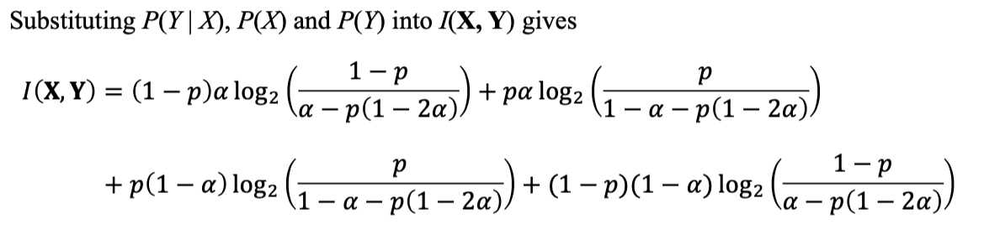

To maximize $I(X,Y)$ we set $\alpha =1/2$ and the capacity of the BSC is:

- So the capacity of the BSC is $C = 1-H(p)$

#### 7.2: Capacity of the Binary Erasure Channel 

#### 7.3: Comparison of BSC and BEC Channel Capacity

##### 7.4: Capacity of a Gaussian Channel 

- The capacity of a channel affected by Gaussian noise is dependant on the channel bandwidth $B$ and the signal-to-noise ratio $S/N$, where $S$is average signal power and $N$ is average noise power.

- In this case the input alphabet is still discrete, but the output is analogue.

- The capacity of the binary input Gaussian channel is given by the Shannon-Hartley channel capacity theorem.

$$
C = B\log_{2}{(1+\frac{S}{N})},bps
$$

- We can express $S$ in terms of bit energy by $S=E_b C$ and $N=N_0 B$, where $N_0$ is the noise power spectral density, W/Hz. 
- Then we define the bandwidth efficiency in terms of the bit-energy-to-noise power spectral density ratio:

$$
\frac{C}{B} = \log_{2}{(1+\frac{E_b}{N_0}\frac{C}{B})}
$$

- The bandwidth shows that as bandwidth $B\rightarrow \infty$, $E_b/N_0\rightarrow -1.6dB$. This is the minimum value of the signal-to-noise ratio $E_b/N_0$ where it is possible to ensure error free transmission.

### 8: Source Coding 

- Sourcing coding involves representing each symbol in an alphabet as unique binary codewords.

- The aim is to minimize the average length of the binary codewords.

- Usually, some symbols are more likely to occur. In this case, those symbols that occurs less often are assigned longer words.

- Mores code is an example of a source code where the length of codeword where the length of codeword depends on the frequency of the letters.

### 9: Code efficiency

- A discrete memoryless source generates $N$ symbols, $s_1$ to $s_N$ with corresponding probability $P(s_1)$ to $P(s_N)$. The source encoder then assigns a binary codeword to each symbol with lengths $l_1$ to $l_N$ (The length could be fixed or variable)

- Therefore the average length of the codewords is:

$$
\bar{L} = \displaystyle\Sigma_{i=1}^N P(s_i)l_i
$$

- We define a ratio called **code efficiency** $\eta$ as:

$$
\eta = \frac{L_{min}}{\bar{L}}
$$

where $L_{min}$ is the minimum average length of the codewords.

- The value of $L_{min}$ id given in Shannon's **source-coding theorem**.

- Given a discrete memoryless source of entropy $H(X)$, the average codeword length is bounded as:

$$
\bar{L} \le H(X)
$$

- The code efficiency can vary between 0 and 1. Ideally we would like the efficiency to be 1.

- In order to increase the source efficiency, we need to reduce the average length of the source codewords.

#### 9.1: Variable Length 

We must ensure that the code can be decoded. The following code I cannot be uniquely, as the '00' have the same prefix as '0'.

Code II do not have same prefix so that can be used. This is known as a **prefix code**.

### 10: Huffman Coding 

- Huffman codes are variable length codes.

- The Huffman coding assign each symbol a binary codeword that is approximately equal to the amount of information given by the symbol.

- Huffman coding algorithm:
    - List the symbol in descending order of probability (highest at the top)
    - Take two smallest probabilities, add them to forma new probability and reorder the probabilities.
    - Repeat this process at each stage until only two probabilities remain.
    - Assign 0 and 1 to the two final symbols. With each successive split, add another 0 and 1 on the end of the previous codeword to form another codeword.

- For example:

then:

Note that the one who is successfully split will be add '0' at the front, the fixed (no split) will be  added '1'.

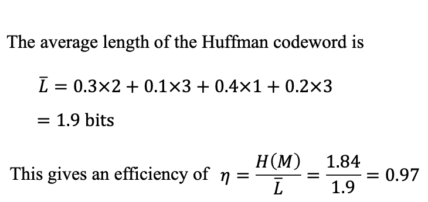

## VI: Introduction to Signals 

### 1: Continuous-Time Signals 

- A continuous signal is defined over all values of time.

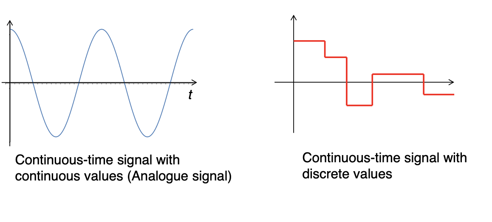

### 2: Discrete-Time Signals 

- Discrete-time signal is defined at specific values of time. 

### 3: Amplification 

- Amplification means form $v(t)$ to $Av(t)$ and keep the time unchanged.
- i.e. multiply a value at y-axis

### 4: Time Shifting 

- Time shifting is moving the signal function in the time (x) axis.

||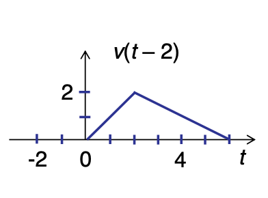|
|---|---|

### 5: Time Scaling 

- From $v(t)$ to $v(at)$.
- For $a>1$, the signal compressed; for $a<1$, the function stretched.

### 6: Common Functions used in Signal Processing 

#### 6.1: Impulse function

$$
 \delta (t) = \begin{cases}
    1,\quad t=0 \\
    0, \quad otherwise 
\end{cases}
$$

#### 6.2: Step function 

$$
u(t) = \begin{cases}
    1,\quad t \ge 0 \\
    0,\quad t < 0
\end{cases}
$$

- Describe a process form '0' to '1'.

#### 6.3: Unit Ramp function 

$$
R(t) = \begin{cases}
    t,\quad t\ge 0 \\
    0,\quad t<0
\end{cases}
$$

### 7: Mean Value of a Signal 

- The mean value of a signal is defined as:

$$
\bar{v} = \frac{1}{(t_2-t_1)}\int _{t_1}^{t_2} v(t){\rm d}t
$$

- For a periodic signals the mean value is defined over the period $T$:

### 8: Root Mean Square Value 

- The **Mean Square Value** of a signal between two points $t_1$ and $t_2$:

$$
\bar{v^2} = \displaystyle\frac{1}{(t_2-t_1)}\int _{t_1} ^{t_2}{v^2(t)}{\rm d}t
$$

### 9: Energy of a Signal

- The energy, $E$, of a continuous-time signal is the area under the signal squared, i.e.:

$$
E = \displaystyle\int _{-\infty} ^{\infty} {|v(t)|^2}{\rm d}t
$$

- The energy of a signal can be finite or infinite. The energy of a periodic signal is infinite.
- A signal with finite energy is called an **energy signal**.

- The energy of a discrete-time signal is the sum of the discrete values squared.

$$
E = \Sigma _{n = -\infty} ^{\infty}{|v(n)|^2}
$$

### 10: Average Signal Power 

- The average power of a continuous-time signal is the time average of its energy calculated over a long time interval.

$$
P_{av} = \lim_{T_0\to \infty}\frac{1}{T_0}\int _{-T_0/2} ^{T_0/2}{|v(t)|^2}{\rm d}t
$$

- For a periodic continuous-time signal, the average power is calculated over one period $T$:

$$
P_{av} = \frac{1}{T}\int _{-T/2} ^{T/2}{|v(t)|^2}{\rm d}t
$$

- The average power of a discrete-time signal is:

$$
P_{av} = \lim_{B\to \infty} \frac{1}{2N+1}\Sigma _{n=-N} ^{N}{|v(n)|^2}
$$

- If the average power of a signal is finite then it said to be a **power signal**.

### 11: Signals in the Frequency Domain 

- All signals in the time domain can be represented in the frequency domain.

- A single sine or cosine function has one frequency, which can be expressed as a shifted delta function.

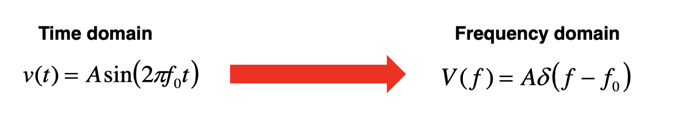

- Time domain signals with more frequencies can be expressed as the sum of shifted delta functions:

### 12: Negative Frequency 

- The sine and cosine function can be written as the complex exponentials:

$e^{j2\pi f_0 t} = \cos{(2\pi f_0 t)}+j\sin{(2\pi f_0 t)}$

and 

$e^{-j2\pi f_0 t} = \cos{(2\pi f_0 t)}-j\sin{(2\pi f_0 t)}$

- Add both we can get:

- Negative frequencies only occur when in complex exponential form.

- In physical waveforms we see the combination of both negative and positive frequencies pairs to from single positive frequencies.

### 13: Analogue-to-Digital (A/D) Conversion 

- The **sampler** converts the analogue signals $v(t)$ to discrete-time signals.

- The **quantiser** maps the sampled values to a smaller set of discrete values.

- The **coder** takes each discrete values and represents it as binary values.

#### 13.1: Sampling 

#### 13.2: Discrete-Time Signals 

- A discrete-time signal with period $N$, where N > 0:

$$
x(n+N) = x(n)
$$

- The smallest value of N is known as **fundamental period**

- So $\sin{(2\pi f_d (N+n))}=\sin{(2\pi f_d n)}$.

This will be true if $2\pi f_d N = 2\pi k$.

- As $f_d = \frac{k}{N}$, if k and N are relatively prime then the fundamental period will be n

#### 13.3: Frequency of discrete-time signals 

- The frequency of a discrete-time signal $f_d$ is measured in **cycles per sample**.

- If the $-\frac{1}{2}\le f_d \le \frac{1}{2}$, the it is unique.

- For discrete-time signals, all frequencies satisfy $|f_d|>\frac{1}{2}$ are known as **aliases**.

#### 13.4: Relationship between Analogue and Discrete-time signals 

- Take an analogue signal $v(t) = \cos{(2\pi f_a t)}$.

- If the signal sampled every $T_s$ seconds (or rate $f_s$), we get:

$$
v(t) = \cos{(2\pi f_a n T_s)} = \cos{\frac{2\pi f_a n}{f_s}}
$$

- The discrete-time signal has a frequency of $\frac{f_a}{f_s}$ cycles/samples. 

- Therefore, we can find the expression of the $f_d$ related to the analogue frequency:

$$
f_d = \frac{f_a}{f_s}
$$

- As the range of an analogue signal is infinite, the range of $f_d$ should be:

$$
-\frac{1}{2}\le f_a \le \frac{1}{2}
$$

- The frequency of the analogue signal when sampled every $T_s$ seconds, or $f_s= \frac{1}{T_s}$, so:

$$
-\frac{f_s}{2}\le f_a \le \frac{f_s}{2}
$$

- Therefore, the highest frequencies of an analogue signal $f_a$ that is unique when sampled with sampling rate $f_s$ is:

$$
f_a = \frac{1}{2T_s} = \frac{f_s}{2}
$$

- The result of alias will be:

#### 13.5: Sampling Theorem 

- In general, analogue signals are made up of many different sin signals summed together.

- Therefore, any analogue signal must be sampled at a rate $f_{max}\le \frac{f_s}{2}$, where $f_{max}$ is the highest frequency in the analogue signal, to ensure the analogue signal can be recovered from the discrete time signal.

- The minimum sampling rate required to recover the analogue signal from the discrete-time signal is called the **Niquist Rate**, $f_N$ and defined as:

$$
f_N = 2f_{max}
$$

- For example, $v(t) = \cos{(2\pi \times 100t)}$, if sampled at a rate of $f_s = 150$. As $t = nT_s$, $T_s = \frac{1}{f_s}$:

$$
f(n) = \cos{(2\pi \times 100 \times \frac{n}{150})}
$$

- We can find the sampling frequency is larger than 1/2.

- As $n = 150t$, $v(t) = \cos{(2\pi \times 50t)}$, which is not same as original signal.

### 14: Linear Time Invariant (LTI) Systems 

- If systems has inputs $x_1(t)$ and $x_2(t)$ and corresponding output $y_1(t)$ and $y_2(t)$ then it is **linear** if the sum of the weighted message $ax_1(t) + bx_2(t)$ generates the output $ay_1(t)+by_2(t)$.

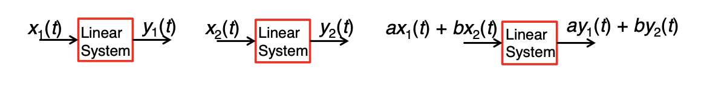

- A system is **time invariant** if a time shift $\tau$ in the input causes the same time shift in the output:

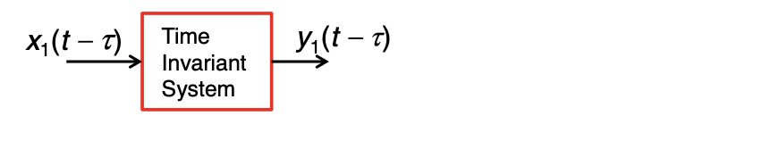

- Hence this system is a **Linear Time Invariant System**.

#### 14.1: Impulse Response

- The impulse response $h(n)$ of a system shows the behavior of the system when the input is impulse function $\delta (n)$.

- Knowing the impulse response of LTI means we can determine the response to any sampled input.

#### 14.2: Finite Impulse Response (FIR) System

- The output of a FIR system depends only on the current input and past input value.

- If the input of an impulse then the number samples at the output is finite and equal to the number of memory elements plus one.

- So the impulse response of the FIR filter is $h(n) = {1,0.5,0,0,...}$

#### 14.3: Infinite Impulse Response (IIR) Systems 

- The output of an infinite impulse response system depends on the input and also output values, which are fed back and added to the input.

- The feedback structure causes IIR system to generate an infinite number of samples at the output when the input is an impluse.

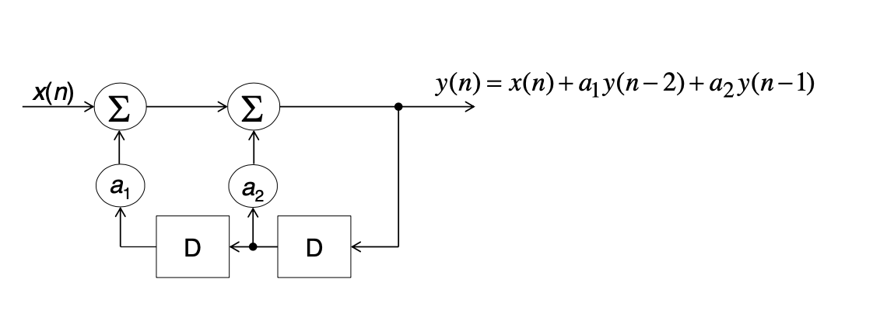

#### 14.4: Application of an IIR system 

- The square root of a positive number A can be determined by recursive equation:

$$
y(n) = \frac{1}{2}[y(n-1)+\frac{x(n)}{y(n-1)}]
$$

- We initialize the memory element with y(-1), which is estimate of the square root of A. The input is a step response with amplitude A, i.e. x(n) = Au(n)

#### 14.5: Causal and Non-Causal Systems 

- A system is **causal** if the output signal depends only on present and past inputs, but does not on future inputs.

- Or else it is **non-causal**.

- For a real-time signal processing, a non-causal system cannot be used as it is not possible to get the future values.

- However, if the signal we wish to process has been recorded the non-causal system can be used

### 15: Introduction to Digital Filters 

- There are three types of filter: **low-pass, band-pass and high-pass**.

- The low-pass filter allows low frequency signals to pass up to a cut-off frequency $f_c$.

- The band-pass filter allows a range of frequency signals to pass.

- The high-pass filter allows high frequencies signals to pass.

#### 15.1: FIR Low-Pass Filter 

- Discrete-time low-pass filters can also be realized using an FIR system.

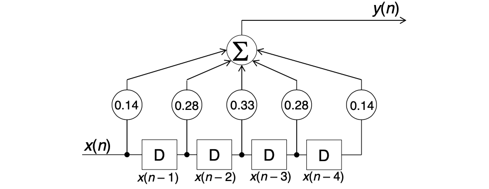

- This low-pass filter has been designed to have a discrete-time cut-off frequency of 1/3 cycles/sample.

#### 15.2: Digital Low-Pass Filtering of a distorted sin signal 

- The sampled values from the distorted sin are fed into the digital low-pass filter. We assume that the signal is zero for negative 'n'.

- The output of the filter shows that the filter has smoothed the distorted sin signal. There is still a small amount of distortion in the signal, but this can be removed by increasing the length of the filter.

- Notice that the filtered signal is delayed by 4 samples compared with the original due to 4 memory elements.

### 16: Convolution 

- Determine the response of a digital filter caused by input signal is one application of an important math operation called **convolution**. If we know the **impulse response** *h(n)* of a system then the convolution of input x(n) and h(n) to obtain y(n):

$$
y(n) = \Sigma _{k=-\infty}^{\infty}{x(k)h(n-k)}
$$

- For simplicity the convolution of two function $x(n)$ and $h(n)$ is denoted as $x(n)*h(n)$.

- The convolution operation involves of four parts:
    - **Flipping**: Reflect $h(k)$ in the y-axis to obtain $h(-k)$
    - **Shifting**: Shift $h(-k)$ by n places to the right to obtain $h(n-k)$.
    - **Multiplying**: Multiplying *x(k)* by *h(n-k)*.
    - **Summing**: Add all values from the product *x(k)h(n-k)* to obtain *y(n)*.

#### 16.1: Convolution Example

#### 16.2: Multiple Fading Channel 

- One application of the convolution operation is to model the effects of a multipath fading channel on a transmitted signal.

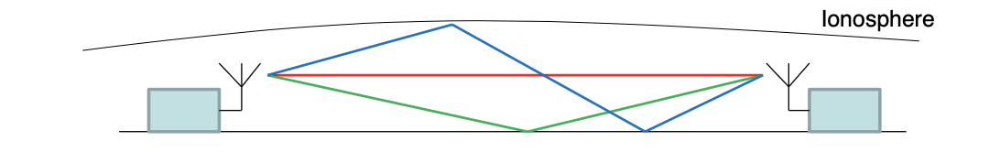

- At the receiver multiple copies of the signal arrive at different times and add constructively or destructively depending on the phase shift of each signal.

- The multipath fading channel can be modelled as a low-pass FIR filter.

## VII: Laplace Transform 

### 1: Introduction to Laplace Transform 

- Laplace transforms used to solve linear differential equations with constant coefficient.

- Produce the transfer functions of different systems to see how different parts of a system interact.

### 2: Definition of Laplace Transform 

- The laplace transform takes a function in time domain and transform it to the $s$ domain.

- $s$ domain is a **complex frequency variable**, where $s = \sigma +j\omega$.

- The laplace transform is defined as:

$$
F(s) = \int _0 ^{\infty} e^{-st}f(t){\rm d}t
$$

- We denote the laplace transform of $f(t)$ as $\mathcal{L}\{f(t)\}$.

- Lower case letters denotes function in the time domain, and upper case letters denotes function in the s domain.

### 3: Laplace Transform Properties 

#### 3.1: linearity 

$$
\begin{aligned}
    \mathcal{L}\{f(t)+g(t)\} &= \mathcal{L}\{f(t)\} + \mathcal{L}\{g(t)\} \\
    \mathcal{L}\{\alpha f(t)\} &= \alpha \mathcal{L}\{f(t)\} \\
\end{aligned}
$$

#### 3.2: First Shift Theorem 

- If $\mathcal{L}\{f(t)\}=F(s)$, then $\mathcal{L}\{e^{-at}f(t)\}=F(s+a)$

#### 3.3: Second Shift Theorem 

- If $\mathcal{L}\{f(t)\}=F(s)$, then $\mathcal{L}\{u(t-d)f(t-d)\} = e^{-sd}F(s)$.

- 'u' is the step function.

#### 3.4: Region of Convergence 

- It was mentioned that 's' can be defined as a complex frequency, defined as $s=\sigma +j\omega$.

- The real part of $s$, $\sigma$, must have restrictions placed on it so that the Laplace integral converges.

$$
F(s) = \int _0 ^{\infty} f(t).e^{-st}{\rm d}t = \int_0^{\infty}e^{-\sigma t}e^{-j\omega t}{\rm d}t
$$

- The term $e^{-\sigma t}$ diverges of converges depending on whether $\sigma <0$ or $\sigma >0$.

- The integral will converge if $\sigma >0$, or $\mathfrak{R}{s}>0$, where $\mathfrak{\{R\}}{s}$ is the real part of $s$.

#### 3.5: Inverse Laplace Transform  

- The inverse laplace transform, $\mathcal{L}^{-1}\{F(s)\}$, can convert from the s-domain back to time domain.

- This can be achieved by using the common Laplace Transform.

#### 3.6: Finding inverse laplace transform using Partial Fraction 

- When finding the inverse Laplace transform, we regularly need to write our expression in the s-domain in terms of partial fractions:

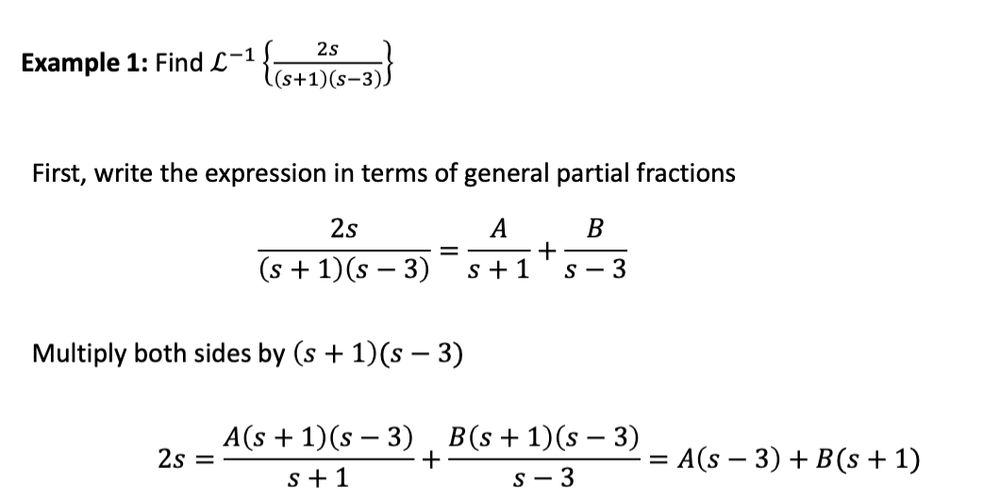

#### 3.7: Laplace Transform of Derivative and Integrals 

- $\mathcal{L}\{f'\} = sF(s)-f(0)$
- $\mathcal{L}\{f''\} = s^2F(s)-sf(0)-f'(0)$

- $\mathcal{L}\{\int _0 ^t f(t){\rm d}t\} = \frac{1}{s}F(s)$

- This method can be used to solve the differential equations with the invert laplace transform.

