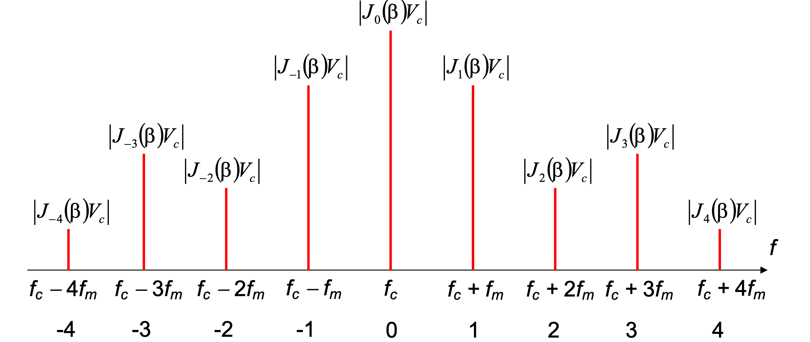
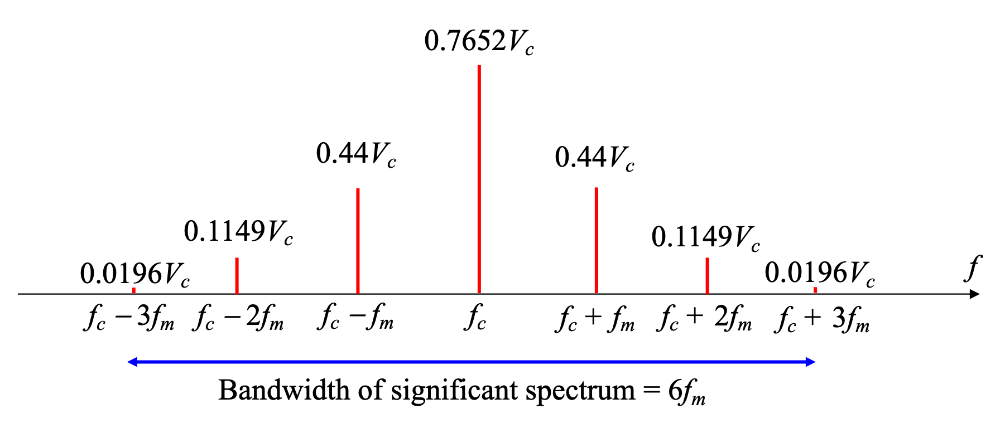
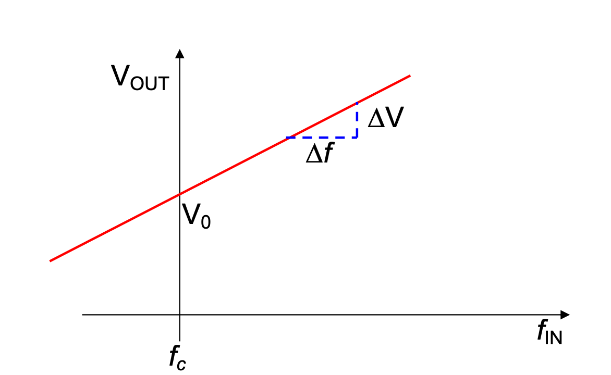
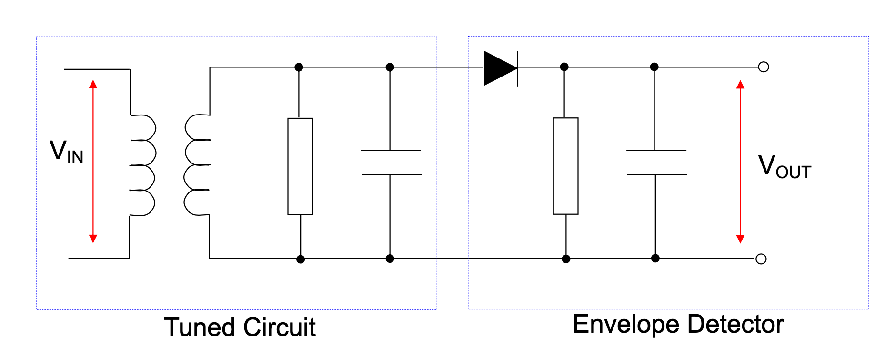
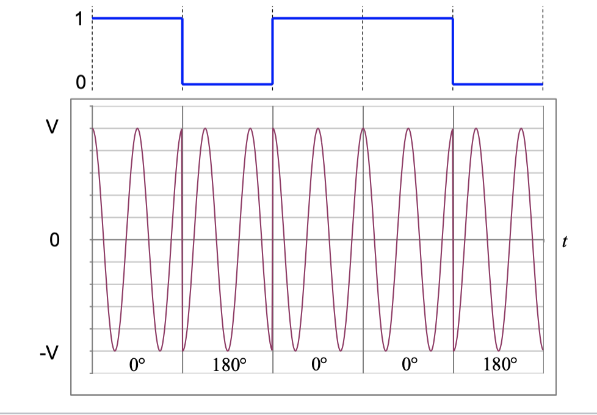
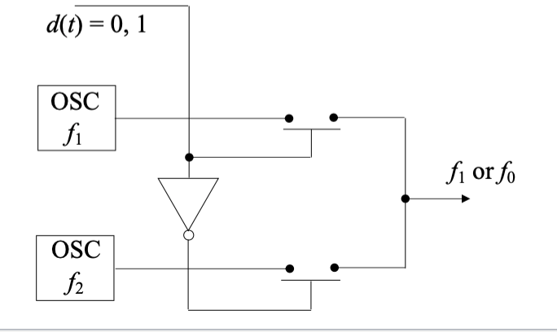
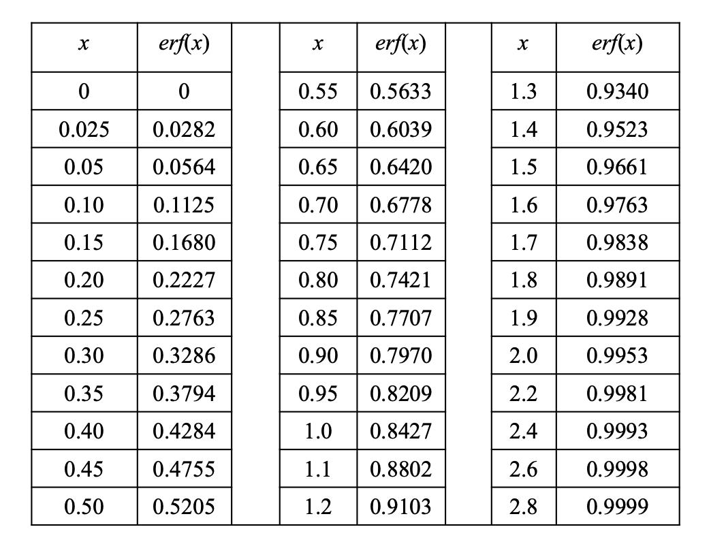

# Signals and Communications 

## I: Introduction to a Communication System

### 1: Communication Systems

- Noise in the systems: external noise and circuits noise reduces the quality of the output. 

### 2: General Digital Communication System Model 

- Source coding: compressing the signals 
- Error control coding: add extra bits (randoms)

#### 2.1: Coder/Decoder (CODEC)

- Sampling: signals at the particular time 
- Quantitation: reducing the binary code 

#### 2.2: Modulator/Demodulator (MODEM)

- Made of modulator and demodulator 

### 3: Radio Transmission 

-  Aerial dimensions are of the same order as the wavelength $\lambda$ of the signal.
-  $\lambda = \frac{c}{f}$, for $c=3\times 10^8$ m/s in free space. 

### 4: Modulation 

- A message information contains the control parameters of carrier signal of a carrier signal, so as to impress the information onto the carrier.

#### 4.1: The Message 

- The message can be digital, analogue or multiple.
- Analogue message, demoted by $*m(t)*$.
- Digital message, denoted by $d(t)$.

#### 4.2: The Carrier 

- The carrier can be a 'sin' or a 'pulse train'.
- If we use a 'cosine' carrier:

$$
v_s(t) = V_c\cos{(2\pi f_c t+\phi _c)}
$$

- The message can varies in amplitude, frequency and  phase, i.e the AM, FM and PM.

## II: Amplitude Modulation 

### 1: Schematic Diagram of AM 

- $v_s(t)=(V_{DC}+m(t))\cos {(2\pi f_c t)}$
- $V_{DC}$ is a variable voltage, which can be 0 to infinite volts.

### 2: Equations for DSB-AM 

* **Double Sideband Amplitude Modulation - DSBAM**:

- If we note the message: $m(t)=V_m\cos{(2\pi f_m t)}$.
- The trigonometric way can be usd to expand:

$v_s(t)=V_{DC}\cos{(2\pi f_c t)}+\frac{V_m}{2}\cos{(2\pi (f_c+f_m)t)}+\frac{V_m}{2}\cos{(2\pi (f_c-f_m)t)}$

### 3: Spectrum and Waveforms 

- It can be found that the message is stored twice in the double **envelope**.

### 4: Modulation Depth 

- The $\frac{V_{m}}{V_{DC}}$ is defined as the **modulation depth**.
- Modulation Depth $m=\frac{Message}{Carrier}$.

### 5: Double Sideband Modulation Types 

- Double Sideband Amplitude Modulation, DSB-AM, with carrier 

- Double Sideband Diminished (Pilot) Carrier, DSB-DimC ($V_{DC}$ is small)

- Double Sideband Suppressed Carrier, DSB-SC (no $V_{DC}$, no carrier).

### 6: Graphical Representation of Modulation Depth and Modulation Types 

- The phase shift may exist, while the information is stored.

### 7: Trapezoid Method of Measuring Modulation Depth 

- For the multiple message signals instead of only one 'sin' single tone, it is difficult to determine the modulation depth.
- So we use the X-Y mode in the oscilloscope, connecting the message signals
to the x-input and AM signals to y-input.
- The trapezoid can be used to justify the modulation depth.

#### 7.1: Trapezoid when m < 1 

#### 7.2: Trapezoid when m = 1

#### 7.3: Trapezoid when m > 1

### 8: DSB-SC from a Balanced Modulator (Used in AM experiment)

### 9: Bandwidth Requirement for DSB-AM 

- The message signals $m(t)$ will not be a single sine, but a band of frequencies extending up to $B$ Hz as shown.

- Bandwidth is two times of the highest frequency in the message.

### 10: Power Considerations in DSB-AM 

- For the AM: 

$$
v_s(t)=V_{DC}\cos{(2\pi f_c t)}+\frac{V_m}{2}\cos{(2\pi (f_c+f_m)t)}+\frac{V_m}{2}\cos{(2\pi (f_c-f_m)t)}
$$

- Noted that the $P_{RMS}=(\frac{V}{\sqrt{2}})^2\times \frac{1}{R_L}$ is only suitable for sin (cos) functions.

* $P_T=\frac{V_{DC}^2}{R_L}(1+\frac{m^2}{2})$

* If we note $P_C=\frac{v_{DC}^2}{2R_L}$

$$
\frac{P_{USB}}{P_T}=\frac{P_c\frac{m^2}{4}}{P_c(1+\frac{m^2}{2})}=\frac{m^2}{4+2m}
$$

### 11: Single Sideband Amplitude Modulation 

- We use BPF to filter one of the sideband.

- After the BPF:

* The BPF filter removes the LSB then the SSB-AM will be:

$$
v_s(t)=V_{DC}\cos{(2\pi f_ct)}+\frac{V_m}{2}\cos{(2\pi (f_c+f_m)t)}
$$

* For SSB-SC, output signal will be:

$$
v_s(t)=\frac{V_m}{2}\cos{(2\pi (f_c+f_m)t)}
$$

### 12: Bandwidth Requirement for SSB-AM 

For the SSB-SC the bandwidth is reduced since there is no carrier component.

### 13: Power in SSB 

For the SSB signal $v_s(t)=V_{DC}\cos{(2\pi f_c t)}+\frac{V_m}{2}\cos {(2\pi (f_m +f_c))t}$ 

the power is:

$$

P_{SSB}=\frac{v_{DC}^2}{2R_L}+\frac{V_m ^2}{8R_L}

$$

### 14: Demodulation of AM Signals

#### 14.1: Envelope or Non-coherent Detection 

* The capacitor charges rapidly and thereby follows the applied voltages up to the positive peak when the diode is conducting, so: 

$$
R_sC << 1/f_c
$$

* After the positive peak, the voltage reduced so that the diode switched off and the capacitor begin to discharging in $R_L$. The discharging continue slowly between the positives peaks of the carrier voltage but no longer than the message period.

$$
\frac{1}{f_c} << R_L C << \frac{1}{W}
$$

#### 14.2: Synchronous or Coherent Demodulation 

* The local oscillator must be coherent in both frequency and phrase with the carrier wave.

##### 14.2.1: Coherent Local Oscillator 

If DSB-AM input = $(V_{DC}+m(t))\cos{(2\pi f_ct)}$

$$
\begin{align*}
V_x &= (V_{DC}+m(t))\cos{(2\pi f_ct)}\cos{(2\pi f_ct)} \\
&= \frac{V_{DC}}{2}+\frac{V_{DC}}{2}\cos{(4\pi f_C t)}+\frac{m(t)}{2}+\frac{m(t)}{2}\cos{(4\pi f_ct)}
\end{align*}
$$

##### 14.2.2: Frequency and Phrase Errors in Synchronous Demodulation: DSB-SC 

The equation for DSB-SC:

$v_s(t)=m(t)\cos{(2\pi f_ct)}$, where $V_{DC}=0$

LPF remove the $2f_c$ component. 

$V_{out}=\frac{m(t)}{2}\cos{(2\pi \Delta ft+ \Delta \phi)}$

##### 14.2.3: Frequency and Phrase Errors in Synchronous Demodulation: SSB-SC 

### 15: Comparison of DSB and SSB 　

- DSB-AM signals can be demodulated with envelope detector simply.
- DSB-SC and SSB-SC require much less power than DSB-AM and SSB-AM, but more complicated receiver.
- SSB-AM use half the bandwidth of DSB-AM.
- SSB-SC can cope better with small changes in frequencies and phases caused by local oscillator.

## III: Frequency Modulation and Demodulation

### 1: Angle Modulation - FM

* Consider the general carrier $v_s(t) = V_c\cos{(2\pi f_c t + \phi _c)}$

* $2\pi f_c t + \phi _C$ is the angle of the carrier.

* Frequency Modulation by varying f_c$, or phase modulation by varying $\varphi _c$.

### 2: Frequency Modulation 

- In FM, if we note the carrier as 

$$
v_s (t) = V_c\cos{(2\pi f)}
$$

- A frequency modulated carrier can be expressed as:

$$
v_s(t)=V_c\cos{(2\pi (f_c+ frequency \quad deviation)t)}
$$

where the frequency deviation depend on the *m(t)*.

- As the carrier frequency may change so a instantaneous carrier signal is needed. We note:

$$
V_c\cos{(2\pi f_i t)} = V_c\cos{(\varphi_i)}
$$

where $\varphi _i$ is the instantaneous angle which is $2\pi f_i t$ and $f_i$ is the instantaneous frequency,
$f_i = f_c + frequency \quad deviation$.

- Now we need some re-arranges of the angle $\varphi$. 

- As $\varphi _i= 2\pi f_i t$, the $\varphi_i$ is a instantaneous value, so we can get $\frac{d\varphi _i}{dt}=2\pi f_i$, or $f_i = \frac{1}{2\pi}\frac{d\varphi _i}{dt}$

We can find that frequency is proportional to the rate of change of angle.

- If we note the $f_c$ is the unmodulated carrier and $f_m$ is the modulating frequency, then we may deduce:

$$
\begin{align*}
f_i &=f_c +frequency\quad deviation \\
 &= f_c +\Delta f_c\cos{(2\pi f_m t)}  \\
 &= f_c +f_i \\
 &= \frac{1}{2\pi}\frac{d\varphi _i}{dt}  
\end{align*}
$$

Where the $\Delta f_c$ called the **peak deviation** of the carrier.

- Then we can get the equation:

$$
\displaystyle\frac{d\varphi_i}{dt} = 2\pi f_c + 2\pi \Delta f_c\cos{(2\pi f_m t)}
$$

- Integrate the both side:

$$
\int{\frac{d\varphi _i}{dt}}{\rm d}t = \int{[2\pi f_c + 2\pi \Delta f_c\cos{(2\pi f_m t)}]}{\rm d}t
$$

- Therefore:

$$
\varphi _i = 2\pi f_c t + \displaystyle\frac{2\pi \Delta f_c\sin{2\pi f_m t}}{2\pi f_m}
$$

- Get back to the carrier signal:

$$
v_s (t) = V_c \cos{(2\pi f_c t+\displaystyle\frac{\Delta f_c\sin{2\pi f_m t}}{f_m})}
$$

- The ratio $\displaystyle\frac{\Delta f_c}{f_m}$ is called the **Modulation Index** denoted $\beta$.

$$
\beta = \displaystyle\frac{Peak\quad frequency\quad Deviation}{Modulating\quad frequency}
$$

- $m(t)$ is usually considered as 'a single tone modulating signal of the form:

$$
m(t) = V_m \cos{(2\pi f_m t)}
$$

- The equation of $v_s(t)$ can be expressed as a **Bessel Series**：

$$
v_s(t) = V_c\int \displaystyle\Sigma_{-\infty}^{\infty}J_n(\beta)\cos{(2\pi (f_c+nf_m)t)}
$$

- $J(\beta)$ are the Bessel Function of the first kind.

The expand of the equations can be:

### 3: FM Signal Spectrum

The Spectrum should be like:

### 4: Bessel coefficient

- For n = 0, the curve is the carrier component.
- The frequency varies in amplitude with different $\beta$.
- The carrier component suppressed at $\beta =2.4$.(coefficient is 0, no carrier amplitude)

### 5: Bessel Function Table 

### 6: Band-Limited FM Signals 

- The common FM signal contain an infinite number of sidebands, which is not suitable for transfer.

- Thus we have to fit the signal spectrum into available channel bandwidth.

### 7: Significant Sidebands

- In FM the sidebands are considered to be significant if $J_n(\beta) \ge 0.01$.

- We deemed the components which $J_n(\beta)$ is less than 0.01.

- For example, for $\beta =1$, the spectrum is finite:

- The bandwidth is the length between the highest and lowest frequency.

### 8: Carson's Rule for FM bandwidth 

- An approximation for the bandwidth of the FM signal is given by:

$$
Bandwidth \approx 2(\Delta f_c+f_m)
$$

- This is based on the fact that at least 98% of the total power in FM will be in this bandwidth.

### 9: Narrowband and Wideband FM

#### 9.1: Norrowband FM (NBFM)

For small $\beta$ ($\beta$ $\le 0.3$), which are referred as *narrowband FM*.

There are only carrier and 2 significant sidebands, i.e. BW=2$f_m$.

#### 9.2: Wideband FM (WBFM)

For $\beta >0.3$ there are more than 2 significant sidebands. This is referred as *wideband FM*.

### 10: Generation of FM Signals - Frequency modulation 

An FM modulator is:

- a voltage-to-frequency converter V/f
- a voltage controlled oscillator VCO 
  
In these device (V/F or VCO), the output frequency is dependant on the input voltage.

#### 10.1: V/F Characteristics

- Apply $V_{IN}$ and measure the frequency output, it is found that V/F characteristic is a straight line.

 

- $f_c$, the frequency output when the input is zero is called the **undeviated or norminal carrier frequency**.

- The gradient of $\displaystyle\frac{\Delta f}{\Delta V}$ is called the **Frequency Conversion Factor**,denoted by $\alpha$, with unit hertz per volt.

- If an analogue message input, $m(t)=V_m\cos{(2\pi f_m t)}$
- As the input $m(t)$ varies from $+V_m \rightarrow 0 \rightarrow - V_m$, the output frequency will vary from a maximum frequency, through $f_c$ to a minimum frequency.

- For a straight line we may say:

$$
f_{OUT} = f_c+\alpha V_{IN}
$$

When $V_{IN}=m(t)$, $f_{OUT}=f_c +\alpha m(t)$,i.e. the deviation depend on $m(t)$.

- We can find the max and min of the frequency:

$$
\begin{align*}
f_{max} &= f_c +\alpha V_m \\
f_{min} &= f_c -\alpha V_m 
\end{align*}
$$

- According to the definition of **Peak Deviation**, $\Delta f_c = \alpha V_m$, hence the **modulation index** $\beta = \displaystyle\frac{\Delta f_c}{f_m}=\displaystyle\frac{\alpha V_m}{f_m}$.

### 11: Power in FM Signals

- $v_s(t) = V_c\displaystyle\int_{n=-\infty}^{\infty}{J_n(\beta)\cos{(2\pi (f_c + nf_m)t)}}$, the peak value is $V_cJ_n(\beta)$.
- we use RMS value to determine the average power:

$$
V_{RMS} = \displaystyle\frac{V_{pk}}{\sqrt{2}}
$$

- The power in sideband $P_{SB}$:

$$
P_{SB} = \displaystyle\frac{1}{R_L}(\displaystyle\frac{V_cJ_n(\beta)}{\sqrt{2}})^2= \displaystyle\frac{(V_cJ_n(\beta))^2}{2R_L}
$$

- The total power $P_T$ is the integration of infinite components:

$$
P_T = \displaystyle\frac{1}{R_L}(\frac{V_c}{\sqrt{2}})^2 =\displaystyle\int_{n=-\infty}^{\infty}{\displaystyle\frac{(V_cJ_n(\beta))^2}{2R_L}}
$$

### 12: Distortion in FM Signals 

- The distortion can be defined as:

$$
D = \displaystyle\frac{P_T-P_{BL}}{P_T} = 1-\displaystyle\frac{P_{BL}}{P_T}
$$

- For a band-limited FM, let $a$ = the number of sideband pairs:

$$
P_{BL} = \displaystyle\frac{1}{R_L}\displaystyle\int_{n=-a}^{a}\displaystyle\frac{(V_cJ_n(\beta))^2}{2}
$$

which is the carrier power + significant sideband power.

### 13: FM Demodulation - General Principles 

- An FM demodulator is essentially a frequency to voltage converter (F/V).

- We define $V_o$ as the output when $f_{IN}=f_c$, the nominal input frequency.

- The gradient $\frac{\Delta V}{\Delta f}$ is called the voltage factor, $K$ V/Hz:

$$
V_{OUT} = V_0 + K\alpha V_{IN}
$$

where $V_0$ represents a DC offset in $V_{OUT}$.

- This DC offset may be removed by level-shifting or AC coupling.

Often but bot always, a system is designed so that $K\alpha =1$.

### 14: Slope Detection 

- One method is to use the slope of a tuned circuit in conjunction with an envelope detector, known as a **slope detector**.

Tuned to a higher frequency than the carrier frequency.

- The tuned circuit is tuned so $f_c$ is on th e slope of the frequency response, not at the peak.
- As the FM signal deviate about $f_c$ on the tuned circuit slope, the amplitude of the output varies linearly to the deviation from $f_c$.
- Thus the FM signal is effectively converted to AM. Then the envelope detector recover the message signal.

#### 14.1: Frequency Response of the Slope detector

- The linear region on slope of the frequency response is small.
- This means FM signal with larger peak deviations $\Delta f_c$ and larger modulation index $\beta$, will extend beyond the linear region, which result in distortion of the demodulated signals.
- Hence the slope detector can only be used for NBFM.

### 15: Balanced Discriminator 

- The balanced discriminator is split into two halves, tuned into $f_1$ and $f_2$ which are either side of the $f_c$.
- The linearity region of the frequency response provides that the difference between $f_1$ and $f_2$ is large.
- When the instantaneous frequency of the FM is $f_c$, both diodes conduct which cancel each out resulting in no output.
- However, when the frequency of FM signal moves away from $f_c$, one diode conducts more than the other resulting in one of the resistors having a larger voltage.
- The output is then the modulating signal.

- Balanced discriminator have a characteristic 'S-shaped' frequency response.
- This method will provide larger linear region to demodulate the narrow-band and wide-band signals. 

## IV: Digital Modulation 

### 1: Introduction

- Digital modulation is the mapping of binary data to sin carrier signals.

- The digital message can vary the amplitude, frequency and phase of the carrier.
    - Amplitude Shift keying.
    - Frequency Shift Keying.
    - Phase shift Keying

### 2: Digital Modulator 

### 3: Amplitude Shift Keying (ASK)

- We generate the ASK from the DSB-AM modulator and the input $d(t)$ is encoded signal.

$$
v_s(t) = (V_{DC}\pm V)\cos{(2\pi f_c t)}
$$

-  If $V_{DC}> V$, then the carrier will have two amplitude, $V_1 = V_{DC}+V$ and $V_0 = V_{DC} -V$.

$$
v_s(t) = \begin{cases}
    V_1\cos{(2\pi f_c t)},& for\quad 1 \\
    V_0\cos{(2\pi f_c t)}, & for\quad 0 
\end{cases}
$$

#### 3.1: On-off Keying 

- Use a DSB-SC to generate the OOK.(make sure $V = V_{DC}$).

$$
v_s(t) = \begin{cases}
   (2V)\cos{(2\pi f_c t)},& bit\quad 1 \\
   0,& bit\quad 0 
\end{cases} 
$$

### 4: Phase Shift Keying 

- Using a DSB-SC modulator:

- More easier way:

$$
v_s(t) = \begin{cases}
    V\cos{(2\pi f_c t)},& 1 \\
    -V\cos{(2\pi f_c t)},& 0
\end{cases}
$$

### 5: Frequency Shift Keying 

- An FSK signal can be generated using an FM modulator:

- Or:

$$
v_s(t) = \begin{cases}
    V_c \cos{(2\pi f_1 t)}, & 1\quad,f_1 = f_c +\Delta f_c \\
    V_c \cos{(2\pi f_0 t)}, & 1\quad,f_0 = f_c -\Delta f_c 
\end{cases}
$$

### 6: ASK and PSK Demodulation

- The result after the I&D will be:

$$
\bar{V} = \displaystyle\frac{V_{DC}+V}{2T}(T+\displaystyle\frac{\sin{(4\pi f_c T)}}{4\pi f_c T})
$$

As $f = \frac{1}{T}$, if we choose 'n'(integer) times f is $f_c$:

$$
f_c = \frac{n}{T}
$$

So $\bar{V} = \frac{V_{DC}+V}{2}$ is for the signal '1', while $\bar{V} = \frac{V_{DC}-V}{2}$ for the signal '0'.

If the ASK signal the demo received as below:

The signal is then mixed with the local oscillator set at the same frequency as the carrier.

For the PSK signal, it is also mixed with the local oscillator as the same frequency.

The result will be below:

### 7: FSK Demodulator

The mixed signals are integrated over $T$ resulting in two average $r_0$ and $r_1$, which is known as **correlation demodulator**.

#### 7.1: Minimum Shift Keying (MSK)

If $f_1 - f_0 = \frac{n}{T}$ and $f_1 +f_0 = \frac{m}{T}$, m and n are all integers, we call $f_1$ and $f_0$ are **orthogonal** to each other.

Then the final result of $f_0$ will be 0.

When $f_1-f_0 = \frac{1}{2\pi}$, the sin() become 0, so it is called the **minium shift keying (MSK)**.

### 8: Theoretical Performance

- We can define the bit-error rate performance as a function of a signal-to-noise ratio.
- It is assumed that the modulated signal is corrupted with the addition of noise, the white Gaussian distributed, which is known as Additive White Gaussian Noise (AWGN) channel.
  

- Bit-error rate "BER" $P_b$ is defined as:

#### 8.1: Probability Density Function 

- The most common one in engineering - The Gaussian Distribution (normal distribution)

- The equation is given by:

$$
p(x) = \displaystyle\frac{1}{\sqrt{2\pi \sigma ^2}} e^{-\frac{(x-\mu)^2}{2\sigma ^2}}
$$

- The $\mu$ is the *mean* and the $\sigma ^2$ is the *variance*.

- Cause we cannot integrate directly, we express it into the error function $erf(x)$.

$$
erf(x) = \displaystyle\frac{2}{\sqrt{\pi}}\int _0 ^x e^{-t^2}{\rm d}t
$$

- We also use the complimentary function $erfc(X)$:

$$
erfc(x) = 1-erf(x)
$$

- We can use the substitution to make the target p(x) to erf(x), for example:

For the function:

$$
P(0\le x \le g) = \displaystyle\frac{1}{\sqrt{{2\pi \sigma ^2}}}\displaystyle\int _{0} ^g {e^{-\frac{x^2}{2\sigma ^2}{\rm d}x}}
$$

- Q function is the positive side of the standard normal distribution, which is used sometimes.

#### 8.2: PSK on the AWGN Channel 

- If x was transmitted then received symbol will be $r = x + n$, where $n$ is AWGN with zero mean and variance $\sigma ^2$.
- If $r>0$ then the receiver will make the decision that $x = \sqrt{E_b}$ was transmitted, else if $r<0$ then the receiver will decide that $x = -\sqrt{E_b}$ was transmitted.

- If we transmitted $x = \sqrt{E_b}$:

$$
P(e|x = \sqrt{E_b}) = \displaystyle\int _0^{\infty}{p(r|x = \sqrt{E_b}){\rm d}r}
$$

#### 8.3: OOK on the AWGN Channel 

- Now if $r>\frac{\sqrt{E_b}}{2}$ then the OOK demodulator will make the decision that $x=\sqrt{E_b}$.
- Else if $r<\frac{\sqrt{E_b}}{2}$, then the demodulator decides that $x=0$ was transmitted:
$$
P(e|x=\sqrt{E_b}) = \displaystyle\int _{-\infty} ^{\frac{\sqrt{E_b}}{2}}{p(r|x=\sqrt{E_b}){\rm d}r}
$$

Similarly
$$
P(e|x=-\sqrt{E_b})=\frac{1}{2}erfc((\sqrt{\frac{E_b}{4N_0}}))
$$

($N_0$ is $2 \sigma ^2$)

- So the average BER is:
$$
P_b = \displaystyle\frac{P(e|x=-\sqrt{E_b})+P(e|x=\sqrt{E_b})}{2}=\displaystyle\frac{1}{2}erfc(\sqrt{\displaystyle\frac{E_b}{4N_0}})
$$
- Compare this with the PSK BER:
$$
 P_b = \displaystyle\frac{1}{2}erfc(\frac{E_b}{N_0})
$$

- The OOK perform **worse** than PSK.

#### 8.4: FSK on the AWGN Channel 

- We first assume the separation between the two frequencies $f_0$ and $f_1$ is sufficient so that both FSK signals are orthogonal. The constellation diagram for orthogonal FSK is shown below.

- The FSK demodulator output compares two received values, $r_0$ and $r_1$.
- Assume that noise samples $n_0$ and $n_1$, which are both Gaussian distributed with zero mean and variance $\sigma ^2$. The two received output will be: 

$r_0 = \sqrt{E_b}+n_0$ and $r_1 = \sqrt{E_b}+n_1$

- If assumes that we transmitted $x_1$. The output at the FSK demodulator will be:

$r_1 = \sqrt{E_b}+n_1$ and $r_0 = n_0$

- An error occurs if the FSK demodulator decides that $r_0>r_1$, or $n_0>\sqrt{E_b}+n_1$:

- The average BER for orthogonal FSK is then:

$$
P_b = \displaystyle\frac{1}{2}erfc((\sqrt{\frac{E_b}{2N_0}}))
$$

#### 8.5: Performance Comparison of OOK, PSK and FSK on AWGN channel 

**The Notation of dB**

- For a value of 'x' is its original unit, 'x' in dB will be $10\lg{x}$.
- For a value in dB, its original value will be $10^{\frac{x}{10}}$

