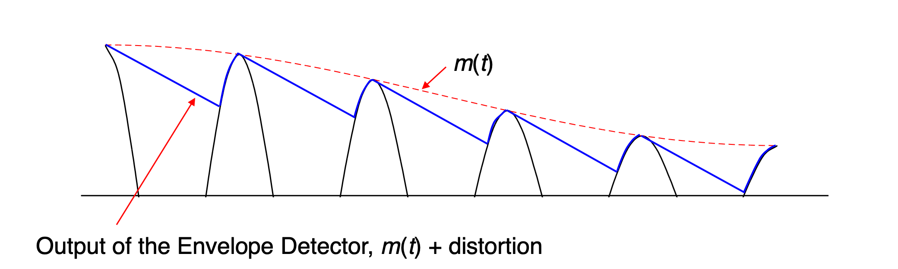

# Signals and Communications 

## I: Introduction to a Communication System

### 1: Communication Systems

- Noise in the systems: external noise and circuits noise reduces the quality of the output. 

### 2: General Digital Communication System Model 

- Source coding: compressing the signals 
- Error control coding: add extra bits (randoms)

#### 2.1: Coder/Decoder (CODEC)

- Sampling: signals at the particular time 
- Quantitation: reducing the binary code 

#### 2.2: Modulator/Demodulator (MODEM)

- Made of modulator and demodulator 

### 3: Radio Transmission 

-  Aerial dimensions are of the same order as the wavelength $\lambda$ of the signal.
-  $\lambda = \frac{c}{f}$, for $c=3\times 10^8$ m/s in free space. 

### 4: Modulation 

- A message information contains the control parameters of carrier signal of a carrier signal, so as to impress the information onto the carrier.

#### 4.1: The Message 

- The message can be digital, analogue or multiple.
- Analogue message, demoted by $*m(t)*$.
- Digital message, denoted by $d(t)$.

#### 4.2: The Carrier 

- The carrier can be a 'sin' or a 'pulse train'.
- If we use a 'cosine' carrier:

$$
v_s(t) = V_c\cos{(2\pi f_c t+\phi _c)}
$$

- The message can varies in amplitude, frequency and  phase, i.e the AM, FM and PM.

## II: Amplitude Modulation 

### 1: Schematic Diagram of AM 

- $v_s(t)=(V_{DC}+m(t))\cos {(2\pi f_c t)}$
- $V_{DC}$ is a variable voltage, which can be 0 to infinite volts.

### 2: Equations for DSB-AM 

* **Double Sideband Amplitude Modulation - DSBAM**:

- If we note the message: $m(t)=V_m\cos{(2\pi f_m t)}$.
- The trigonometric way can be usd to expand:

$v_s(t)=V_{DC}\cos{(2\pi f_c t)}+\frac{V_m}{2}\cos{(2\pi (f_c+f_m)t)}+\frac{V_m}{2}\cos{(2\pi (f_c-f_m)t)}$

### 3: Spectrum and Waveforms 

- It can be found that the message is stored twice in the double **envelope**.

### 4: Modulation Depth 

- The $\frac{V_{m}}{V_{DC}}$ is defined as the **modulation depth**.
- Modulation Depth $m=\frac{Message}{Carrier}$.

### 5: Double Sideband Modulation Types 

- Double Sideband Amplitude Modulation, DSB-AM, with carrier 

- Double Sideband Diminished (Pilot) Carrier, DSB-DimC ($V_{DC}$ is small)

- Double Sideband Suppressed Carrier, DSB-SC (no $V_{DC}$, no carrier).

### 6: Graphical Representation of Modulation Depth and Modulation Types 

- The phase shift may exist, while the information is stored.

### 7: Trapezoid Method of Measuring Modulation Depth 

- For the multiple message signals instead of only one 'sin' single tone, it is difficult to determine the modulation depth.
- So we use the X-Y mode in the oscilloscope, connecting the message signals
to the x-input and AM signals to y-input.
- The trapezoid can be used to justify the modulation depth.

#### 7.1: Trapezoid when m < 1 

#### 7.2: Trapezoid when m = 1

#### 7.3: Trapezoid when m > 1

### 8: DSB-SC from a Balanced Modulator (Used in AM experiment)

### 9: Bandwidth Requirement for DSB-AM 

- The message signals $m(t)$ will not be a single sine, but a band of frequencies extending up to $B$ Hz as shown.

- Bandwidth is two times of the highest frequency in the message.

### 10: Power Considerations in DSB-AM 

- For the AM: 

$$
v_s(t)=V_{DC}\cos{(2\pi f_c t)}+\frac{V_m}{2}\cos{(2\pi (f_c+f_m)t)}+\frac{V_m}{2}\cos{(2\pi (f_c-f_m)t)}

$$

- Noted that the $P_{RMS}=(\frac{V}{\sqrt{2}})^2\times \frac{1}{R_L}$ is only suitable for sin (cos) functions.

* $P_T=\frac{V_{DC}^2}{R_L}(1+\frac{m^2}{2})$

* If we note $P_C=\frac{v_{DC}^2}{2R_L}$

$$
\frac{P_{USB}}{P_T}=\frac{P_c\frac{m^2}{4}}{P_c(1+\frac{m^2}{2})}=\frac{m^2}{4+2m}
$$

### 11: Single Sideband Amplitude Modulation 

- We use BPF to filter one of the sideband.

- After the BPF:

* The BPF filter removes the LSB then the SSB-AM will be:

$$
v_s(t)=V_{DC}\cos{(2\pi f_ct)}+\frac{V_m}{2}\cos{(2\pi (f_c+f_m)t)}
$$

* For SSB-SC, output signal will be:

$$
v_s(t)=\frac{V_m}{2}\cos{(2\pi (f_c+f_m)t)}
$$

### 12: Bandwidth Requirement for SSB-AM 

For the SSB-SC the bandwidth is reduced since there is no carrier component.

### 13: Power in SSB 

For the SSB signal $v_s(t)=V_{DC}\cos{(2\pi f_c t)}+\frac{V_m}{2}\cos {(2\pi (f_m +f_c))t}$ 

the power is:

$$

P_{SSB}=\frac{v_{DC}^2}{2R_L}+\frac{V_m ^2}{8R_L}

$$

### 14: Demodulation of AM Signals

#### 14.1: Envelope or Non-coherent Detection 

* The capacitor charges rapidly and thereby follows the applied voltages up to the positive peak when the diode is conducting, so: 

$$
R_sC << 1/f_c
$$

* After the positive peak, the voltage reduced so that the diode switched off and the capacitor begin to discharging in $R_L$. The discharging continue slowly between the positives peaks of the carrier voltage but no longer than the message period.

$$
\frac{1}{f_c} << R_L C << \frac{1}{W}
$$

#### 14.2: Synchronous or Coherent Demodulation 

* The local oscillator must be coherent in both frequency and phrase with the carrier wave.

##### 14.2.1: Coherent Local Oscillator 

If DSB-AM input = $(V_{DC}+m(t))\cos{(2\pi f_ct)}$

$$
\begin{align*}
V_x &= (V_{DC}+m(t))\cos{(2\pi f_ct)}\cos{(2\pi f_ct)} \\
&= \frac{V_{DC}}{2}+\frac{V_{DC}}{2}\cos{(4\pi f_C t)}+\frac{m(t)}{2}+\frac{m(t)}{2}\cos{(4\pi f_ct)}
\end{align*}
$$

##### 14.2.2: Frequency and Phrase Errors in Synchronous Demodulation: DSB-SC 

The equation for DSB-SC:

$v_s(t)=m(t)\cos{(2\pi f_ct)}$, where $V_{DC}=0$

LPF remove the $2f_c$ component. 

$ V_{out}=\frac{m(t)}{2}\cos{(2\pi \Delta ft+ \Delta \phi)}$

##### 14.2.3: Frequency and Phrase Errors in Synchronous Demodulation: SSB-SC 

### 15: Comparison of DSB and SSB 　

- DSB-AM signals can be demodulated with envelope detector simply.
- DSB-SC and SSB-SC require much less power than DSB-AM and SSB-AM, but more complicated receiver.
- SSB-AM use half the bandwidth of DSB-AM.
- SSB-SC can cope better with small changes in frequencies and phases caused by local oscillator.

