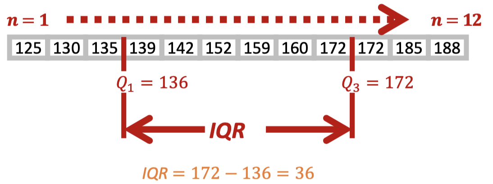
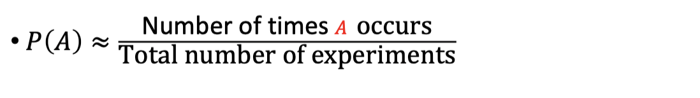

# Statistical Method 

## I: Introduction 

### 1: Definition 

- A random variable is a quantity we want to measure (usually repeatedly) 

- An observation is a particular value of a random variable.

- We only observe a sample of population.

### 2: Data 

- Qualitative data is descriptive.

- Quantitative data can be counted, measured and expressed using numbers.

### 3: Random variables 

- A random variable is a quantity we want to measure (usually repeatedly)

- Some random variables can be qualitative

- Mostly, the random variables are the things we can measure and therefore take numerical values.

### 4: Uncertainties in measurement 

- Systems error (bias) - affects accuracy 
    - Could be reduced or eliminated by careful calibration and experiment.

- Random error (random variation) - affects precision 
    - Due to factors cannot be controlled.
    - Could be reduced by repeated measurements at the same condition.

### 5: Presentation of data

- Bar chart

- Pie chart 

- Histogram 

- Scatter plot 

### 6: Summary Statistics 

#### 6.1: Measure of location 

- The **arithmetic mean**.

- $\bar{x} = \frac{x_1+x_2+...+x_n}{n}$.

- Another method is using occurrence frequency:

$$
\bar{x} = \frac{\Sigma f_ix_i}{\Sigma f_i}
$$

- The weighted mean can be defined as:

$$
\bar{x} = \displaystyle\frac{\Sigma x_iw_i}{\Sigma w_i}
$$

- $w$ is the weighting factor.

- The **trimmed mean** is the mean after the remove of max and min.

- The **median** is the value in the middle of the array.

- The **mode** is the value that appears most often.

#### 6.2: Measure of variability 

- The **range** is $x_{max}-x_{min}$.

- The quartiles are the three points ($Q_1,Q_2,Q_3$) that divide data set into four groups equally.

- $Q_1$ is the lower quartile and $Q_3$ is the higher quartile.

- The interquartile range (IQR) = $Q_3-Q_1$.

- The **variance** (sample variance) is defined by:

$$
s^2 = \displaystyle\frac{\sum_{i=1}^n (x_i-\bar{x})^2}{n-1}
$$

- The equivalent population parameter is the population variance $\sigma ^2$

- The **standard deviation**:
    - For population:
        - $\sigma$
    - For sample:
        - $s$

- The **Coefficient of variation** is unitless defined as $\frac{s}{\bar{x}}$

- The **standard error** of the mean describes the variation of the values in a sample of the population:

$$
S.E._{\bar{x}} = \frac{s}{\sqrt{n}}
$$

## II: Probability 

### 1: Basics Concepts 

- Experiment / Trail: A process where the outcome is **random**.

- Outcome: The result of a particular experiment.

- Sample Space: The set of all possible outcomes of an experiment.

- Events: Specific collection of sample points.

eg:

### 2: Probability of events

- If the sample space *S* of an experiment consists of finitely many outcomes that are equally likely then the probability $P(A)$ of an event $A$ is:

- If the same applies to the experiment which is not equally likely:

- The probability of A is the proportion of times A occurs as the number of trials increasing.

### 3: Events 

- For two events A and B we define:
    - The *union* of A,B: $A\cup B$
    - The *intersection* of A,B: $A\cap B$
    - The *complement* of an A: $A'$ or $\bar{A}$

#### 3.1: Mutually exclusive events 

- Mutually exclusive events **cannot both happen at the same time**.

- E.g. For dice point =1 and point =6.

#### 3.2: Conditional Probability

- Note that $P(A|B)$, which means probability of A given B.

- Using the Venn graph, it can be expressed as:

i.e:

$$
P(A|B) = \frac{P(A\cup B)}{P(B)}
$$

- Using the formula in P(A) and P(B), we can get:

$$
P(A|B) = \displaystyle\frac{P(B|A)P(A)}{P(B)}
$$

- Definition of **independent events**:

Two events are independent if the occurrence of one does not affect the outcomes of other.

- For independent two events:

$$
P(A\cup B) = P(A)P(B)
$$

#### 3.3: Bayes'theorem 

- Bayes' theorem is a way to reversing the condition in a conditional probability:

$$
P(A|B) = \displaystyle\frac{P(B|A)P(A)}{P(B)}
$$

### 4: Combinatorics 

For example, choose random from a unsorted card deck with 52 cards, the possible events can be noted as:

$$
\begin{pmatrix}
52 \\
2    
\end{pmatrix}=
\displaystyle\frac{52!}{(52-5)!5!}
$$

or generally:

$$
C(n,k) = 
\begin{pmatrix}
    n \\
    k
\end{pmatrix} = \displaystyle\frac{n!}{(n-k)!k!}
$$

or 

$$
C(n,k) = \displaystyle\frac{A_k^n}{n!}
$$

- This is called the *permutation*.

