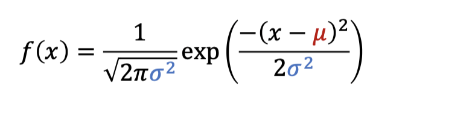
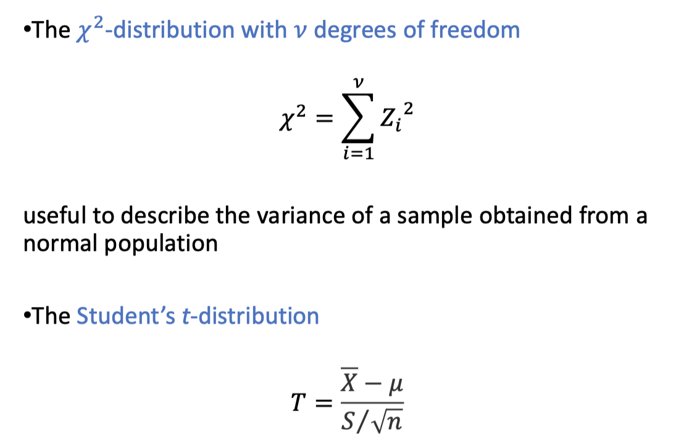
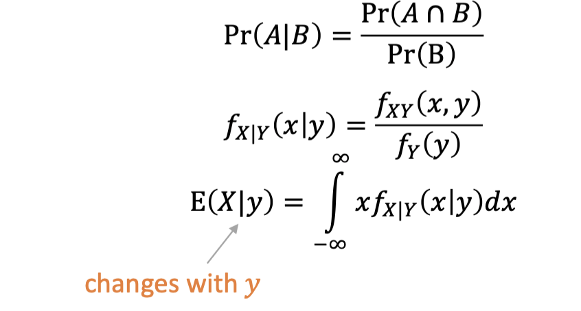

# Statistical Method 

## I: Introduction 

### 1: Definition 

- A random variable is a quantity we want to measure (usually repeatedly) 

- An observation is a particular value of a random variable.

- We only observe a sample of population.

### 2: Data 

- Qualitative data is descriptive.

- Quantitative data can be counted, measured and expressed using numbers.

### 3: Random variables 

- A random variable is a quantity we want to measure (usually repeatedly)

- Some random variables can be qualitative

- Mostly, the random variables are the things we can measure and therefore take numerical values.

### 4: Uncertainties in measurement 

- Systems error (bias) - affects accuracy 
    - Could be reduced or eliminated by careful calibration and experiment.

- Random error (random variation) - affects precision 
    - Due to factors cannot be controlled.
    - Could be reduced by repeated measurements at the same condition.

### 5: Presentation of data

- Bar chart

- Pie chart 

- Histogram 

- Scatter plot 

### 6: Summary Statistics 

#### 6.1: Measure of location 

- The **arithmetic mean**.

- $\bar{x} = \frac{x_1+x_2+...+x_n}{n}$.

- Another method is using occurrence frequency:

$$
\bar{x} = \frac{\Sigma f_ix_i}{\Sigma f_i}
$$

- The weighted mean can be defined as:

$$
\bar{x} = \displaystyle\frac{\Sigma x_iw_i}{\Sigma w_i}
$$

- $w$ is the weighting factor.

- The **trimmed mean** is the mean after the remove of max and min.

- The **median** is the value in the middle of the array.

- The **mode** is the value that appears most often.

#### 6.2: Measure of variability 

- The **range** is $x_{max}-x_{min}$.

- The quartiles are the three points ($Q_1,Q_2,Q_3$) that divide data set into four groups equally.

- $Q_1$ is the lower quartile and $Q_3$ is the higher quartile.

- The interquartile range (IQR) = $Q_3-Q_1$.

- The **variance** (sample variance) is defined by:

$$
s^2 = \displaystyle\frac{\sum_{i=1}^n (x_i-\bar{x})^2}{n-1}
$$

- The equivalent population parameter is the population variance $\sigma ^2$

- The **standard deviation**:
    - For population:
        - $\sigma$
    - For sample:
        - $s$

- The **Coefficient of variation** is unitless defined as $\frac{s}{\bar{x}}$

- The **standard error** of the mean describes the variation of the values in a sample of the population:

$$
S.E._{\bar{x}} = \frac{s}{\sqrt{n}}
$$

## II: Probability 

### 1: Basics Concepts 

- Experiment / Trail: A process where the outcome is **random**.

- Outcome: The result of a particular experiment.

- Sample Space: The set of all possible outcomes of an experiment.

- Events: Specific collection of sample points.

eg:

### 2: Probability of events

- If the sample space *S* of an experiment consists of finitely many outcomes that are equally likely then the probability $P(A)$ of an event $A$ is:

- If the same applies to the experiment which is not equally likely:

- The probability of A is the proportion of times A occurs as the number of trials increasing.

### 3: Events 

- For two events A and B we define:
    - The *union* of A,B: $A\cup B$
    - The *intersection* of A,B: $A\cap B$
    - The *complement* of an A: $A'$ or $\bar{A}$

#### 3.1: Mutually exclusive events 

- Mutually exclusive events **cannot both happen at the same time**.

- E.g. For dice point =1 and point =6.

#### 3.2: Conditional Probability

- Note that $P(A|B)$, which means probability of A given B.

- Using the Venn graph, it can be expressed as:

i.e:

$$
P(A|B) = \frac{P(A\cup B)}{P(B)}
$$

- Using the formula in P(A) and P(B), we can get:

$$
P(A|B) = \displaystyle\frac{P(B|A)P(A)}{P(B)}
$$

- Definition of **independent events**:

Two events are independent if the occurrence of one does not affect the outcomes of other.

- For independent two events:

$$
P(A\cup B) = P(A)P(B)
$$

#### 3.3: Bayes'theorem 

- Bayes' theorem is a way to reversing the condition in a conditional probability:

$$
P(A|B) = \displaystyle\frac{P(B|A)P(A)}{P(B)}
$$

### 4: Combinatorics 

For example, choose random from a unsorted card deck with 52 cards, the possible events can be noted as:

$$
\begin{pmatrix}
52 \\
2    
\end{pmatrix}=
\displaystyle\frac{52!}{(52-5)!5!}
$$

or generally:

$$
C(n,k) = 
\begin{pmatrix}
    n \\
    k
\end{pmatrix} = \displaystyle\frac{n!}{(n-k)!k!}
$$

or 

$$
C(n,k) = \displaystyle\frac{A_k^n}{n!}
$$

- This is called the *permutation*.

### 5: Distributions 

#### 5.1: Random variable 

- Variables whose possible values outcomes of a random process.

- Discrete or Continuous.

- Consider a random variable that represents the outcome of a experiment.

#### 5.2: Probability Distributions of Univariate discrete variable

- For a *discrete* random $X$:

    - the distribution corresponds to a list of probability $P(X=x)$ for all values of $x$, formally known as the *probability mass function*:

$$
f(x) = P(X=x)
$$

- Note that:

$$
0 \le f(x) \le 1 
$$

$$
\Sigma P(X=x) =1 
$$

eg:

#### 5.3: Probability Distributions of Univariate continuous variable

- For a continuous random variable $Y$:
    - the set of possible outcomes is **infinite**
    - we cannot specify the pmf for a continuous random variable, which use **cumulative distribution function (cdf)** is defined the same :$F(y) = P(Y\le y)$.
    - the probability that the outcome has a value between a small interval $y$ and $y+\delta y$. 
    - the gradient of $F$ at $y$ is:

$$
\frac{F(y+\delta y)-F(y)}{\delta y}
$$

- The gradient function $f(y)$ is known as the probability function (pdf):

$$
f(y) \ge 0 \quad \forall y 
$$

which is related to the cdf:

$$
f(y) = \displaystyle\frac{dF(y)}{dy}
$$

- Note that it is possible for the pdf to take values greater than 1, as the **pdf** itself is not probability, the cdf is the probability.

- For example:

#### 5.4: The expectation of a random variable 

- The expectation or expected value is defined as:

$$
E[X] = \displaystyle\Sigma x P(X=x)
$$

#### 5.5: The variance of a random variable 

$$
Var[X] = \displaystyle\Sigma (x-E[x])^2P(X=x) = E[X^2]-E[X]^2
$$

- Other relationship:

$$
Var[aX+b] = a^2 Var[X]
$$

- For independent random variable:
    - Var[$X_1+X_2$] = Var[$X_1$] + Var[$X_2$]

#### 5.6: The binomial distribution

- Describe the number of *successes* in a sequence of n independent experiments.

- The distribution has two parameters: n for the number of trial and p for probability of success for each experiment.

- The pmf for binomial distribution is:

$$
P(X=x) = C_n^x p^x (1-p)^{n-x}
$$

- The expectation of binomial distribution is expressed as:

$$
E[X] = np
$$

- The variance of binomial distribution is expressed as:

$$
Var[X] = np(1-p)
$$

#### 5.7: The Poisson distribution 

- Describe the probability of a given number of events occurring in a fixed interval of time (or space etc.) if:
    - these events occur with a known constant rate (parameter $\lambda$)
    - and are independent of the time since the last event.

- The probability mass function of a Poisson distribution with $\lambda$ is given by:

$$
P(X=x) = e^{-\lambda} \frac{\lambda ^x}{x!}
$$

- It can be shown that $E[X] = \lambda$ and Var[X] = $\lambda$.

- Sum of the independent Poisson Distribution also follow the Poisson distribution.

- The Poisson distribution can be used to approximate the binomial distribution when the total number of trials is **large** and the probability of success is **low**.

#### 5.8: Comparison of Binomial and Poisson 

#### 5.9: Continuous distributions 

##### 5.9.1: Continuous uniform distribution 

##### 5.9.2: The exponential distribution 

##### 5.9.3: The normal distribution 

- A 'bell-shaped' curve, or a Gaussian curve mean $\mu$ and $\sigma ^2$, which is denoted as:

$$
X ~ N(\mu,\sigma^2)
$$

- The standard normal distribution has $\mu = 0$ and $\sigma^2$:

- Using the standard normal function table and the symmetric property, the possibility P(Z < m) can be find easily.

- Any normally distributed random variable, $X(\mu, \sigma ^2)$ can be transformed (standardized) to the standard normal distribution:

$$

$$

- After the transform, the pmf about new variable z ica n be got as:

 - The add operation of two different normal distribution X1 and X2:

- The central limit theorem:

- Approximation to binomial distribution:
    - As n increasing, the binomial distribution tends towards a normal distribution with mean $np$ and variance $np(1-p)$.
    - Normally requires $np > 5$ and $n(1-p) >5$ 

- Continuity Correction:

- The normal distribution can be used to approximate a Poisson distribution with $\lambda > 10$, for large $\lambda$, each individual outcome becomes small so the continuity can be omitted.

##### 5.9.4: Other continuous distribution 

### 6: Joint probability distributions inference 

#### 6.1: Joint probability distribution 

- If we consider two random variables simultaneously, it will lead to a **joint probability distribution**.

- The joint probability is the probability of the intersection of events $X =x$ and $Y = y$:

- Marginal probability: the probability that $X=x$ regardless of value of $Y$ and vice versa.

- Conditional probability:

- Expectations:

- Covariance:

#### 6.2: Inference - estimation 

##### 6.2.1: Inference 

- We can construct the models for the population and use the information from the sample to estimate the unknown parameters in the model.

##### 6.2.2: Point estimate vs interval estimate 

- Point estimate:
    - gives a single-value estimation of some population parameters.
    - eg. use sample mean to estimate population mean.

- Point estimation:
    - gives a probability of population mean in [a,b].

##### 6.2.3: Estimators 

