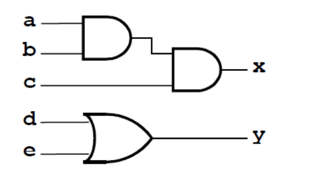
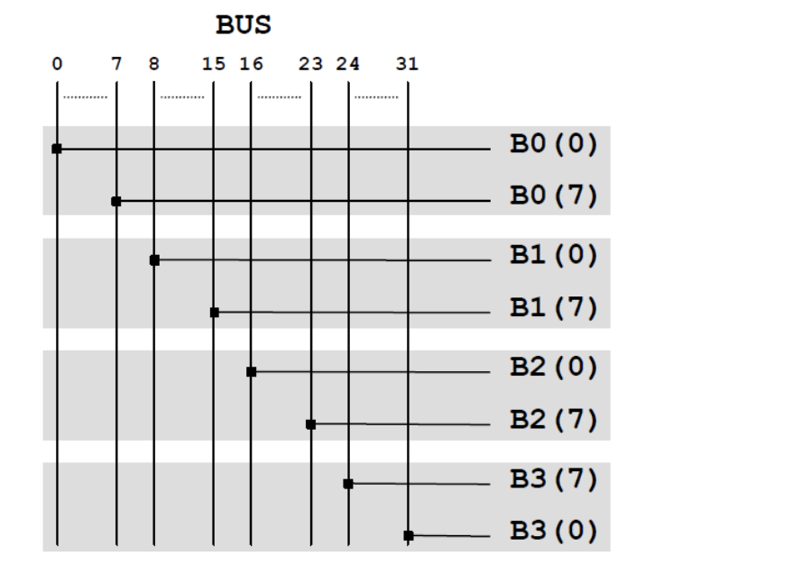
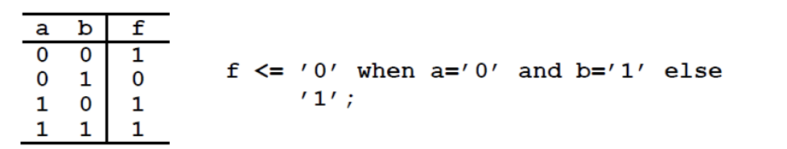

# VHDL Programming 

## I: Introduction 

- VHDL short for VLSI hardware description language.

- VHDL is not an executable language but represents the **elements of a digital circuit**.

### 1.1: Structural-level or gate-level 

The example of gate-level be like:


At this level the VHDL describes elements and how they connected to each other:

- 1: names and types for inputs and outputs.

- 2: logical elements types (AND, NOT, MUX)

- 3: names for internal signals (T1)

- 4: names for the instances of logical elements (U1)

- 5: connection between signals and ports

This representation is called the **netlist**.

### 1.2: Register Transfer Level (RTL) or data-flow level 

The RTL describes the transformation that data undergo while propagating through the circuit. The circuits can be seen as a set of two types of elements:

- 1: Combinatorial logic:
    - explicitly expresses data transformation using algebra, arithmetic expression and condition statements.

- 2: Registers 
    - Registers are responsible for storing the intermediate results.
    - In structural terms, an RTL specification is a sequence of combinatorial logic elements interrupted by registers:


I is the input , U is the output, and CLK is the clock. At RTL level, each operation is explicitly assigned to a **particular process** or **a specific clock cycle**.

- The operation assignment at the various CLK is called **scheduling**.

### 1.3: Arithmetic or behavioral level 

It will be the synthesis tool that will schedule the operations on the  various  clock cycles based on  constraints imposed  by the designer, such as the minimum clock 
frequency or the maximum area. (not considered in this module)

## II: Design entitles 

Each system can be simplified to **modules or blocks**.

For example of roots calculation of second-degree equation:


- To reuse some of the modules, the difference between module and instance should be introduced.

### 1: Modules and instances 

- Module is single entity composed of an **interface** and defined **behavior**.

- Instance represents an **object** of this module used in this circuit.

For example:


this diagram consists of **3 modules and 5 instances**.

### 2: Entity 

- The module interface is called **entity** and determined by the *entity* construct.

- The behavior is called **architecture** and is represented by *architecture* construct.

The entity construct specifies the module name, the ports and a set of generic parameters if needed:

```VHDL
entity entity_name is 
    [generic(generic_list);]
    [port(port_list);]
end entity_name;
```

- The *entity_name* must be unique for each design, the *prot_list* describes the input and output signals of the design entity.

- The *port_list* describes the input and output as:

```VHDL
prot_name[,port_name,...]:{in|out|inout} port_type

```

For example of full adder:


- Note that a delay parameter is also specified for simulation purpose only. A value will be assigned to this parameter when the component is instantialised.

The code would be like (-- for comments):

```VHDL
entity full_adder is
    generic (delay: time);
    port(
        -- inputs
        a:  in bit; 
        b:  in bit;
        cin: in bit;

        -- output 

        s: out bit; 
        cout: out bit;
    );
    
end full_adder;

```

### 3: Architecture 

An entity declaration defines the module interface, but it does not specify the functionality, which is described by architecture declaration:

```VHDL
architecture architecture_name  of entity name is 
    [declaration]
begin 
    [implementation]
end architecture_name;
```

It is possible to specify different architecture for same entity and select one before proceeding. The association between a particular architecture and an  entity is called *configuration declaration*.

For the implementation of full-adder:

```VHDL
architecture first of full_adder is 
begin 
    s <= a xor b xor cin after delay;
    cout <= (a and b) or (b and cin) or (a and cin) after delay;
end first
```

- Note that the synchronous problem should be mentioned, for example of the circuit below:



the code would be:

```vhdl
begin 
    t <= a and b;
    x <= t and c;
    y <= d or e;
end par_two
```

Note that the first AND gate and second AND gate are not executed synchronous, while the sentences under "begin" would execute at same time, which would lead to conflict.

So if we choose another architecture:

```VHDL
architecture par_three of circuit is 
    signal t: bit;
begin 
    y <= d or e;
    x <= t and c;
    t <= a and b;
end par_three;
```

The conflict would be solved.


## III: Data Types 

### 1: Data types 

- Only few of the types can be used fro *synthesis purpose* as they are recognized by *automatic synthesis tools*.

- The **basic data types** and **user-defined types** will be introduced.

### 2: Bit types

- The bit type is the simplest, which represent a binary value and can only be '0' or '1' enclosed in single **quotes**.

- The operators are **assignment, comparison and logical operators**.

```VHDL
x <= a and b;
y <= '1';
```

- Constant need quotes and '+' no defined.

#### 2.1: Bit-vector type 

- Used for vectors.

- A set of signals by a common **name** and an **index**.

- Possible to read and write elements through index:

- The vector has an order determined by keywords **to** or **downto**:

```VHDL
bit_vector( 0 to 3 ); -- 4 Elements 
bit_vector( 16 downto 1); -- 16 Elements
```

- The specific elements is referred using (), such as a(5).

- Bit and bit-vector have no other states rather than logic '0' or '1', to use *std_logic* and *std_logic_vector* to extend the range of values and solve these limitation.

### 3: Integer type 

- The integer type represents **32-bit integer** values and can be used for synthesis.

- The values are **unsigned integers** by default.

### 4: IEEE types 

- It is used for synthesis purposes to specify values other than '0' and '1'.

- A standard IEEE library defines the addition types: *std_logic** that include a nine logic values rather than 2:


- The IEEE library has three packages:
    - std_logic_unsigned
    - std_logic_signed 
    - std_logic_arith
- These define some arithmetic and comparison operators for std_logic and std_logic_vector types, such as :

```
c <= a +b;
```

### 5: User-defined types: subtyping and enumeration 

- A user-defined type is a new data type specified by the user that can redefined some operators used in new type.

- **Subtyping** defines a new type equivalent ro an existing one with limited range of values.

eg.

```VHDL
subtype new_type_name is type_name range val1 to val2 ;
```

- To define a 5-bit integer as a subtype of standard integer with a range:

```VHDL
subtype small_integer is integer range 0 to 31; 
```

- **Enumeration** defines a new type by enumerating all the values:

```VHDL
type new_type_name is ( val0, val1, ..., valN ); 
```

- A typical case of using an enumerated type is in finite state machine:

```VHDL
type status is ( RES, INIT, COMP, ERR, OK ); 
```

- For a signal **pres** of this type:

```
pres <= INIT;
```

## IV: Combinatorial Logic 

### 1: Slice and Concatenation 

- *Slice* is a subset of a vector:

```VHDL 
signal_name (index1 to index2);
```

- Index1 and index2 must be valid value followed the order imposed by *to* or *downto*.

For example:

```VHDL 
architecture rtl of test is 
    signal BUS: std_logic_vector(0 to 31);
    signal B0, B1, B2, B3: std_logic_vector(0 to 7);
begin 
    B0 <= BUS(0 to 7);
    B1 <= BUS(8 to 15);
    B2 <= BUS(16 to 23);
    B3 <= BUS(31 downto 24);
end rtl;
```


- The *concatenation* allows signals under the same name with the operator '&':

```VHDL
BUS2 <= B3(7 downto 0) & B2 & B1 & B0 
```

For example:

```VHDL
if ( a='1' and b='0' and c='1') then ...
```

can be rewrite as:

```VHDL
signal temp: std_logic_vector(0 to 2);
temp <= a & b & c;
if (temp = "101") then ...
```

### 2: Logic expression 


### 3: Truth tables 

- For example:


which using *conditional assignment* construct.

or more simplified version:



or the output may not limits to '0' and '1':


- The concatenation can be used in truth tables:

```VHDL
architecture rtl of test is 
    signal temp: std_logic_vector (0 to 1);
begin 
    temp <= a & b;
end rtl;
```
and 

```VHDL 
with temp select
    f <=  '1' when "00",
    '0' when "01",
    '-' when "10",
    '1' when "11",
    '-' when others;
```

### 4: Implication Tables: 6 to 3 priority encoder 

- An *encoder* accepts an active level on one of its inputs representing one digit and converts it to a coded output (binary).


For example:

```VHDL
-- 6 to 3-bit priority encoder 
library IEEE;
use IEEE.std_logic_1164.all;

-- The encoder 
entity pro_enc is 
    port(a: in std_logic;
         b: in std_logic;
         c: in std_logic;
         d: in std_logic;
         e: in std_logic;
         f: in std_logic;
         f0: out std_logic;
         f1: out std_logic;
         f2: out std_logic;
    );
end pri_enc;
```

and the architecture:

```VHDL 
architecture rtl of pri_enc is 
    signal enc_in: std_logic_vector(0 to 5);
    signal enc_out: std_logic_vector (0 to 2);
begin 
    -- concatenation inputs into enc_in 
    enc_in <= a & b & c & d & e & f;
```


