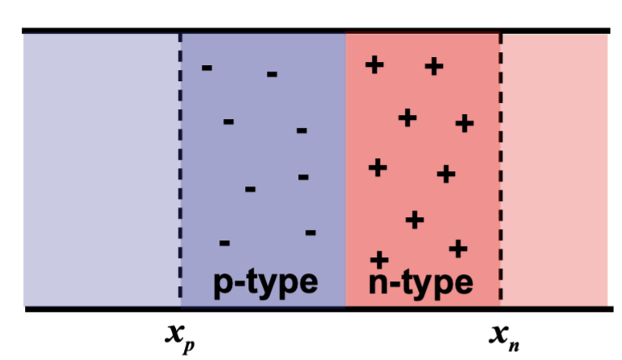

 Electronic Devices for Smartphones Report  

Ziyu Tian 

## I: Abstract

This report presents a comprehensive analysis of electronic devices crucial to the functionality of smartphones, including MOSFET, CMOS, LED/OLED display, and RAM/FLASH memory. Each section explores the basic principles, equation derivations, and the influence of various semiconductor parameters and technologies. Based on the principle,the report highlights the interplay of these devices and their impact on smartphone performance. Notable contents include the application of MOSFET equivalent scaling methods, demonstrating the evolving landscape of modern transistors. The report concludes with insights into the future outlook for electronic devices in the context of smartphone technology.
 

## II: Introduction 

The rise of smartphones should be recalling to the end of 20th century, when the IBM Simon (shown in Fig.1) is invented by IBM and BellSouth in 1933. Powered by the inventing of MOSFET, IBM Simon with a touchscreen was referred as the first smartphone in the world. Based on the achievement of IBM Simon, the burgeoning smartphone industry developing rapidly. In 2008, Apple Company pushed out iPhone 3G, which is another milestone in the history of smartphone. As shown in Fig.2, iPhone 3G has already presented a complete exemplar electronic system, which is generally similar to the latest smartphone such as iPhone 15. Since than, the smartphone become a typical system with multiple functional electronic devices, including MOSFET / CMOS inside the main processor and memory chip and p-n junction in LED screen,. In the following report, I would focus on the the principles of these devices with related technology, demonstrate how these could be applied on modern smartphones.

    

{:height="150px" width="150px"}

*Fig.1* IBM Simon

 

|{:height="150px" width="150px"}|{:height="140px" width="140px"}|
|---|---|

*Fig.2* iPhone 3g (left) and iPhone 15 (right)

## III: Electronic Device Technology 

## 1: MOSFET: Key Component of CPU and Memory 

## 1.1: Principle of MOS Capacitors 

Inside the modern smartphone system, the Central Processor Units (CPU) plays a essential role to conducting calculation tasks, and MOSFET is the key components to form a CPU. To construct a CPU such as Apple A17 (SoC actually) shown in Fig.3, billions of MOSFET should be deployed precisely. In the following part of this chapter, I would demonstrate the functionality principles of MOSFET from the MOS capacitors.   

   

{:height="150px" width="150px"}

*Fig.3* Apple A17 SoC

The name 'MOS' refers to Metal Oxide Semiconductor, which means it is composed of a piece of metal, a layer of oxide insulator and another substrate of semiconductor, as shown in Fig.4. In the domain of smartphone electronic system design, the expectation of a MOS is to perform as a switch to control the carrier polarity at 'surface layer' in the substrate. This process is called 'inversion', which could generate a hole-doped layer inside the the electron-doped substrate (n-type) semiconductor, and vice versa for the p-type semiconductor.

  

{:height="160px" width="250px"}

*Fig.4* MOS Structure

For example of a p-type semiconductor, the principle of inversion layer generation could be descried as the following steps. Before adding external voltage across the metal, the energy-band graph could be shown as Fig.5. According to the Fermi-Dirac distribution function, which provides the possibility of a electron occupying energy-band $E$:

$$
F(E) = \displaystyle\frac{1}{1+e^{\frac{E-E_F}{kT}}}
$$

Applying the integration on $F(E)$ from $E_c$ to the top of conduction-band, the electron concentration of could be deduced as below:

$$
\begin{aligned}
    n &= \sum_{E_C}^{E_{top}}N(E)F(E){\rm d}E \\
    &= N_C\exp(-\displaystyle\frac{E_C-E_F}{kT}) \\
    &= n_i\exp(\displaystyle\frac{E_F-E_i}{kT}) \\
\end{aligned}
$$

And the expression of hole concentration could be deduced in the same structure:

$$
p = n_i\exp(\displaystyle\frac{E_i-E_F}{kT})
$$

  

{:height="150px" width="150px"}

*Fig.1.3* P-type Original Energy-band Graph

In this condition, if we add the external positive voltage on the metal side, the previous conduction-band would bend down due to the depletion of holes in p-substrate, as shown in Fig.1.4. The conduction-band would keep bending with the increasing of metal-voltage. During this process, the value of $E_F-E_i$ become positive, which means the electron-concentration $n_p$ is larger than $n_i$ according to the formula above. If we define that $\phi _F = E_i -E_F$, with the continuous bending of $E_C$, the inversion concentration $n$ would be equal to the original $p$ when $E_i$ moving to the symmetric position of original $E_i$, as shown in Fig.6. This state is called *strong inversion*, indicating that a strong inversion layer doped with electrons is completely generated in the original p-type substrate.

  

{:height="180px" width="220px"}

*Fig.5* Bending of Energy band

  

.png){:height="180px" width="220px"}

*Fig.6* Bending in Strong Inversion

To apply this method of generating inversion layers, the precise value of the external voltage should be determined in order to generate the inversion layer. Based on the band-bending result, the voltage-drop through the oxide and semiconductor surface would generate a build-in voltage $\phi_{bi} = \phi_s + \phi_{ox}$, as shown in Fig.7. If we apply the external voltage $V_G$ in addition to the build-in potential difference, the new relation could be expressed as: 

$$
\phi_{bi} + V_G = \phi_s +\phi_{ox}
$$

The semiconductor surface potential could be derived from the integration of $E$ through the depletion direction:

$$
\begin{aligned}
\displaystyle\phi_s &= \int_{0}^{x_d}\frac{qN_Ax}{\varepsilon
_0 \varepsilon_s}{\rm d}x   \\
&= \frac{qN_Ax_d^2}{2\varepsilon_0 \varepsilon_s}
\end{aligned}
$$

According to the calculation above, the conduction-band should be decreased until the bending potential reaches $2\phi_s$ to form the *strong inversion* threshold, i.e. $\phi_{st} = 2\phi_{s}$. 

The next step to calculate $V_G$ is to find the $\phi_{ox}$ when the semiconductor reaches the *strong inversion*:

$$
\begin{aligned}
\displaystyle\phi_{ox} &=  \frac{-Q_{s}}{C_{ox}} \\
&= \frac{-qN_Ax_{dmax}}{C_{ox}}
\end{aligned}
$$

Based on the formulas above, the necessary metal-side voltage could be expressed as:

$$
V_G = -\phi_{bi} + \phi_{st} -\frac{Q_{dmax}}{C_{ox}}
$$

At this stage, a switch-like MOS capacitor could be built to control the inversion in semiconductor substrate with a calculated voltage $V_G$. Applying the switching function of MOS, another useful electronic devices called MOSFET were invented in 1960.

  

{:height="180px" width="350px"}

*Fig.7* Metal-Oxide-Semiconductor Potential Difference

## 1.2: Principle of MOSFET 

The typical MOSFET (eg. n-channel) is composed of four electrode terminals, including a p-type substrate, two electron doped regions (Drain and Source) and a metal-electrode called gate, as shown in Fig.8 below. With the increasing of the voltage across the drain and source electrodes $V_{DS}$, a inversion layer would be generated along the channel, as shown in Fig.9. Keep increasing $V_{DS}$, the potential difference between gate and drain would decrease, so that decrease the concentration of electron in channel, finally the n-channel would disappear, which is called *pinch off*, as shown in Fig.10. According to the operation principle of MOSFET above, the $I_D$_$V_{DS}$ graph could be drawn as Fig.11, presenting the drain-source current $I_D$ would increase with the increasing of $V_{DS}$, until the saturation happens. 

  

{:height="120px" width="300px"}

*Fig.8* MOSFET Structure

  

.png){:height="120px" width="300px"}

*Fig.9* Inversion Layer Generation (the green channel)

  

.png).png){:height="120px" width="300px"}

*Fig.10* Inversion Layer Pinch-Off

  

{:height="120px" width="300px"}

*Fig.11* I-V Graph

To implement the MOSFET in a micro-electronic system such as smartphone, another analysis should be conducted on the value of $I_D$, which is relative to the power and performance issues. 

The equation of train current $I_D$ could be derived from the drift-current formula:

$$
\begin{aligned}
    I_D &= J_eWd \\
    &= q\mu_e n(y)E_y(y)Wd \\
    &= Q(y)\frac{\mu_e}{d}\frac{dV(y)}{dy}Wd \\
    &= -W\mu_eC_{ox}[V_{GS}-V(y)-V_t]\frac{dV(y)}{dy} \\
    &= -\frac{W}{L}\mu_eC_{ox}[V_G-\frac{1}{2}V_{DS}-V_t]V_{DS}
\end{aligned}
$$

In the scenario of power of MOSFET, the $I_D$ we considered is the off-state current, which means the static current without any $V_{GS}$. If we increase the value of $I_D$, the MOSFET would response in a higher frequency, which means the overall performance would be improved. However, this would also lead to a higher off-state power. The trade-off between power consumption and performance should be considered during the design process. 

With the help of MOSFET theory, the CPU and Memory module could be constructed from basic logic gates.

## 1.3: Application of MOSFET: Processors

The basic logic gates in the smartphone processors use a special MOSFET structure, which called the Complementary MOSFET (CMOS). CMOS is composed of a pair of complementary MOSFET, i.e. a n-channel and a p-channel MOSFET. A typical CMOS element could be used as a logic inverter as shown in Fig.12. When a logic '1' voltage be applied as the input, the p-channel MOS would be off without generation of inversion layer while the n-channel MOS would be on to enable the output as a logic '0' voltage. In addition, other basic logic gates could be designed with CMOS as well. Fig.13 shows a example of CMOS NAND gate. If we construct the logic gates with the calculation purpose such as adders or multipliers, it could execute the tasks of computation, which is the core-principle of the processors. In modern CPU design, billions of CMOS would be constructed to perform the processing tasks. 

  

{:height="100px" width="200px"}

*Fig.12* CMOS Inverter

  

{:height="100px" width="200px"}

*Fig.13* CMOS NAND Gate

## 1.4: Application of MOSFET: Memory

Apart from the processors, various memory chips play an important role in smartphones as well. In the following paragraph, I would demonstrate the basic principle of three most common types of memory: DRAM, SRAM and FLASH Memory.

DRAM (Dynamic Random Access Memory) has a simple structure as shown in Fig.14, which is composed of a MOS switch and a common capacitor. The capacitor cell would be charged with the control of MOS-switch. During that process, a one-bit data could be stored into the capacitor. 

  

{:height="150px" width="250px"}

*Fig.14* DRAM Structure

Compared to DRAM, SRAM (Static Random Access Memory) has a faster response speed. As shown in Fig.15, two face-to-face invertors generate a latch structure. The input data would be transmitted between two invertors until being read from the output. 

  

{:height="150px" width="250px"}

*Fig.15* SRAM Structure

FLASH Memory has a special MOS structure which combines the advantages of DRAM and SRAM. Additional floating cell is added between the control gate and semiconductor, as shown in Fig.16. For a typical NOR Flash, hot electron injection is used to charge and discharge the floating gate. If the floating gate has electrons, the value stored would be '0' while empty cell means '1'.The data could be read and write with the control of gate-voltage.

  

{:height="150px" width="250px"}

*Fig.16* FLASH Structure

In summary, the memory modules are composed of different constructions of MOSFET / CMOS.

## 2: LED: Development of Display Devices 

## 2.1: P-N Junction and LED Principles

The operation principle of LED is based on a P-N Junction, which is a two-terminal devices with a p-doped substrate and a n-doped substrate, as shown in Fig.17. At the interface of n-type and p-type, the electrons / holes concentration gradient would lead to a diffusion effect. The moving of electrons in n-type would leave the holes which are trapped in the crystal cells, and the holes in p-type would leave the electrons. The potential difference of these trapped carriers would generate an internal electric-field, which is called the build-in voltage $V_{bi}$. If we applied a positive voltage on the p-type (forward bias), the drift current would go through from p-type to n-type. During this process, the redundant electrons and holes would re-combine at the middle interface. In some carefully designed p-n junction with special semiconductor materials, the energy generated from p-n re-combination would be radiated in the form of photom. This process could be described by formula below:

$$
\begin{aligned}
    \lambda &= \displaystyle\frac{hc}{E} \\
    &= \frac{1.24}{E_g (eV)}
\end{aligned}
$$

The wave-length $\lambda$ represents different type of light as shown in Fig.18, so that the color of light could be controlled by $E_g$, which is subject to the LED materials. If we construct hundreds of LEDs to form a matrix with a controller-circuit (as shown in Fig.19), a character could be displayed on this screen. The technology of LED pushed the barrier of screen development significantly.

  

{:height="150px" width="250px"}

*Fig.17* P-N Junction

  

{:height="200px" width="300px"}

*Fig.18* Electromagnetic Spectrum

  

{:height="200px" width="300px"}

*Fig.19* Example of LED Matrix Control Circuit

## 2.2: OLEDs and AMOLEDs

Developed from basic LED principles, a more energy efficient and high-resolution Organic LED (OLED) is invented. Sharing the same principle, OLED has the similar structure with LED, as shown in Fig.20. Under the forward bias voltage, the electrons and holes would be combined at the interface between two transport layers. In OLED, several types of organic films are placed in thew middle of junction, which could control the light color. Compared to traditional LEDs, OLED have thinner structure with more flexibility, which makes the curved screen on smartphone possible. As a self-lightning device, OLED could be used on high-resolution screen without any light-source. 

  

{:height="150px" width="250px"}

*Fig.20* OLED Structure

Nowadays, OLED has already being widely used in the applications of smartphone screens. One of the most popular OLED technology is the Active Matrix Organic Light Emitting Diode (AMOLED). In AMOLED designs, each pixel could be controlled by an individual thin film transistor 
(TFT), as shown in Fig.21. This method consume less power with higher resolution due to the precise-control of current via TFT matrix, so that been generally used in smartphone industries.

  

{:height="150px" width="300px"}

*Fig.21* Thin Film Transistor (TFT)

## 3: MOSFET Scaling: Further Evolution 

To optimize the performance of semiconductors, the key target of MOSFET research is to reduce the size of MOSFET. The following methods are used to scale transistors equivalently. Strained Silicon shown in Fig.22 could improve the carrier mobility by changing silicon structure and the FinFET structure shown in Fig.23 reduce the drain current via its special 3D structure. Based on these scaling methods, the 3 nm generation design from TSMC could be produced, which is the latest technology till now.

  

{:height="150px" width="300px"}

*Fig.22* Strained Silicon Crystal

  

.png){:height="150px" width="250px"}

*Fig.23* FinFET Structure

## IV: Discussion 

Mainly focus on the applications of MOSFET/CMOS and LED, the analysis above elucidating the principles of smartphone CPU and Memory, indicating the importance of optimizing MOSFET performance-power relation and improving LED display resolution. 

From 22 nm (2011) to 3 nm (2023), from LED to AMOLED, the semiconductor manufacturing industries developed rapidly in the past 10 years. Anticipating future advancements, I expect continuous progress in MOSFET optimization to play a pivotal role in enhancing semiconductor performance, and the new materials might improve the OLED flexibility further. 
## V: Summary and Conclusion 

From the first smartphone was invented in 1933, to the iPhone 15 Pro being pushed put in 2023, the rapid iteration of semiconductor industry leads to the blooming of smartphone. Focus on the optimization of MOSFET, CMOS and LED, the key issues of the performance-power trade-off has been proposed. Base on the further research products, the more advanced MOS scaling technology, new LED materials and even holography, would definitely lead to a bright outlook of the smartphone systems.The discovery of semiconductor devices would an endless journey.
