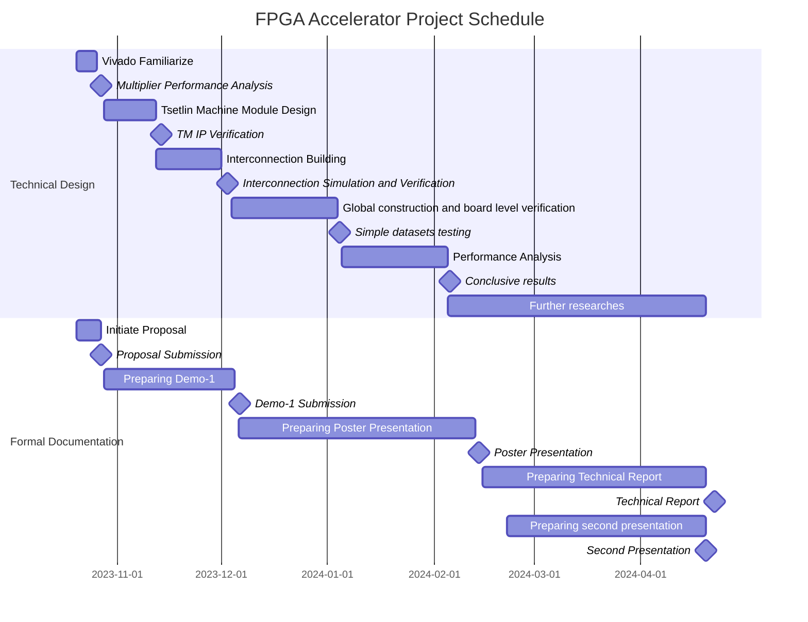

```mermaid

gantt
    dateFormat  YYYY-MM-DD
    title       FPGA Accelerator Project Schedule 
    excludes    

    section Technical Design
    Vivado Familiarize                     : a1, 2023-10-20,2023-10-26

    Multiplier Performance Analysis        :milestone, 2023-10-27, 0d

    Tsetlin Machine Module Design                            :         a2, 2023-10-28,2023-11-12

    TM IP Verification:    milestone, 2023-11-15

    Interconnection Building:                     :         a3, 2023-11-12, 2023-12-01

    Interconnection Simulation and  Verification                     : milestone, 2023-12-03, 0d

    Global construction and board level verification: a4, 2023-12-04, 2024-01-04

    Simple datasets testing: milestone, after a4, 1d

    Performance Analysis: pa1, 2024-01-05,2024-02-05

    Conclusive results: milestone, after pa1, 1d 

    Further researches: further1, 2024-02-05, 2024-04-20


    section Formal Documentation 

    Initiate Proposal    :  proposal1,2023-10-20,2023-10-27

    Proposal Submission :  milestone, after proposal1, 0d

    Preparing Demo-1: demo1,2023-10-28,2023-12-05

    Demo-1 Submission: milestone, after demo1, 3d

    Preparing Poster Presentation: post1,2023-12-06,2024-02-13

    Poster Presentation: milestone, after post1,2d 

    Preparing Technical Report: report, 2024-02-15, 2024-04-20

    Technical Report: milestone, after report, 5d 

    Preparing second presentation: demo2,2024-02-22, 2024-04-20

    Second Presentation: milestone, after demo2, 0d 


```

