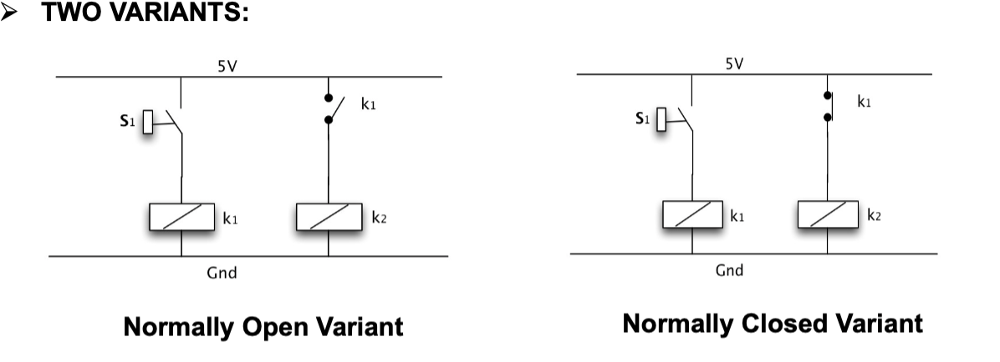
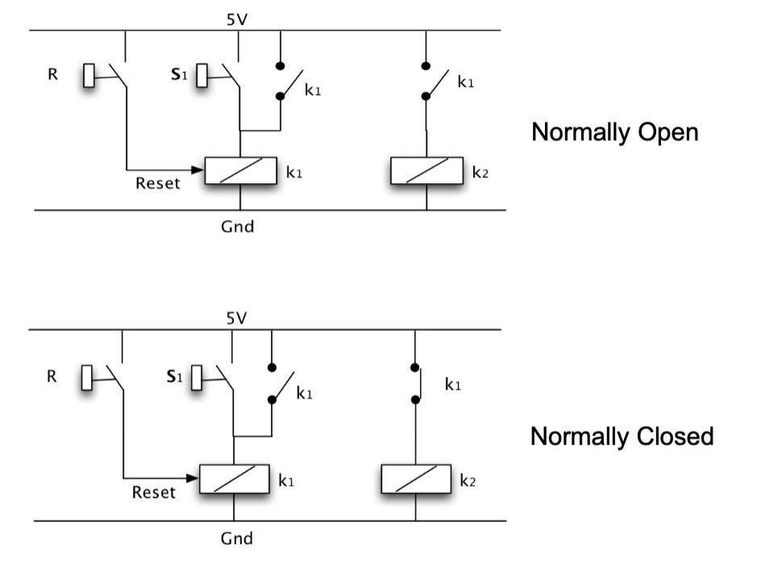
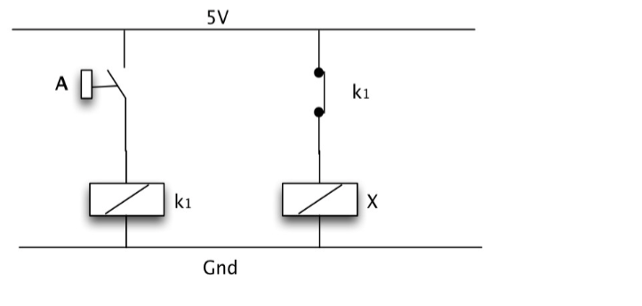
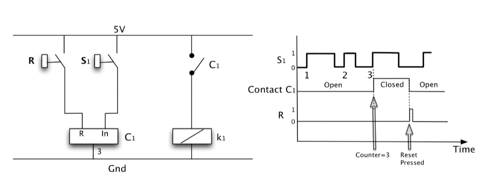

# Industrial Automation and PLCs 

## I: ON-OFF (relay) Control 

### 1: Background 

- Often described as ON-OFF control or BANG-BANG Control.

- Could be implemented using simple RELAYS or by software implementation using PLC.

### 2: Washing Machine Example 

### 3: Type-1 RELAY 

- Using coils to control a different switch.

### 4: TYPE-2 Relay Latching and Reset Circuit 

- We need a mechanism which will latch the relay when
the button is pressed and released. We also need a mechanism to reset the latch.

- We could implement Logical Expression using Relays. 

- Buffer should be like:

- NOT Gate should be like:

- AND Gate:

- OR Gate:

- XOR Gate:

### 5: Example of a water-level control system 

- If the level reaches the setting level or the emergency switch being pushed, the water-flow would be stopped.

### 6: Type-3 Timers 

- There is often a need in control applications where we want a relay to energise
after some fixed time delay has passed following a button being presse

- A timer unit integrated into the relay system can achieve this.

- There are two topology variations of the timer (simple and latching) which can operate in two ‘DELAY’ modes, either ON or OFF. 

- A latch could also be added:

### 7: Type-4 Counters 

- Counters are used for the counting of a specific number of operations (switchings) of the system contacts.

- A simple counter will have two inputs: a Reset (R) that resets the counter and an input (In) which provides the pulses that are counted.

### 8: Reality and Switching Relay Characteristic 

- Our discussion so far has assumed that the relay is an ideal switch: as the input signal goes from negative to positive the switch immediately changes state from
OFF to ON and if the input signal goes from positive to negative the switch state changes from ON to OFF.

- In practice relays exhibit hysteresis: as the
input signal goes from negative to positive it actually needs to reach a threshold value (+t) before the switch state changes. Likewise as the input signal goes from positive to negative it must reach a threshold value (-t) before the switch state changes from ON to OFF.

- So the relay in Simulink is:

### 9: Example of a bank-control system 

